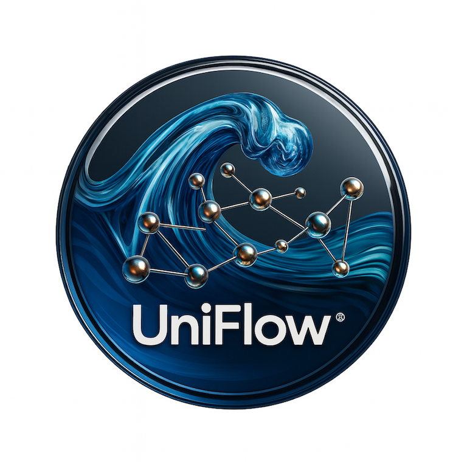

# 🌊 UniFlow - Next-Generation ML Pipeline Framework

<p align="center">
  
  <br>
  <em> Next-Generation ML Pipeline Framework </em>
  <br>
  <br>
  <p align="center"><strong>Provided and maintained by <a href="https://unicolab.ai">🦄 UnicoLab</a></strong></p>
</p>

[](https://www.python.org/downloads/)
[](LICENSE)
[](https://unicolab.ai)
---


**UniFlow** is a production-ready ML pipeline orchestration framework that combines developer-friendly design with enterprise-grade features. Build, version, schedule, and monitor ML workflows with minimal boilerplate.

## ✨ Features

### Core Pipeline Features
- **🚀 5-Minute Setup** - From installation to first pipeline in minutes
- **🎯 Zero Boilerplate** - Automatic context injection, no manual wiring
- **💾 Multi-Level Caching** - Content-based, shared, and smart caching strategies
- **📊 Asset-Centric Design** - First-class datasets, models, and metrics
- **🔄 Full Lineage Tracking** - Complete provenance for all artifacts

### Production Features
- **📁 Project Management** - Multi-tenant isolation and resource tracking
- **🔄 Pipeline Versioning** - Track, compare, and manage pipeline versions
- **⏰ Automated Scheduling** - Daily, hourly, and interval-based execution
- **🔧 Advanced Debugging** - Breakpoints, tracing, profiling, and error analysis
- **⚡ Performance Optimization** - Lazy evaluation, parallel execution, GPU management

### Integration & Deployment
- **🧩 Extensible Stacks** - Local, AWS, GCP, Azure support
- **🔌 Plugin System** - Custom orchestrators and artifact stores
- **🎨 Framework Agnostic** - PyTorch, TensorFlow, scikit-learn, Keras
- **👁️ Real-Time UI** - Modern dashboard with live monitoring
- **🏛️ Model Registry** - Full lifecycle management from dev to production

## 📦 Installation

### Using Poetry (Recommended)

```bash
# Clone the repository
git clone https://github.com/UnicoLab/UniFlow.git
cd uniflow

# Install with Poetry
poetry install

# With UI support
poetry install --extras ui

# All features
poetry install --extras all
```

### Using pip

```bash
pip install uniflow

# Or with extras
pip install "uniflow[pytorch]"      # PyTorch support
pip install "uniflow[tensorflow]"   # TensorFlow support
pip install "uniflow[ui]"           # UI for real-time monitoring
pip install "uniflow[all]"          # Everything
```

### Quick Setup with Make

```bash
# Complete setup (install + frontend)
make setup

# Start development environment
make dev
```

## 🚀 Quick Start

### Basic Pipeline

```python
from uniflow import Pipeline, step, context

# Define context - parameters auto-injected!
ctx = context(
    learning_rate=0.001,
    epochs=10,
    batch_size=32
)

# Steps automatically receive parameters from context
@step(outputs=["model"])
def train_model(learning_rate: float, epochs: int, batch_size: int):
    print(f"Training with lr={learning_rate}, epochs={epochs}, batch={batch_size}")
    model = {"weights": "trained", "accuracy": 0.95}
    return model

@step(inputs=["model"], outputs=["metrics"])
def evaluate_model(model):
    metrics = {"accuracy": 0.95, "loss": 0.05}
    return metrics

# Create and run pipeline
pipeline = Pipeline("training_pipeline", context=ctx)
pipeline.add_step(train_model)
pipeline.add_step(evaluate_model)

result = pipeline.run()
print(f"Success: {result.success}")
```

### With Versioning

```python
from uniflow import VersionedPipeline

# Create versioned pipeline
pipeline = VersionedPipeline("training_pipeline")
pipeline.version = "v1.0.0"

pipeline.add_step(load_data)
pipeline.add_step(train)
pipeline.save_version(metadata={"description": "Initial version"})

# Run and track
result = pipeline.run()

# Compare versions
pipeline.version = "v2.0.0"
pipeline.add_step(validate)
pipeline.save_version()

diff = pipeline.compare_with("v1.0.0")
pipeline.display_comparison("v1.0.0")
```

### With Projects (Multi-Tenancy)

```python
from uniflow import Project

# Create isolated project
project = Project("recommendation_system")

# Pipelines within project
pipeline = project.create_pipeline("training_v1")
pipeline.add_step(train_model)
result = pipeline.run()

# Get project statistics
stats = project.get_stats()
print(f"Total runs: {stats['total_runs']}")
print(f"Total artifacts: {stats['total_artifacts']}")
```

### With Scheduling

```python
from uniflow import PipelineScheduler

scheduler = PipelineScheduler()

# Schedule daily at 2 AM
scheduler.schedule_daily(
    name="daily_training",
    pipeline_func=lambda: pipeline.run(),
    hour=2,
    minute=0
)

#Schedule every 30 minutes
scheduler.schedule_interval(
    name="frequent_sync",
    pipeline_func=lambda: sync_pipeline.run(),
    minutes=30
)

# Start scheduler
scheduler.start()

# List active schedules
schedules = scheduler.list_schedules()
```

## 🖥️ Real-Time UI

Monitor pipelines with the beautiful UniFlow UI:

```bash
# Start UI server
make ui-start

# Or using CLI
uniflow ui start --open-browser

# Check status
make ui-status
```

Visit **http://localhost:8080** to see:
- 📊 Live pipeline execution status
- 📈 Real-time metrics and visualizations
- 🌳 Interactive DAG visualization
- 📦 Asset and artifact explorer
- 🔍 Experiment tracking and comparison
- 📁 Project management dashboard
- ⏰ Schedule monitoring
- 🏆 Model leaderboard

## 🎯 Advanced Features

### 1. Intelligent Caching

Multiple caching strategies for optimal performance:

```python
from uniflow import SmartCache, memoize

# Smart cache with TTL
cache = SmartCache(ttl_seconds=3600, max_size_mb=500)

@step(cache="code_hash")  # Cache until code changes
def preprocess_data(data):
    return expensive_preprocessing(data)

@step(cache="input_hash")  # Cache based on inputs only
def train_model(data, hyperparams):
    return train(data, hyperparams)

# Memoization decorator
@memoize(ttl_seconds=3600)
def load_config():
    return parse_config_file()
```

### 2. Debugging Tools

Comprehensive debugging capabilities:

```python
from uniflow import StepDebugger, PipelineDebugger

# Debug individual steps
debugger = StepDebugger(my_step)
debugger.add_breakpoint(
    condition=lambda inputs: len(inputs['data']) > 100,
    action=lambda step, inputs: print(f"Large dataset detected!")
)
result = debugger.debug_execute(data=[...])

# Debug entire pipeline
pipeline_debugger = PipelineDebugger(pipeline)
pipeline_debugger.enabletracing()
pipeline_debugger.enable_profiling()

result = pipeline.run()

# View execution trace
trace = pipeline_debugger.get_trace()

# Get performance profile
profile = pipeline_debugger.get_profile()
for step_name, metrics in profile.items():
    print(f"{step_name}: {metrics['duration_seconds']:.2f}s")
```

### 3. Performance Optimization

Tools for high-performance pipelines:

```python
from uniflow.utils.performance import (
    LazyValue, ParallelExecutor, GPUResourceManager,
    optimize_dataframe, batch_iterator
)

# Lazy evaluation
expensive_data = LazyValue(lambda: load_huge_dataset())
# Not loaded until accessed!
data = expensive_data.value

# Parallel execution
executor = ParallelExecutor(max_workers=4)
results = executor.map(process_chunk, chunks)

# GPU management
gpu = GPUResourceManager()
device = gpu.get_best_device()  # Least loaded GPU

# DataFrame optimization (50-80% memory reduction!)
df_optimized = optimize_dataframe(df)
```

### 4. Asset Management

Track ML assets with full lineage:

```python
from uniflow import Dataset, Model, Metrics

@step(outputs=["processed_data"])
def preprocess():
    return Dataset.create(
        data=processed_data,
        name="processed_train",
        properties={"samples": 10000, "features": 50}
    )

@step(inputs=["processed_data"], outputs=["trained_model", "metrics"])
def train(processed_data: Dataset):
    model = train_neural_network(processed_data)

    return (
        Model.create(model, trained_on=processed_data),
        Metrics.create(accuracy=0.95, loss=0.05)
    )
```

## 📊 CLI Reference

### Pipeline Management

```bash
# Initialize new project
uniflow init

# Run pipeline
uniflow run training_pipeline

# View configuration
uniflow config
```

### UI Server

```bash
# Start UI
uniflow ui start --open-browser

# Check status
uniflow ui status

# Stop UI
uniflow ui stop
```

### Cache Management

```bash
# Show cache statistics
uniflow cache stats

# Clear cache
uniflow cache clear
```

### Experiments

```bash
# List experiments
uniflow experiment list

# Compare runs
uniflow experiment compare run1 run2
```

### Stacks

```bash
# List available stacks
uniflow stack list

# Switch stack
uniflow stack switch production
```

## 🛠️ Makefile Commands

UniFlow includes a comprehensive Makefile for common tasks:

```bash
# Setup
make setup          # Complete installation
make install        # Install package only
make install-dev    # Install with dev dependencies

# Development
make dev            # Start UI in development mode
make test           # Run all tests
make test-coverage  # Run tests with coverage
make lint           # Run code linters
make format         # Format code with black

# UI
make ui-start       # Start UI server
make ui-status      # Check UI status
make frontend-build # Build frontend

# Utilities
make clean          # Clean build artifacts
make cache-stats    # Show cache statistics
make help           # Show all available commands
```

## 🏗️ Architecture

UniFlow uses a modular architecture:

```
┌─────────────────────────────────────────────┐
│          Developer Interface                │
│  (Decorators, Context, Asset Classes)       │
└─────────────────────────────────────────────┘
                    ↓
┌─────────────────────────────────────────────┐
│          Execution Engine                   │
│  (DAG, Scheduler, Cache, Debugger)          │
└─────────────────────────────────────────────┘
                    ↓
┌─────────────────────────────────────────────┐
│        Storage & Orchestration              │
│  (Metadata Store, Artifact Store, UI)       │
└─────────────────────────────────────────────┘
```

## 🎯 Why UniFlow?

| Feature | UniFlow | ZenML | Metaflow | Prefect |
|---------|---------|-------|----------|---------|
| Setup Time | < 5 min | ~1 hour | ~15 min | ~30 min |
| Auto Context Injection | ✅ | ❌ | ❌ | ❌ |
| Multi-Level Caching | ✅ | ⚠️ | ⚠️ | ⚠️ |
| Pipeline Versioning | ✅ | ⚠️ | ❌ | ❌ |
| Project Isolation | ✅ | ⚠️ | ❌ | ❌ |
| Built-in Scheduling | ✅ | ❌ | ❌ | ✅ |
| Debugging Tools | ✅ | ⚠️ | ❌ | ⚠️ |
| Asset-Centric Design | ✅ | ⚠️ | ❌ | ❌ |
| Full Lineage Tracking | ✅ | ✅ | ⚠️ | ❌ |
| Modern UI | ✅ | ✅ | ❌ | ✅ |

## 📚 Documentation

- **[Quick Start Guide](docs/getting-started.md)** - Get started in 5 minutes
- **[User Guide](docs/user-guide/)** - Complete feature documentation
  - [Pipeline Versioning](docs/user-guide/versioning.md)
  - [Project Management](docs/user-guide/projects.md)
  - [Scheduling](docs/user-guide/scheduling.md)
  - [Debugging Tools](docs/user-guide/debugging.md)
  - [Performance Optimization](docs/user-guide/performance.md)
  - [Caching Strategies](docs/user-guide/caching.md)
- **[API Reference](docs/api/)** - Complete API documentation
- **[Examples](examples/)** - Real-world examples
- **[Contributing](CONTRIBUTING.md)** - Development guide

## 🔍 Examples

### Complete ML Workflow

```python
from uniflow import (
    VersionedPipeline, Project, PipelineScheduler,
    Dataset, Model, step, context
)

# Setup project
project = Project("ml_production")

# Create versioned pipeline
pipeline = VersionedPipeline("training")
pipeline.version = "v1.0.0"

ctx = context(learning_rate=0.001, epochs=10)
pipeline.context = ctx

@step(outputs=["dataset"])
def load_and_prepare():
    data = load_data()
    return Dataset.create(data, name="training_data")

@step(inputs=["dataset"], outputs=["model"])
def train(dataset: Dataset, learning_rate: float, epochs: int):
    model = train_model(dataset, learning_rate, epochs)
    return Model.create(model, trained_on=dataset)

@step(inputs=["model"], outputs=["metrics"])
def evaluate(model: Model):
    return evaluate_model(model)

pipeline.add_step(load_and_prepare)
pipeline.add_step(train)
pipeline.add_step(evaluate)

# Save version
pipeline.save_version(metadata={"description": "Production model v1"})

# Schedule for daily training
scheduler = PipelineScheduler()
scheduler.schedule_daily(
    name="daily_training",
    pipeline_func=lambda: pipeline.run(),
    hour=2
)
scheduler.start()
```

## ❓ Troubleshooting

### Installation Issues

```bash
# Using Poetry
poetry install --extras all

# Using pip
pip install -e ".[all]"
```

### UI Not Starting

```bash
# Build frontend first
cd uniflow/ui/frontend
npm install && npm run build

# Or use make
make frontend-build
```

### Cache Issues

```bash
# Clear cache
make cache-clear

# Or via CLI
uniflow cache clear
```

### More Help

- Check [Documentation](docs/)
- View [Examples](examples/)
- Report [Issues](https://github.com/UnicoLab/UniFlow/issues)

## 🤝 Contributing

We welcome contributions! Please see [CONTRIBUTING.md](CONTRIBUTING.md) for:
- Development setup
- Code style guidelines
- Testing requirements
- Pull request process

## 📝 License

UniFlow is released under the Apache 2.0 License. See [LICENSE](LICENSE) for details.

## 🌟 Community

- [GitHub](https://github.com/UnicoLab/UniFlow)
- [Documentation](https://docs.uniflow.ai)
- [Issues](https://github.com/UnicoLab/UniFlow/issues)
- [Discussions](https://github.com/UnicoLab/UniFlow/discussions)

---


<p align="center">
  <strong>Making ML Pipelines Effortless 🧪✨</strong><br>
  <em>Built with ❤️ for the ML community by <a href="https://unicolab.ai">🦄 UnicoLab</a></em>
</p>
