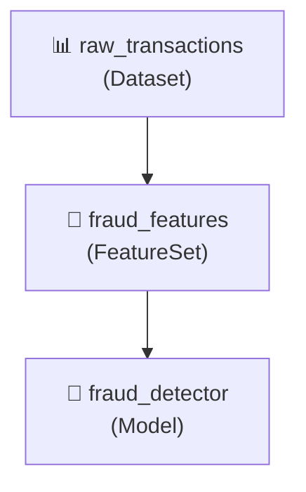

# 🗃️ Artifact Catalog

!!! info "What you'll learn"
    How to discover, version, tag, and trace lineage across all your ML artifacts — models, datasets, features, and more — using FlowyML's centralized catalog.

The Artifact Catalog provides **centralized artifact management** with search, tagging, content-hash deduplication, and full lineage tracking. It works identically in local development (SQLite) and production (remote API).

---

## Why Artifact Catalog? 🤔

| Without Catalog | With Artifact Catalog |
|---|---|
| Artifacts scattered across filesystems | Centralized discovery and search |
| No version history | Full tagging and versioning |
| "Where did this model come from?" | Complete lineage tracking |
| Duplicate artifacts wasting storage | Content-hash deduplication |

---

## Quick Start 🚀

```python
from flowyml import ArtifactCatalog

catalog = ArtifactCatalog()  # Auto-selects local or remote backend

# Register an artifact
artifact_id = catalog.register(
    name="fraud_detector_v2",
    artifact_type="Model",
    source_step="train_model",
    source_run_id="run-abc-123",
    source_pipeline="fraud_detection",
    tags={"stage": "staging", "team": "fraud"},
)

# Search and discover
models = catalog.search("fraud")
recent = catalog.list(artifact_type="Model", limit=10)

# Tag for promotion
catalog.tag(artifact_id, stage="production")

# Trace lineage
lineage = catalog.get_lineage(artifact_id)
print(lineage["parents"])   # What inputs produced this
print(lineage["children"])  # What downstream consumed this
```

---

## Backend Selection ⚙️

The catalog auto-selects its backend based on your environment:

| Condition | Backend | Storage |
|---|---|---|
| Default (no config) | `LocalCatalogBackend` | SQLite (`.flowyml/catalog.db`) |
| Stack has `catalog_endpoint` | `RemoteCatalogBackend` | FlowyML API server |
| `FLOWYML_CATALOG_ENDPOINT` env var | `RemoteCatalogBackend` | FlowyML API server |

### Local Development — Zero Config

```python
catalog = ArtifactCatalog()  # Uses local SQLite automatically
```

### Remote / Production

```bash
export FLOWYML_CATALOG_ENDPOINT=https://flowyml.example.com/api/v1/catalog
export FLOWYML_CATALOG_API_KEY=your-api-key
```

### Explicit Backend

```python
from flowyml.storage.catalog import LocalCatalogBackend, RemoteCatalogBackend

# Force local
catalog = ArtifactCatalog(backend=LocalCatalogBackend("/path/to/db"))

# Force remote
catalog = ArtifactCatalog(backend=RemoteCatalogBackend("https://api.example.com"))
```

---

## Content-Hash Deduplication 🔐

Pass `data` to `register()` — the catalog computes a SHA-256 hash and warns if a duplicate exists:

```python
catalog.register(
    name="training_features",
    artifact_type="Dataset",
    data=my_dataframe,  # Content is hashed for dedup
)
```

---

## Lineage Tracking 🔗

Register parent → child relationships to build a full artifact graph:

```python
# 1. Register raw data
raw_id = catalog.register(name="raw_transactions", artifact_type="Dataset")

# 2. Register features (child of raw data)
feat_id = catalog.register(
    name="fraud_features",
    artifact_type="FeatureSet",
    parent_ids=[raw_id],
)

# 3. Register model (child of features)
model_id = catalog.register(
    name="fraud_detector",
    artifact_type="Model",
    parent_ids=[feat_id],
)

# 4. Query lineage
lineage = catalog.get_lineage(model_id)
print(lineage["parents"])   # → [feat_id]
print(lineage["children"])  # → []
```

### Lineage Visualization



---

## Catalog API Reference 📚

### `ArtifactCatalog`

| Method | Returns | Description |
|---|---|---|
| `register(name, artifact_type, ...)` | `str` | Register artifact, returns ID |
| `search(query)` | `list` | Full-text search across artifacts |
| `list(artifact_type, limit)` | `list` | List artifacts with optional filters |
| `get(artifact_id)` | `dict` | Get artifact metadata by ID |
| `tag(artifact_id, **tags)` | `None` | Add/update tags on artifact |
| `get_lineage(artifact_id)` | `dict` | Get parent and child relationships |
| `delete(artifact_id)` | `None` | Remove artifact from catalog |

### `register()` Parameters

| Parameter | Type | Required | Description |
|---|---|---|---|
| `name` | `str` | ✅ | Artifact name |
| `artifact_type` | `str` | ✅ | Type: `Model`, `Dataset`, `FeatureSet`, etc. |
| `data` | `Any` | ❌ | Raw data for content-hash deduplication |
| `source_step` | `str` | ❌ | Step that produced this artifact |
| `source_run_id` | `str` | ❌ | Pipeline run ID |
| `source_pipeline` | `str` | ❌ | Pipeline name |
| `tags` | `dict` | ❌ | Key-value tags for filtering |
| `parent_ids` | `list[str]` | ❌ | Parent artifact IDs for lineage |

---

## Real-World Example: Model Promotion 🌍

```python
from flowyml import ArtifactCatalog

catalog = ArtifactCatalog()

# 1. Search for the best model
models = catalog.search("fraud_detector")
best = max(models, key=lambda m: m.get("tags", {}).get("f1_score", 0))

# 2. Promote to production
catalog.tag(best["id"], stage="production", promoted_by="ml-team")

# 3. Verify lineage before deployment
lineage = catalog.get_lineage(best["id"])
print(f"Model trained on: {lineage['parents']}")
```

---

## Best Practices 💡

!!! tip "Tag everything"
    Use tags like `stage`, `team`, `experiment` to make artifacts discoverable: `catalog.search("stage:production team:fraud")`.

!!! tip "Always record lineage"
    Pass `parent_ids` when registering to build a full artifact graph. This makes "where did this model come from?" trivially answerable.

!!! warning "Content hashing"
    Content-hash deduplication only works when you pass `data` to `register()`. Without it, duplicate artifacts are still allowed.
