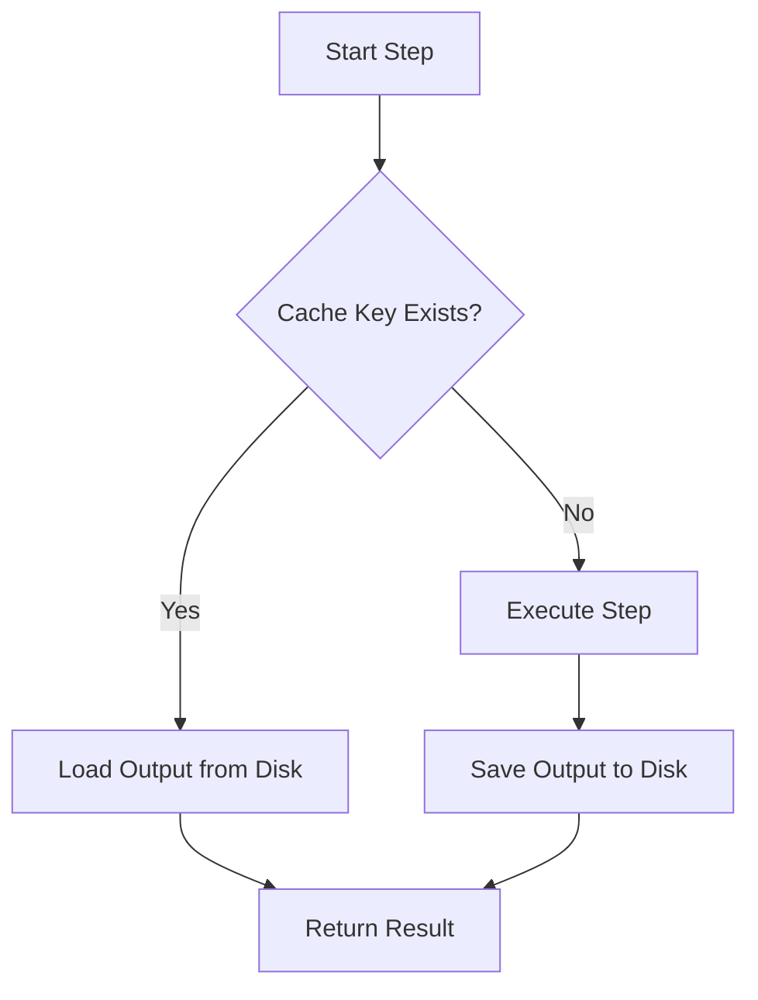

# Caching ⚡

flowyml's intelligent caching system eliminates redundant work, saving you time and compute costs.

> [!NOTE]
> **What you'll learn**: How to skip expensive steps that have already run
>
> **Key insight**: The fastest code is the code you don't run. flowyml automatically detects when inputs and code haven't changed.

## Why Caching Matters

**Without caching**:
- **Wasted time**: Re-running data loading (10 mins) just to fix a typo in plotting
- **Wasted money**: Retraining models (GPU hours) when only the evaluation metric changed
- **Slow iteration**: Feedback loops take hours instead of seconds

**With flowyml caching**:
- **Instant feedback**: Skip straight to the step you're working on
- **Cost savings**: Reduce cloud compute bills by 40-60%
- **Resume capability**: Crash in step 5? Fix it and resume instantly; steps 1-4 are cached

## How Caching Works

flowyml calculates a **Cache Key** for every step before it runs. If a matching key exists, the step is skipped.

The key combines:
1. **Code Hash**: The source code of the function
2. **Input Hash**: The values of all input arguments
3. **Configuration**: Parameters injected from context



## Configuration ⚙️

### Pipeline-Level Caching

Enable or disable caching for an entire pipeline:

```python
from flowyml import Pipeline

# Enable caching (default)
pipeline = Pipeline("my_pipeline", enable_cache=True)

# Disable caching
pipeline = Pipeline("my_pipeline", enable_cache=False)

# Custom cache directory
pipeline = Pipeline("my_pipeline", cache_dir="./custom_cache")
```

### Step-Level Caching

Control caching for individual steps:

```python
from flowyml import step

# Use default caching (code_hash)
@step(outputs=["result"])
def cached_step(data):
    return expensive_computation(data)

# Disable caching for this step
@step(cache=False, outputs=["fresh_data"])
def always_run():
    return fetch_latest_data()
```

## Decision Guide: Caching Strategies

| Strategy | Behavior | Use When |
|----------|----------|----------|
| `code_hash` (Default) | Invalidate if **code OR inputs** change | **Development**: You're tweaking logic and need safety. |
| `input_hash` | Invalidate ONLY if **inputs** change | **Production/Training**: Code is stable, but you're tuning hyperparameters. |
| `cache=False` | **Always** run | **Side Effects**: Sending emails, writing to DB, fetching live data. |

### 1. `cache="code_hash"` (Safest)

The default. If you change *anything* in the function (even a comment), it re-runs.

```python
@step(cache="code_hash")
def process(data):
    # Changing this comment triggers a re-run!
    return [x * 2 for x in data]
```

### 2. `cache="input_hash"` (Fastest)

Ignores code changes. Only re-runs if the *data* passed to it changes.

```python
@step(cache="input_hash")
def train_model(dataset, epochs):
    # You can refactor this code without triggering a 4-hour training run
    # It only re-runs if 'dataset' or 'epochs' change
    return model.fit(dataset, epochs=epochs)
```

> [!WARNING]
> Use `input_hash` carefully! If you change the logic (e.g., fix a bug) but inputs stay the same, flowyml won't know to re-run it. You'll get the old, buggy result.

### 3. `cache=False` (Side Effects)

For steps that must always run.

```python
@step(cache=False)
def send_slack_alert(metrics):
    # Always send the alert, even if metrics haven't changed
    slack.send(f"Accuracy: {metrics['accuracy']}")
```

## Practical Examples

### Example 1: Data Pipeline with Mixed Caching

```python
from flowyml import Pipeline, step

@step(cache="code_hash", outputs=["raw"])
def load_data(file_path: str):
    """Cache invalidated if code OR file_path changes."""
    return pd.read_csv(file_path)

@step(inputs=["raw"], cache="input_hash", outputs=["clean"])
def clean_data(raw):
    """Cache invalidated only if raw data changes."""
    return raw.dropna().reset_index(drop=True)

@step(inputs=["clean"], cache=False, outputs=["result"])
def upload_to_db(clean):
    """Never cached - always uploads."""
    database.save(clean)
    return {"uploaded": len(clean)}

pipeline = Pipeline("etl", enable_cache=True)
pipeline.add_step(load_data)
pipeline.add_step(clean_data)
pipeline.add_step(upload_to_db)
```

### Example 2: Machine Learning Training

```python
@step(cache="code_hash", outputs=["dataset"])
def prepare_dataset(data_path: str, test_split: float):
    """Recompute if code or parameters change."""
    return load_and_split(data_path, test_split)

@step(inputs=["dataset"], cache="input_hash", outputs=["model"])
def train_model(dataset, learning_rate: float, epochs: int):
    """Expensive training - cache based on inputs only."""
    # Training logic doesn't change often, but we try different hyperparameters
    model = Model()
    model.fit(dataset, lr=learning_rate, epochs=epochs)
    return model

@step(inputs=["model"], cache=False, outputs=["metrics"])
def evaluate_fresh(model):
    """Always evaluate to get latest metrics."""
    return model.evaluate(test_data)
```

### Example 3: Debugging

```python
# During development
pipeline = Pipeline("debug_pipeline", enable_cache=False)
# All steps run fresh every time

# After development
pipeline = Pipeline("prod_pipeline", enable_cache=True)
# Benefit from caching
```

## Cache Performance 📊

### Cache Hits Save Time

```python
import time

@step(cache="code_hash")
def expensive_step():
    time.sleep(5)  # Simulate expensive computation
    return "result"

pipeline = Pipeline("perf_test", enable_cache=True)
pipeline.add_step(expensive_step)

# First run: 5+ seconds
result1 = pipeline.run()  # ⏱️ 5.2s

# Second run: milliseconds!
result2 = pipeline.run()  # ⏱️ 0.05s ⚡ (cached)
```

### Monitoring Cache Usage

Check which steps were cached:

```python
result = pipeline.run()

for step_name, step_result in result.step_results.items():
    status = "CACHED" if step_result.cached else "EXECUTED"
    print(f"{step_name}: {status} ({step_result.duration_seconds:.2f}s)")

# Output:
# load_data: CACHED (0.01s)
# process: EXECUTED (2.34s)
# train: CACHED (0.02s)
```

## Cache Storage 💾

### Default Location

By default, cache is stored in `.flowyml/cache`:

```
.flowyml/
├── cache/
│   ├── cache.db       # SQLite database tracking cache entries
│   └── objects/       # Pickled cached objects
│       ├── abc123.pkl
│       └── def456.pkl
```

### Custom Cache Directory

```python
pipeline = Pipeline(
    "my_pipeline",
    enable_cache=True,
    cache_dir="/path/to/custom/cache"
)
```

### Cache Entry Structure

Each cache entry contains:
- **Key**: Hash of code + inputs + step name
- **Value**: Serialized step output
- **Metadata**: Timestamp, step name, code hash
- **TTL**: Optional time-to-live

## Managing the Cache 🧹

### Clear Cache via Code

```python
from flowyml.core.cache import CacheStore

cache = CacheStore(".flowyml/cache")

# Clear all cache
cache.clear()

# Clear specific step
cache.clear_step("my_step_name")
```

### Cache Invalidation Patterns

#### Manual Invalidation

```python
# Before running, clear cache for specific step
cache.clear_step("data_loading")

# Then run pipeline
result = pipeline.run()
```

#### Automatic Invalidation

Cache is automatically invalidated when:
- Function code changes (for `code_hash` strategy)
- Input values change
- Dependencies are updated

#### Time-Based Invalidation

Implement custom TTL:

```python
from datetime import datetime, timedelta

@step
def load_with_ttl():
    # Custom logic to check cache age
    cache_age = get_cache_age("load_with_ttl")
    if cache_age > timedelta(hours=24):
        # Force re-execution
        return fetch_fresh_data()
```

## Debugging Cache Issues 🔧

### Verify Cache is Working

```python
# Run with debug output
result = pipeline.run(debug=True)

# Check cache status for each step
for step_name, step_result in result.step_results.items():
    if step_result.cached:
        print(f"✓ {step_name} was cached")
    else:
        print(f"⚠ {step_name} was executed (not cached)")
```

### Common Cache Issues

#### Issue: Cache Not Hitting When Expected

**Causes:**
- Input values changed slightly (floating point precision)
- Code changed (even whitespace with `code_hash`)
- Cache was cleared
- Different function object (re-imported module)

**Solutions:**
```python
# Use input_hash if code changes shouldn't matter
@step(cache="input_hash")

# Round inputs to avoid floating point issues
@step
def process(value: float):
    value = round(value, 6)  # Normalize precision
    ...
```

#### Issue: Stale Cache

**Cause:** Using `input_hash` but logic changed

**Solution:**
```python
# Temporarily disable cache to force refresh
@step(cache=False)  # Remove after verified
def updated_logic(data):
    # New implementation
    ...
```

Or manually clear:
```python
cache.clear_step("updated_logic")
```

## When to Use Each Strategy

| Strategy | Development | Production | Stable Logic | Changing Logic | Side Effects |
|----------|-------------|------------|--------------|----------------|--------------|
| `code_hash` (default) | ✅ Best | ✅ Safe | ✅ Good | ✅ Best | ⚠️ Use with care |
| `input_hash` | ⚠️ Risky | ✅ Efficient | ✅ Best | ❌ Dangerous | ⚠️ Use with care |
| `False` | ✅ Debugging | ✅ Real-time | ❌ Wasteful | ✅ Fine | ✅ Required |

## Best Practices 💡

### 1. Enable Caching in Development

```python
# ✅ Good - iterates faster
pipeline = Pipeline("dev", enable_cache=True)

# Changes to unchanged steps don't re-run
```

### 2. Be Careful with Side Effects

```python
# ❌ Bad - side effect might be cached!
@step
def send_email(results):
    email_service.send(results)  # Might not run if cached!
    return "sent"

# ✅ Good - disable cache for side effects
@step(cache=False)
def send_email(results):
    email_service.send(results)  # Always runs
    return "sent"
```

### 3. Use Input Hash for Stable, Expensive Operations

```python
# ✅ Good - training is expensive and logic is stable
@step(cache="input_hash")
def train_model(data, hyperparams):
    # 2 hours of training
    model = expensive_training(data, hyperparams)
    return model
```

### 4. Clear Cache Between Major Changes

```python
# When refactoring or major updates
cache_store.clear()

# Or via CLI
# flowyml cache clear
```

### 5. Monitor Cache Hit Rates

```python
result = pipeline.run()

total_steps = len(result.step_results)
cached_steps = sum(1 for r in result.step_results.values() if r.cached)
hit_rate = cached_steps / total_steps * 100

print(f"Cache hit rate: {hit_rate:.1f}%")
# Target: > 50% in development, 20-40% in production
```

## Advanced: Custom Cache Keys

For complete control, provide a custom cache key function:

```python
def my_cache_key(step, inputs, context):
    # Custom logic to generate cache key
    return f"{step.name}:{hash(str(inputs))}"

@step(cache=my_cache_key)
def custom_cached_step(data):
    ...
```

## Next Steps 📚

- **[Steps](steps.md)**: Configure step caching strategies
- **[Pipelines](pipelines.md)**: Enable caching at pipeline level
- **[Configuration](configuration.md)**: Set cache directory in config
