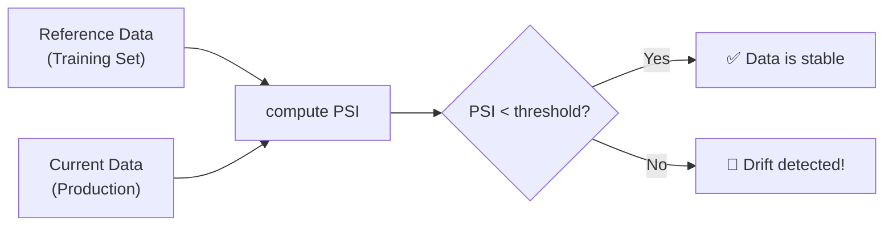

# 📉 Data Drift Detection

!!! info "What you'll learn"
    How to catch "silent failures" where models degrade because the world changed. A model is only as good as the data it sees — drift detection ensures you know when reality shifts.

FlowyML ensures your models don't rot in production by detecting when live data diverges from training data, using the **Population Stability Index (PSI)**.

---

## Why Drift Detection Matters

| Without Drift Detection | With Drift Detection |
|---|---|
| Model accuracy silently degrades | Proactive alerts on data shifts |
| Users complain about bad predictions weeks later | Know immediately when distributions change |
| Retraining on a fixed schedule (wasteful) | Retrain only when necessary |
| "Why did predictions get worse?" | Root cause: "Feature X shifted by PSI=0.34" |

---

## How PSI Works

The **Population Stability Index** measures how much a feature's distribution has changed:

| PSI Value | Interpretation | Action |
|---|---|---|
| < 0.1 | No significant drift | ✅ Safe |
| 0.1 – 0.2 | Moderate drift | ⚠️ Monitor closely |
| > 0.2 | Significant drift | 🚨 Investigate / Retrain |



---

## 🕵️ Detecting Drift

Use the `detect_drift` function to compare two datasets:

```python
from flowyml.monitoring.data import detect_drift
import numpy as np

# Reference data (e.g., training set)
train_data = np.random.normal(0, 1, 1000)

# Current data (e.g., production traffic)
prod_data = np.random.normal(0.5, 1, 1000)  # Shifted mean!

# Check for drift
result = detect_drift(
    reference_data=train_data,
    current_data=prod_data,
    threshold=0.1,  # PSI threshold (default: 0.1)
)

if result["drift_detected"]:
    print(f"⚠️ Drift detected! PSI: {result['psi']:.4f}")
    print(f"Reference Mean: {result['reference_stats']['mean']:.2f}")
    print(f"Current Mean: {result['current_stats']['mean']:.2f}")
else:
    print("✅ Data is stable.")
```

### `detect_drift()` Return Value

| Key | Type | Description |
|---|---|---|
| `drift_detected` | `bool` | Whether PSI exceeded the threshold |
| `psi` | `float` | Population Stability Index value |
| `reference_stats` | `dict` | Stats of reference data (mean, std, min, max) |
| `current_stats` | `dict` | Stats of current data (mean, std, min, max) |
| `threshold` | `float` | Threshold used for detection |

---

## 📊 Computing Statistics

Compute descriptive statistics for any dataset:

```python
from flowyml.monitoring.data import compute_stats

stats = compute_stats(prod_data)
print(stats)
# {'count': 1000.0, 'mean': 0.48, 'std': 1.01, 'min': -3.2, 'max': 3.8, ...}
```

---

## Real-World Examples

### Automated Quality Gate

Stop a pipeline if drift is detected — prevent bad predictions from being served:

```python
from flowyml import Pipeline, step, get_notifier, If

@step(outputs=["drift_result"])
def check_drift(new_batch):
    reference = load_reference_data()
    return detect_drift(reference, new_batch)

@step
def alert_team(drift_result):
    get_notifier().notify(
        title="🚨 Data Drift Detected",
        message=f"PSI: {drift_result['psi']:.4f}\n"
                f"Reference mean: {drift_result['reference_stats']['mean']:.2f}\n"
                f"Current mean: {drift_result['current_stats']['mean']:.2f}",
        level="warning",
        channels=["slack"],
    )

@step
def process_data(data):
    pass  # Continue processing

# Build pipeline with quality gate
pipeline = Pipeline("drift_monitored")
pipeline.add_step(check_drift)
pipeline.add_control_flow(
    If(condition=lambda ctx: ctx["drift_result"]["drift_detected"])
    .then(alert_team)
    .else_(process_data)
)
```

### Multi-Feature Drift Monitoring

```python
import pandas as pd
from flowyml.monitoring.data import detect_drift

def monitor_all_features(reference_df: pd.DataFrame, current_df: pd.DataFrame):
    """Check drift for every feature column."""
    drifted_features = []

    for col in reference_df.columns:
        result = detect_drift(
            reference_data=reference_df[col].values,
            current_data=current_df[col].values,
            threshold=0.1,
        )
        if result["drift_detected"]:
            drifted_features.append({
                "feature": col,
                "psi": result["psi"],
                "ref_mean": result["reference_stats"]["mean"],
                "cur_mean": result["current_stats"]["mean"],
            })

    if drifted_features:
        print(f"🚨 {len(drifted_features)} features drifted:")
        for f in drifted_features:
            print(f"  {f['feature']}: PSI={f['psi']:.4f} "
                  f"(mean {f['ref_mean']:.2f} → {f['cur_mean']:.2f})")
    else:
        print("✅ All features stable.")

    return drifted_features
```

---

## Best Practices

!!! tip "Monitor all input features"
    Don't just check one feature — a model can break if any input feature drifts. Automate checks across all columns.

!!! tip "Set sensible thresholds"
    PSI < 0.1 is usually safe. PSI > 0.2 requires investigation. Tune based on your domain's tolerance for distribution shift.

!!! warning "Drift ≠ Performance Drop"
    Drift indicates the data changed, but the model might still perform well. Always pair drift detection with actual performance monitoring.
