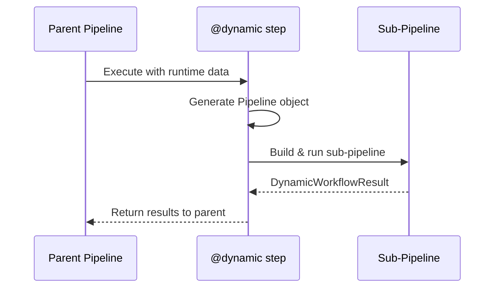

# ⚡ Dynamic Workflows

!!! info "What you'll learn"
    How to create steps that generate sub-pipelines at runtime based on intermediate results — inspired by Flyte's dynamic-node handler.

Dynamic workflows let a **single step produce an entire DAG** at runtime. The generated sub-pipeline is expanded and executed inline, giving you the power to build data-driven, runtime-configurable pipelines.

---

## Why Dynamic Workflows?

| Static Pipelines | Dynamic Workflows |
|---|---|
| Fixed number of steps | Steps generated at runtime |
| All branches known upfront | Branches depend on data |
| Rigid structure | Flexible, data-driven |

**Use when**: The shape of your pipeline depends on data you only have at execution time.

---

## Basic Usage

```python
from flowyml import dynamic, Pipeline, step

@dynamic(outputs=["best_model"])
def hyperparameter_search(config: dict):
    """Generate a sub-pipeline with one training step per learning rate."""
    sub = Pipeline("hp_search")

    for lr in config["learning_rates"]:
        @step(outputs=[f"model_lr_{lr}"])
        def train(learning_rate=lr):
            return train_model(learning_rate)
        sub.add_step(train)

    return sub

# Add to parent pipeline — expands at runtime
pipeline.add_step(hyperparameter_search)
```

---

## How It Works



1. The parent pipeline calls the `@dynamic` function like any other step
2. The function builds and returns a `Pipeline` object
3. FlowyML executes that sub-pipeline inline
4. Results are wrapped in a `DynamicWorkflowResult` and returned to the parent

---

## Real-World Examples

### Data-Driven Feature Engineering

```python
@dynamic(outputs=["features"])
def build_features(schema: dict):
    """Generate processing steps based on column types."""
    sub = Pipeline("feature_pipeline")

    for col, dtype in schema["columns"].items():
        if dtype == "numeric":
            @step(outputs=[f"feat_{col}"])
            def normalize(column=col):
                return normalize_column(column)
            sub.add_step(normalize)
        elif dtype == "categorical":
            @step(outputs=[f"feat_{col}"])
            def encode(column=col):
                return one_hot_encode(column)
            sub.add_step(encode)

    return sub
```

### Conditional Fan-Out

```python
@dynamic(outputs=["report"])
def analyze(data: dict):
    """Choose analysis pipeline based on data size."""
    sub = Pipeline("analysis")

    if data["row_count"] > 1_000_000:
        sub.add_step(sample_data)
        sub.add_step(approximate_stats)
    else:
        sub.add_step(exact_stats)

    sub.add_step(generate_report)
    return sub
```

### Multi-Model Training

```python
@dynamic(outputs=["leaderboard"])
def train_all_models(model_configs: list[dict]):
    """Train one model per config — number of models unknown until runtime."""
    sub = Pipeline("multi_train")

    for cfg in model_configs:
        @step(outputs=[f"model_{cfg['name']}"])
        def train(config=cfg):
            return train_model(**config)
        sub.add_step(train)

    sub.add_step(compare_models)
    return sub
```

---

## Direct Results (Non-Pipeline Return)

If the dynamic function returns a **non-Pipeline value**, it's treated as a direct result — no sub-pipeline is created:

```python
@dynamic
def maybe_expand(data: dict):
    if data["size"] < 100:
        return simple_transform(data)      # Direct result — no sub-pipeline
    return build_complex_pipeline(data)    # Returns Pipeline — expanded
```

---

## `DynamicWorkflowResult` API

| Attribute | Type | Description |
|---|---|---|
| `sub_pipeline` | `Pipeline \| None` | The generated sub-pipeline (if any) |
| `results` | `Any` | Aggregated results from execution |
| `expanded` | `bool` | `True` if a sub-pipeline was created and run |

---

## Decorator Parameters

| Parameter | Type | Default | Description |
|---|---|---|---|
| `name` | `str \| None` | Function name | Custom step name |
| `outputs` | `list[str]` | `[]` | Output names exposed to parent |
| `inputs` | `list[str]` | `[]` | Input names consumed from parent |

---

## Best Practices

!!! tip "Keep dynamic functions focused"
    A dynamic step should build **one logical sub-pipeline**. If you need multiple expansions, use separate `@dynamic` steps.

!!! tip "Testing"
    Test dynamic functions by calling them directly — they return a `Pipeline` object you can inspect without running.

!!! warning "Avoid deep nesting"
    Dynamic workflows can themselves contain dynamic steps, but deep nesting makes debugging difficult. Prefer flat compositions.
