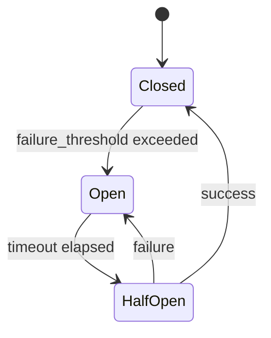

# 🛡️ Error Handling & Retries

!!! info "What you'll learn"
    How to make pipelines resilient to network blips, API timeouts, and transient errors. In distributed systems, failure is inevitable — your pipeline should handle it.

Build self-healing pipelines that recover from failures automatically using retries, circuit breakers, fallbacks, and failure handlers.

---

## Why Robustness Matters 🛡️

| Without Error Handling | With FlowyML Resilience |
|---|---|
| One network timeout kills the whole job | Transient errors retried automatically |
| Waking up at 3 AM to click "retry" | Self-healing pipelines |
| Cascading failures spread across services | Circuit breakers stop the cascade |
| Partial failures leave data inconsistent | Fallbacks provide safe defaults |

---

## Decision Guide ⚖️

| Pattern | Use When | Example |
|---|---|---|
| **Retry** | Transient errors: network blips, rate limits | API timeout, 503 error |
| **Circuit Breaker** | System outages: service is down hard | Database down, repeated 500s |
| **Fallback** | Critical path: must continue even if step fails | Use cached data if live API fails |
| **Failure Handler** | Alerting: notify team when things break | Slack ping on critical step failure |

---

## 🔄 Retries with Exponential Backoff

Automatically retry failed steps with configurable backoff strategies.

```python
from flowyml import step, retry, ExponentialBackoff

@step(
    retry=retry(
        max_attempts=5,
        backoff=ExponentialBackoff(initial=1.0, multiplier=2.0),
        on=[NetworkError, TimeoutError, RateLimitError],
    )
)
def fetch_data():
    """Retry pattern: 1s → 2s → 4s → 8s between attempts."""
    return api.get_data()
```

### Retry Configuration

| Parameter | Type | Default | Description |
|---|---|---|---|
| `max_attempts` | `int` | `3` | Total attempts including the first |
| `backoff` | `BackoffStrategy` | `ExponentialBackoff()` | Delay strategy between retries |
| `on` | `list[type]` | All exceptions | Exception types to retry on |

### Backoff Strategies

```python
from flowyml import ExponentialBackoff

# Exponential: 1s → 2s → 4s → 8s
ExponentialBackoff(initial=1.0, multiplier=2.0)

# Exponential with jitter (recommended for distributed systems)
ExponentialBackoff(initial=1.0, multiplier=2.0, jitter=True)
```

---

## 🔌 Circuit Breakers

Prevent cascading failures by "opening the circuit" when a service is down — failing fast instead of waiting for timeouts.

```python
from flowyml import step, CircuitBreaker

@step(
    circuit_breaker=CircuitBreaker(
        failure_threshold=3,   # Open after 3 consecutive failures
        timeout=60,            # Wait 60s before trying again (half-open)
    )
)
def call_unstable_api():
    return external_service.call()
```

### Circuit Breaker States



| State | Behavior |
|---|---|
| **Closed** | Requests pass through normally |
| **Open** | Requests fail immediately (no attempt) |
| **Half-Open** | One test request allowed; success → Closed, failure → Open |

---

## 🛡️ Fallbacks

Define a fallback function to execute when a step fails, ensuring the pipeline can continue with safe defaults.

```python
from flowyml import step

def load_cached_data():
    """Fallback: return cached data if live API is down."""
    return cache.get("latest_data")

@step(
    fallback=load_cached_data,
    fallback_on=[TimeoutError, ConnectionError],
)
def fetch_live_data():
    return api.get_live_data()
```

!!! tip "When to use fallbacks"
    Fallbacks are ideal for **non-critical data sources** where stale data is better than no data. Don't use fallbacks for steps where correctness is required.

---

## 🚨 Failure Handlers

Configure actions to take when a step fails — even if the pipeline continues via fallback:

```python
from flowyml import step, on_failure

@step(
    on_failure=on_failure(
        action="slack",
        recipients=["#ml-alerts"],
        include_logs=True,
    )
)
def critical_step():
    """If this fails, the team gets a Slack notification with full logs."""
    return train_model()
```

---

## Combining Patterns 🧩

Use retries, circuit breakers, and fallbacks together for maximum resilience:

```python
@step(
    retry=retry(max_attempts=3, backoff=ExponentialBackoff(initial=0.5)),
    circuit_breaker=CircuitBreaker(failure_threshold=5, timeout=120),
    fallback=use_cached_prediction,
    on_failure=on_failure(action="slack", recipients=["#ml-alerts"]),
)
def get_prediction(input_data):
    """
    1. Try up to 3 times with exponential backoff
    2. After 5 total failures, circuit opens (fast-fail for 120s)
    3. If all retries exhaust, use cached prediction
    4. Always notify #ml-alerts on failure
    """
    return model_api.predict(input_data)
```

---

## Best Practices 💡

!!! tip "Start simple"
    Add `retry(max_attempts=3)` to any step that calls an external API. This single addition prevents most transient failures.

!!! tip "Use circuit breakers for shared services"
    If multiple pipeline steps call the same service, a circuit breaker prevents all of them from hammering a failing service.

!!! warning "Don't retry non-idempotent operations"
    Only retry operations that are safe to repeat. Don't retry a `POST` that creates a database record — you'll get duplicates.
