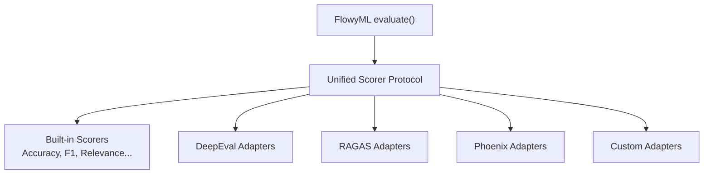

# 🔌 Evaluation Adapters — DeepEval, RAGAS & Phoenix

!!! info "What you'll learn"
    How to use third-party evaluation frameworks (DeepEval, RAGAS, Phoenix) through FlowyML's unified `Scorer` protocol — mix and match evaluators from different libraries in a single `evaluate()` call.

FlowyML provides **first-class adapter scorers** for three popular evaluation frameworks. Each adapter wraps the upstream library's evaluator into FlowyML's unified `Scorer` protocol, so you can combine scorers from different providers seamlessly.

---

## Adapter Architecture



**Key benefit**: Mix scorers from different libraries in a single evaluation:

```python
from flowyml.evals import evaluate, Relevance, DeepEvalHallucination, RagasFaithfulness

result = evaluate(
    data=my_data,
    scorers=[Relevance(), DeepEvalHallucination(), RagasFaithfulness()],
)
```

---

## DeepEval Adapters

!!! tip "Installation"
    `pip install deepeval`

| Adapter | Evaluates | Scorer Name |
|---|---|---|
| `DeepEvalAnswerRelevancy` | Is the answer relevant to the question? | `deepeval.answer_relevancy` |
| `DeepEvalHallucination` | Does the answer hallucinate beyond context? | `deepeval.hallucination` |
| `DeepEvalBias` | Does the answer exhibit bias? | `deepeval.bias` |
| `DeepEvalToxicity` | Does the answer contain toxic content? | `deepeval.toxicity` |

### Usage Example

```python
from flowyml.evals import evaluate, EvalDataset
from flowyml.evals import DeepEvalAnswerRelevancy, DeepEvalHallucination

# Create GenAI evaluation dataset
data = EvalDataset.create_genai("rag_golden_set", examples=[
    {
        "inputs": {"query": "What is machine learning?"},
        "expected": "Machine learning is a subset of artificial intelligence...",
        "context": ["Machine learning uses algorithms to learn from data..."],
    },
    {
        "inputs": {"query": "Explain neural networks"},
        "expected": "Neural networks are computing systems inspired by...",
        "context": ["A neural network is made up of layers of nodes..."],
    },
])

result = evaluate(
    data=data,
    scorers=[DeepEvalAnswerRelevancy(), DeepEvalHallucination()],
)

# Access individual scores
for name, feedback in result.scores.items():
    print(f"{name}: {feedback.value:.2f} ({'PASS' if feedback.passed else 'FAIL'})")
```

---

## RAGAS Adapters

!!! tip "Installation"
    `pip install ragas`

| Adapter | Evaluates | Scorer Name |
|---|---|---|
| `RagasFaithfulness` | Is the answer faithful to the provided context? | `ragas.faithfulness` |
| `RagasContextPrecision` | Is the retrieved context precise and relevant? | `ragas.context_precision` |
| `RagasContextRecall` | Does the context cover the expected answer? | `ragas.context_recall` |
| `RagasAnswerRelevancy` | Is the answer relevant to the input query? | `ragas.answer_relevancy` |

### Usage Example

```python
from flowyml.evals import evaluate, RagasFaithfulness, RagasContextPrecision

result = evaluate(
    data=rag_golden_set,
    scorers=[RagasFaithfulness(), RagasContextPrecision()],
)

# Check faithfulness score
print(f"Faithfulness: {result.scores['ragas.faithfulness'].value:.2f}")
```

---

## Phoenix Adapters

!!! tip "Installation"
    `pip install arize-phoenix`

| Adapter | Evaluates | Scorer Name |
|---|---|---|
| `PhoenixHallucination` | Hallucination detection via Phoenix | `phoenix.hallucination` |
| `PhoenixToxicity` | Toxicity scoring via Phoenix | `phoenix.toxicity` |
| `PhoenixQACorrectness` | Q&A correctness via Phoenix | `phoenix.qa_correctness` |
| `PhoenixSummarization` | Summarization quality via Phoenix | `phoenix.summarization` |

### Usage Example

```python
from flowyml.evals import evaluate, PhoenixHallucination, PhoenixQACorrectness

result = evaluate(
    data=qa_golden_set,
    scorers=[PhoenixHallucination(), PhoenixQACorrectness()],
)
```

---

## Using All Adapters Together

You can combine scorers from **any** framework in a single evaluation:

```python
from flowyml.evals import (
    evaluate,
    Relevance,                  # Built-in GenAI scorer
    DeepEvalHallucination,      # DeepEval adapter
    RagasFaithfulness,          # RAGAS adapter
    PhoenixQACorrectness,       # Phoenix adapter
)

result = evaluate(
    data=golden_set,
    scorers=[
        Relevance(),
        DeepEvalHallucination(),
        RagasFaithfulness(),
        PhoenixQACorrectness(),
    ],
    experiment="cross_framework_eval",
)
```

---

## Creating Custom Adapters

Wrap any third-party scorer by implementing the `Scorer` protocol:

```python
from flowyml.evals import Scorer, ScorerFeedback, ScorerType

class MyCustomAdapter(Scorer):
    """Adapter for my-custom-eval-library."""
    name = "custom.my_metric"
    description = "Custom evaluation metric from my library"
    scorer_type = ScorerType.GENAI

    def score(self, *, inputs=None, outputs=None, context=None, **kwargs) -> ScorerFeedback:
        # Call your external evaluator
        raw_score = my_external_lib.evaluate(
            question=inputs.get("query", ""),
            answer=outputs,
            context=context,
        )
        return ScorerFeedback(
            value=raw_score,
            passed=raw_score > self.threshold,
            reason=f"Score: {raw_score:.2f}",
        )

# Register globally (optional)
from flowyml.evals.scorers import register_scorer
register_scorer("custom.my_metric", MyCustomAdapter)
```

---

## Discovering Available Scorers

```python
from flowyml.evals.scorers import list_scorers

# List all registered scorers
for scorer in list_scorers():
    print(f"{scorer['name']:30s} ({scorer['type']}) — {scorer['description']}")

# Filter by type
genai_scorers = list_scorers(scorer_type="genai")
```

---

## Best Practices

!!! tip "Start with built-in scorers"
    FlowyML's built-in `Relevance`, `Faithfulness`, and `Toxicity` scorers require no extra dependencies. Add adapter scorers when you need specialized metrics.

!!! tip "Use get_scorer() for dynamic selection"
    ```python
    from flowyml.evals.scorers import get_scorer
    scorer = get_scorer("deepeval.hallucination")  # By name
    ```

!!! warning "Adapter dependencies"
    Each adapter requires its upstream library to be installed. Install only what you need: `pip install deepeval`, `pip install ragas`, or `pip install arize-phoenix`.
