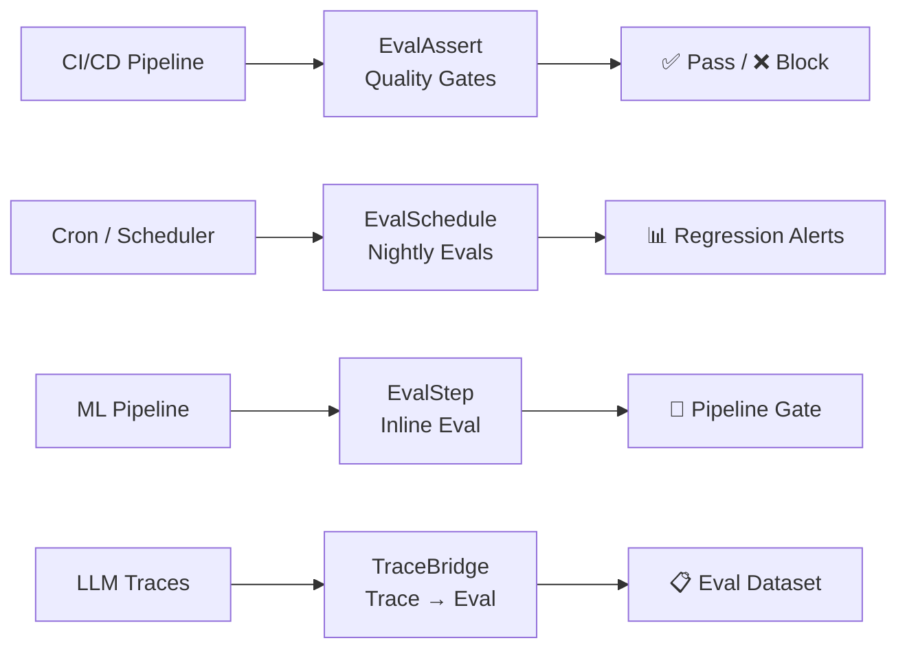

# 🛡️ Evaluation CI/CD & Continuous Monitoring

!!! info "What you'll learn"
    How to use `EvalAssert` for quality gates, `EvalSchedule` for continuous monitoring, `EvalStep` for pipeline-integrated evaluation, and `TraceBridge` for evaluating traced LLM interactions.

FlowyML provides a complete toolkit for **integrating evaluations into your ML lifecycle** — from blocking bad models in CI to detecting regressions in production overnight.

---

## Architecture Overview



---

## EvalAssert — Quality Gates

Block bad models from reaching production with assertion-based gates in your test suite:

```python
from flowyml.evals import EvalAssert, evaluate, Accuracy, F1Score

def test_model_quality():
    """Run as a pytest test — blocks deployment if assertions fail."""
    result = evaluate(data=golden_set, scorers=[Accuracy(), F1Score()])

    assertion = EvalAssert(result=result)
    assertion.assert_min_score("accuracy", 0.9)    # Must exceed 90%
    assertion.assert_min_score("f1_score", 0.85)   # Must exceed 85%
    assertion.assert_pass_rate(0.95)                # 95% of samples must pass
```

### Available Assertions

| Method | Description |
|---|---|
| `assert_min_score(name, threshold)` | Fail if scorer average is below threshold |
| `assert_max_score(name, threshold)` | Fail if scorer average exceeds threshold (e.g., toxicity) |
| `assert_pass_rate(rate)` | Fail if overall pass rate is below rate |
| `assert_no_regression(baseline)` | Fail if any scorer dropped vs. baseline |

### CLI for CI Pipelines

```bash
# Run evaluation and print results
flowyml eval run --data golden_set.csv --scorers accuracy,f1_score

# Assert thresholds (exits with code 1 on failure)
flowyml eval assert -d golden_set.csv -s accuracy --min-score accuracy 0.9

# Compare two experiment runs
flowyml eval compare --baseline v1 --current v2
```

### GitHub Actions Example

```yaml
- name: Evaluate Model Quality
  run: |
    flowyml eval assert \
      -d tests/golden_set.csv \
      -s accuracy,f1_score \
      --min-score accuracy 0.9 \
      --min-score f1_score 0.85
```

---

## EvalSchedule — Continuous Evaluation

Schedule evaluations to run automatically on a cron schedule with regression alerts:

```python
from flowyml.evals import EvalSchedule, Relevance, Faithfulness

schedule = EvalSchedule(
    name="nightly_rag_eval",
    dataset_name="production_golden_set",
    scorers=[Relevance(), Faithfulness()],
    cron="0 2 * * *",              # Daily at 2am
    baseline_experiment="rag_v2",   # Compare against this baseline
    alert_on_regression=True,       # Send alerts if scores drop
)
schedule.start()
```

### Configuration

| Parameter | Type | Description |
|---|---|---|
| `name` | `str` | Schedule identifier |
| `dataset_name` | `str` | Name of the EvalDataset to use |
| `scorers` | `list[Scorer]` | Scorers to run |
| `cron` | `str` | Cron expression for scheduling |
| `baseline_experiment` | `str` | Experiment to compare against |
| `alert_on_regression` | `bool` | Send alerts when scores drop |

---

## EvalStep — Pipeline Integration

Add quality gates directly into your ML pipelines:

```python
from flowyml import Pipeline
from flowyml.evals import EvalStep, Accuracy, F1Score

pipeline = Pipeline("training_with_eval")
pipeline.add_step(train_step)

# Evaluation gate — fails the pipeline if quality drops
eval_step = EvalStep(
    name="quality_gate",
    scorers=[Accuracy(threshold=0.9), F1Score(threshold=0.85)],
    fail_on_regression=True,
    baseline_experiment="model_v1",
)
pipeline.add_step(eval_step)

pipeline.add_step(deploy_step)  # Only runs if eval_step passes
```

---

## TraceBridge — Evaluate LLM Traces

Convert traced LLM interactions into evaluation datasets automatically:

```python
from flowyml.evals import evaluate_traces, Relevance, Toxicity

# Evaluate specific traces
results = evaluate_traces(
    trace_ids=["trace-001", "trace-002", "trace-003"],
    scorers=[Relevance(), Toxicity()],
    experiment="trace_quality_audit",
)

# Or evaluate all traces from a project
results = evaluate_traces(
    project="chatbot",
    scorers=[Relevance(), Toxicity()],
    limit=100,
)
```

### Programmatic TraceBridge

```python
from flowyml.evals import TraceBridge

bridge = TraceBridge()

# Convert traces to EvalDataset
eval_data = bridge.traces_to_dataset(
    trace_ids=["trace-001", "trace-002"],
    dataset_name="chatbot_golden_set",
)

# Now evaluate like any other dataset
result = evaluate(data=eval_data, scorers=[Relevance()])
```

---

## Best Practices

!!! tip "Start with EvalAssert in CI"
    Add `flowyml eval assert` to your CI pipeline first — it's the easiest win. Block bad models before they reach production.

!!! tip "Golden sets matter"
    Create a curated golden set of 50-200 examples with human labels. This is the foundation for all evaluation gates.

!!! warning "Schedule costs"
    Nightly evaluations with GenAI scorers cost LLM API calls. Monitor your `EvalSchedule` costs with `flowyml eval cost-report`.
