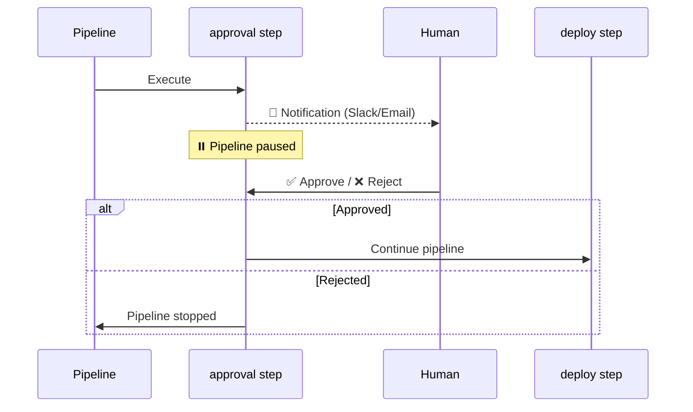

# ✋ Human-in-the-Loop & Approvals

!!! info "What you'll learn"
    How to pause pipelines for manual review, safety checks, or compliance approvals. Not everything should be automated — deployment to production often needs a human "thumbs up."

Inject human intelligence into automated workflows with approval gates that pause execution and wait for human decisions.

---

## Why Human Review Matters 🤔

| Use Case | Example |
|---|---|
| **Safety** | "Does this model output look safe?" |
| **Compliance** | "Has Legal approved this dataset?" |
| **Quality Assurance** | "Is the generated image high quality?" |
| **Cost Control** | "Approve spending $500 on this training run?" |
| **Deployment** | "Ready to deploy to production?" |

---

## ✋ Approval Steps

Insert an `approval` step anywhere in your pipeline to pause execution:

```python
from flowyml import Pipeline, step, approval

pipeline = Pipeline("deployment_pipeline")

@step
def train():
    return model

# 🛑 Pause here! Wait for human approval
approve_deploy = approval(
    name="approve_deploy",
    approver="lead-data-scientist",
    timeout_seconds=86400,  # 24 hours to approve
)

@step
def deploy(model):
    # Only runs if approved
    production.deploy(model)

pipeline.add_step(train)
pipeline.add_step(approve_deploy)
pipeline.add_step(deploy)
```

### How It Works



---

## Interactive CLI Approval 💻

When running locally, the pipeline pauses and prompts in the terminal:

```bash
$ flowyml run deployment_pipeline

...
[INFO] Step 'train' completed.
[WARN] ✋ Step 'approve_deploy' requires approval.
       Waiting for approval from: lead-data-scientist
       Timeout: 86400s
       Approve execution? [y/N]:
```

---

## Auto-Approval Logic 🤖

Define conditions for automatic approval — useful for CI/CD environments or non-production stages:

```python
import os

approve_deploy = approval(
    name="approve_deploy",
    approver="ml-team",
    auto_approve_if=lambda: os.getenv("ENVIRONMENT") == "staging",
)
```

| Environment | Behavior |
|---|---|
| `staging` | Auto-approved, no human needed |
| `production` | Pauses and waits for human approval |

---

## Approval Parameters ⚙️

| Parameter | Type | Default | Description |
|---|---|---|---|
| `name` | `str` | *required* | Step name |
| `approver` | `str` | *required* | Team or person to approve |
| `timeout_seconds` | `int` | `3600` | Max wait time (default: 1 hour) |
| `auto_approve_if` | `Callable` | `None` | Lambda for conditional auto-approval |

---

## Real-World Examples 🌍

### Multi-Stage Approval

```python
pipeline = Pipeline("regulated_deployment")
pipeline.add_step(train_model)

# Stage 1: ML team reviews quality
pipeline.add_step(approval(
    name="ml_review",
    approver="ml-team",
    timeout_seconds=86400,
))

# Stage 2: Compliance reviews fairness
pipeline.add_step(approval(
    name="compliance_review",
    approver="compliance-team",
    timeout_seconds=172800,  # 48 hours
))

pipeline.add_step(deploy_to_production)
```

### Cost Approval Gate

```python
@step(outputs=["estimated_cost"])
def estimate_training_cost(config):
    return calculate_gpu_cost(config)

pipeline.add_step(estimate_training_cost)
pipeline.add_step(approval(
    name="cost_approval",
    approver="engineering-manager",
    auto_approve_if=lambda: ctx["estimated_cost"] < 100,  # Auto-approve under $100
))
pipeline.add_step(train_expensive_model)
```

---

## 📧 Notifications

Approvers can be notified via configured channels when their attention is required. See [Notifications](notifications.md) for setup.

!!! tip "Combine with notifications"
    Configure Slack or email notifications so approvers get pinged immediately — don't make them check a dashboard.
