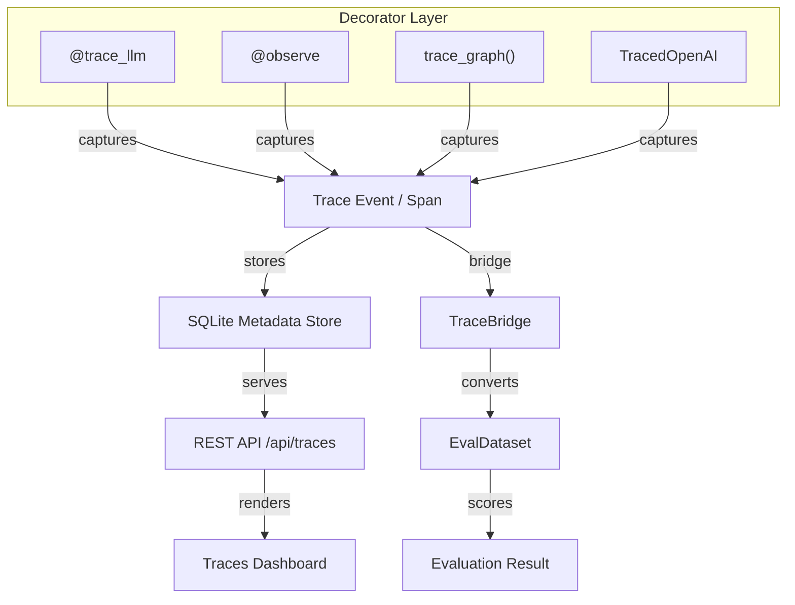

# GenAI & LLM Tracing 🕵️

flowyml provides built-in observability for Large Language Models (LLMs), giving you X-ray vision into your GenAI applications.

!!! tip "Comprehensive Guide Available"
    For full integration docs covering LangGraph, LangChain, OpenAI, CrewAI, session tracing, auto-evaluations, and more — see the **[GenAI Observability Guide](../integrations/genai-observability.md)**.

!!! info "What you'll learn"
    How to track token usage, costs, and latency for every LLM call. LLMs are black boxes — tracing turns them into transparent, measurable components.

## Architecture



## Why Tracing Matters

**Without tracing**:
- **Hidden costs**: "Why is our OpenAI bill $500 this month?"
- **Latency spikes**: "Why is the chatbot taking 10 seconds?"
- **Quality issues**: "What exact prompt caused this hallucination?"

**With flowyml tracing**:
- **Cost transparency**: See cost per call, per user, or per pipeline
- **Performance metrics**: Pinpoint slow steps in your RAG chain
- **Full context**: See the exact prompt and completion for every interaction

## 🕵️ LLM Call Tracing

You can trace any function as an LLM call or a chain of calls using the `@trace_llm` decorator. flowyml automatically captures:

*   ✅ **Prompts & Completions**: Full text of the inputs and outputs.
*   ✅ **Token Usage**: Breakdown of prompt, completion, and total tokens.
*   ✅ **Cost Estimation**: Automatic cost calculation based on the model tier.
*   ✅ **Latency**: Precise timing of each call.

### Basic Usage

```python
from flowyml import trace_llm
import openai

@trace_llm(name="text_generation", model="gpt-4")
def generate_text(prompt: str):
    response = openai.chat.completions.create(
        model="gpt-4",
        messages=[{"role": "user", "content": prompt}]
    )
    return response.choices[0].message.content

# This call will be automatically traced and logged to the UI
result = generate_text("Write a haiku about ML pipelines")
```

### Advanced: Nesting Traces (Chains)

For complex workflows like RAG (Retrieval-Augmented Generation), you can nest traces to see exactly where time and money are spent.

```python
from flowyml import trace_llm

@trace_llm(name="rag_chain", event_type="chain")
def rag_pipeline(query: str):
    # Retrieve context (Tool)
    context = retrieve_context(query)

    # Generate answer (LLM)
    answer = generate_answer(query, context)
    return answer
@trace_llm(name="retrieval", event_type="tool")
def retrieve_context(query: str):
    # Simulate vector DB lookup
    return "flowyml documentation..."

@trace_llm(name="generation", event_type="llm", model="gpt-4")
def generate_answer(query: str, context: str):
    # This call's tokens and cost will be tracked
    return openai.chat.completions.create(
        model="gpt-4",
        messages=[
            {"role": "system", "content": f"Context: {context}"},
            {"role": "user", "content": query}
        ]
    )
```

!!! tip "Pro Tip"
    Use `event_type="chain"` for the parent function and `"llm"` or `"tool"` for children. This creates a beautiful nested waterfall view in the UI.

## 📊 Viewing Traces

Traces are automatically persisted to the metadata store and can be visualized in the flowyml UI.

### In the UI

Navigate to the **Traces** tab in the flowyml Dashboard (`http://localhost:8080/traces`). You will see:

- **Timeline View**: A waterfall chart of your traces.
- **Latency & Cost**: Aggregated metrics for each trace.
- **Inputs & Outputs**: Full inspection of prompts and completions.
- **Token Usage**: Detailed breakdown of prompt vs. completion tokens.

### Programmatic Access

You can also retrieve traces via the Python API for analysis.

```python
from flowyml.storage.metadata import SQLiteMetadataStore

store = SQLiteMetadataStore()
trace = store.get_trace(trace_id="<trace_id>")

print(f"Latency: {trace.latency}ms")
print(f"Tokens: {trace.total_tokens}")
```

## 🏷️ Trace Attributes

You can add custom attributes to your traces for better filtering and analysis.

```python
@trace_llm(name="categorize", attributes={"model_version": "v2", "temperature": 0.7})
def categorize_text(text):
    # ...
```

---

## 🔌 Trace → Evaluation (TraceBridge)

Convert traced LLM interactions into evaluation datasets for automated quality auditing:

```python
from flowyml.evals import evaluate_traces, Relevance, Toxicity

results = evaluate_traces(
    trace_ids=["trace-001", "trace-002"],
    scorers=[Relevance(), Toxicity()],
    experiment="trace_quality_audit",
)
print(results.summary)  # {'relevance': 0.92, 'toxicity': 0.03}
```

!!! tip "Continuous Monitoring"
    Combine `evaluate_traces()` with `EvalSchedule` to automatically evaluate new traces every night.

---

## 💰 Cost Reference

| Model | Input (per 1K) | Output (per 1K) |
|---|---|---|
| `gpt-4o` | $0.005 | $0.015 |
| `gpt-4o-mini` | $0.00015 | $0.0006 |
| `gpt-4-turbo` | $0.01 | $0.03 |
| `claude-3-opus` | $0.015 | $0.075 |
| `claude-3-sonnet` | $0.003 | $0.015 |

!!! info "Custom Cost Models"
    Override pricing with `@trace_llm(cost_per_1k_input=..., cost_per_1k_output=...)`.

---

## 🌐 REST API

| Endpoint | Method | Description |
|---|---|---|
| `/api/traces/` | GET | List traces (filterable by project, type, trace_id) |
| `/api/traces/{trace_id}` | GET | Get a specific trace tree |
| `/api/traces/` | POST | Create or update a trace event |

```python
import requests

# List recent traces
traces = requests.get("http://localhost:8080/api/traces/?limit=10").json()

# Get a specific trace tree
tree = requests.get(f"http://localhost:8080/api/traces/{trace_id}").json()
```

---

## 📐 Event Types Reference

| Event Type | Description | Use Case |
|---|---|---|
| `llm` | A direct LLM API call | `openai.chat.completions.create()` |
| `chat_model` | A chat model call | `ChatOpenAI.invoke()` |
| `chain` | A parent wrapper/chain | RAG pipeline, multi-step workflow |
| `tool` | A tool/function call | Vector DB search, API call, calc |
| `agent` | An autonomous agent loop | ReAct agent, planning loops |
| `agent_action` | A specific agent action | Tool selection within agent loop |
| `embedding` | Embedding generation | `openai.embeddings.create()` |
| `retriever` | RAG retriever | Vector DB search |
| `graph_node` | LangGraph node execution | State machine transitions |
| `session` | Session-level event | Multi-turn conversation |
| `custom` | User-defined event | Any custom span |

---

## Next Steps

- **[GenAI Observability Guide](../integrations/genai-observability.md)** — Full integration docs for LangGraph, LangChain, OpenAI, CrewAI, session tracing, auto-evals
- **[Evaluations](../evaluations.md)** — Built-in scorers for quality, toxicity, and relevance
- **[Notifications](notifications.md)** — Set up alerts when traces breach quality thresholds
