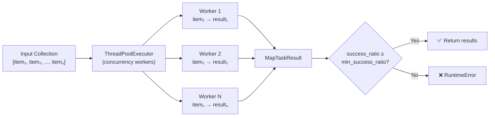

# 🗺️ Map Tasks

!!! info "What you'll learn"
    How to distribute work across collections with automatic parallelism, per-item retries, and partial failure tolerance — inspired by Flyte's array-node handler.

Map tasks let you **write a function for a single item** and have FlowyML automatically execute it over an entire collection in parallel with configurable concurrency, retry behaviour, and failure tolerance.

---

## Why Map Tasks?

| Without Map Tasks | With `@map_task` |
|---|---|
| Manual `for` loops | Automatic parallelism |
| No retry per item | Per-item retries with exponential backoff |
| One failure kills everything | Partial failure tolerance |
| No progress visibility | Result inspection with success ratios |

---

## Basic Usage

```python
from flowyml import map_task

@map_task(concurrency=4, retries=2, min_success_ratio=0.9)
def process_record(record: dict) -> dict:
    """Process a single record — FlowyML handles the rest."""
    return transform(record)

# Use in pipeline
pipeline.add_step(process_record, inputs=["raw_records"], outputs=["processed"])
```

When `process_record` receives a **list** of records at runtime, FlowyML:

1. Distributes items across a thread pool (up to `concurrency` workers)
2. Retries each failed item up to `retries` times with exponential backoff
3. Returns a `MapTaskResult` containing successes, failures, and error details
4. Raises `RuntimeError` only if the success ratio falls below `min_success_ratio`

---

## Configuration Reference

| Parameter | Type | Default | Description |
|---|---|---|---|
| `concurrency` | `int` | `4` | Maximum parallel workers |
| `retries` | `int` | `0` | Per-item retry count |
| `retry_delay` | `float` | `1.0` | Base delay between retries (seconds, exponential) |
| `min_success_ratio` | `float` | `1.0` | Minimum ratio of items that must succeed |
| `fail_fast` | `bool` | `False` | Cancel remaining items on first failure |
| `timeout_per_item` | `int \| None` | `None` | Optional per-item timeout (seconds) |
| `name` | `str \| None` | Function name | Custom step name |

---

## Real-World Examples

### Batch Data Processing

```python
@map_task(concurrency=8, retries=1)
def clean_text(text: str) -> str:
    """Clean and normalize a single text document."""
    text = text.strip().lower()
    text = remove_html_tags(text)
    return text

# Process 10,000 documents with 8 parallel workers
pipeline.add_step(clean_text, inputs=["raw_texts"], outputs=["clean_texts"])
```

### Image Processing with Failure Tolerance

```python
@map_task(concurrency=4, retries=3, min_success_ratio=0.95, retry_delay=2.0)
def resize_image(image_path: str) -> str:
    """Resize a single image — up to 5% can fail without breaking the pipeline."""
    img = load_image(image_path)
    resized = img.resize((224, 224))
    output_path = image_path.replace("raw/", "resized/")
    resized.save(output_path)
    return output_path
```

### Fail-Fast Mode

```python
@map_task(concurrency=2, fail_fast=True)
def validate_record(record: dict) -> dict:
    """Validate a record — stop immediately if any record is invalid."""
    if not record.get("id"):
        raise ValueError("Missing ID")
    return record
```

---

## Result Inspection

Every map task returns a `MapTaskResult` dataclass:

```python
result = process_records(my_records)

print(f"Total:    {result.total}")
print(f"Success:  {result.successes}")
print(f"Failures: {result.failures}")
print(f"Ratio:    {result.success_ratio:.1%}")

# Inspect failures
for idx, error_msg in result.errors.items():
    print(f"  Item {idx} failed: {error_msg}")

# Get only successful outputs (no Nones)
clean_results = result.successful_results
```

### `MapTaskResult` API

| Attribute | Type | Description |
|---|---|---|
| `results` | `list[Any]` | All results (`None` for failed items) |
| `successes` | `int` | Count of successful items |
| `failures` | `int` | Count of failed items |
| `errors` | `dict[int, str]` | Index → error message for failures |
| `total` | `int` | Total items processed |
| `success_ratio` | `float` | Property: `successes / total` |
| `successful_results` | `list[Any]` | Property: only non-None results |

---

## How It Works Under the Hood



---

## Best Practices

!!! tip "Choosing concurrency"
    - **I/O-bound tasks** (API calls, file reads): Use higher concurrency (8–32)
    - **CPU-bound tasks** (data transformations): Match CPU core count (4–8)
    - **GPU tasks**: Keep at 1–2 to avoid memory pressure

!!! tip "Retry strategy"
    Set `retries=2` with `retry_delay=1.0` for network calls. The backoff is exponential: delays are `1s → 2s → 4s`.

!!! warning "Thread safety"
    Map tasks use `ThreadPoolExecutor`. Ensure your function is thread-safe — avoid shared mutable state.
