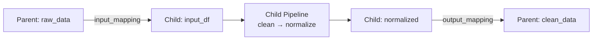

# 🧩 Sub-Pipeline Composition

!!! info "What you'll learn"
    How to nest entire pipelines as steps in other pipelines for modular, reusable, and testable workflow design.

Sub-pipelines let you **compose complex workflows from smaller, tested units** — like function composition, but for entire DAGs. Each child pipeline runs in its own execution context while the parent manages data flow between them.

---

## Why Sub-Pipelines? 🤔

| Monolithic Pipelines | Sub-Pipeline Composition |
|---|---|
| One giant pipeline | Modular, reusable units |
| Hard to test in isolation | Test each child independently |
| Code duplication | Share preprocessing across projects |
| Everything visible | Encapsulate implementation details |

---

## Basic Usage 🚀

```python
from flowyml import Pipeline, step

# 1. Define reusable child pipeline
preprocess = Pipeline("preprocessing")

@step(outputs=["cleaned"])
def clean_data(raw_data):
    return raw_data.dropna()

@step(inputs=["cleaned"], outputs=["normalized"])
def normalize(cleaned):
    return (cleaned - cleaned.mean()) / cleaned.std()

preprocess.add_step(clean_data)
preprocess.add_step(normalize)

# 2. Compose into parent pipeline
parent = Pipeline("training")
parent.add_sub_pipeline(
    preprocess,
    inputs=["raw_data"],
    outputs=["clean_data"],
)
parent.add_step(train_model)
parent.run()
```

---

## Input / Output Mapping 📥

Map parent output names to child input names (and vice versa) when they differ:

```python
parent.add_sub_pipeline(
    preprocess,
    inputs=["raw_data"],
    outputs=["clean_data"],
    input_mapping={"raw_data": "input_df"},       # parent name → child name
    output_mapping={"normalized": "clean_data"},   # child name → parent name
)
```

### How Mapping Works



- **`input_mapping`**: Translates parent output names into the child pipeline's expected input names
- **`output_mapping`**: Translates child output names back into the parent's namespace
- **Unmapped keys** are passed through as-is

---

## Programmatic API 🛠️

Use `SubPipelineStep` directly for full control:

```python
from flowyml.core.subpipeline import SubPipelineStep

sub_step = SubPipelineStep(
    sub_pipeline=preprocess,
    name="data_prep",
    inputs=["raw"],
    outputs=["clean"],
    input_mapping={"raw": "input_df"},
    output_mapping={"normalized": "clean"},
)
parent.add_step(sub_step)
```

Or use the convenience function:

```python
from flowyml import sub_pipeline

parent.add_step(
    sub_pipeline(
        preprocess,
        inputs=["raw"],
        outputs=["clean"],
        output_mapping={"normalized": "clean"},
    )
)
```

---

## Real-World Examples 🌍

### Shared Preprocessing Across Projects

```python
# preprocessing.py — reusable module
def create_preprocess_pipeline():
    pipe = Pipeline("preprocess")
    pipe.add_step(load_data)
    pipe.add_step(handle_missing)
    pipe.add_step(encode_categoricals)
    pipe.add_step(scale_features)
    return pipe

# training.py
preprocess = create_preprocess_pipeline()
training = Pipeline("training")
training.add_sub_pipeline(preprocess, inputs=["raw"], outputs=["features"])
training.add_step(train_model)
training.add_step(evaluate_model)
```

### Multi-Stage ML Pipeline

```python
# Compose three child pipelines into one parent
parent = Pipeline("end_to_end")

parent.add_sub_pipeline(
    data_pipeline,
    inputs=["raw_data"],
    outputs=["features"],
)
parent.add_sub_pipeline(
    training_pipeline,
    inputs=["features"],
    outputs=["model"],
)
parent.add_sub_pipeline(
    evaluation_pipeline,
    inputs=["model", "features"],
    outputs=["report"],
)
parent.run()
```

---

## `SubPipelineStep` API Reference

### Constructor Parameters

| Parameter | Type | Default | Description |
|---|---|---|---|
| `sub_pipeline` | `Pipeline` | *required* | The child pipeline to wrap |
| `name` | `str \| None` | `"sub:{pipeline.name}"` | Step name in parent |
| `inputs` | `list[str]` | `[]` | Input names from parent |
| `outputs` | `list[str]` | `[]` | Output names exposed to parent |
| `input_mapping` | `dict[str, str]` | `{}` | Parent → child name mapping |
| `output_mapping` | `dict[str, str]` | `{}` | Child → parent name mapping |

---

## Best Practices 💡

!!! tip "Design for reusability"
    Build child pipelines as standalone modules with their own tests. Import and compose them in parent pipelines.

!!! tip "Naming convention"
    Use descriptive names: `parent.add_sub_pipeline(preprocess, name="feature_engineering")` makes logs easier to read.

!!! warning "Context isolation"
    Child pipelines run with `auto_start_ui=False`. They share the parent's storage but have their own execution context.
