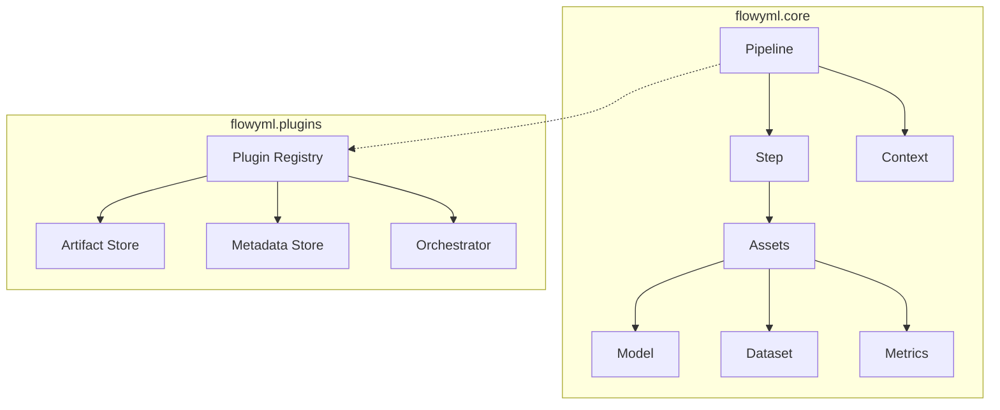

<div class="hero-section" markdown>

## 📋 Core API Reference

Complete reference for FlowyML's foundational classes and functions.

<span class="feature-badge">🎢 Pipeline</span>
<span class="feature-badge">👣 Step</span>
<span class="feature-badge">📜 Context</span>
<span class="feature-badge">📦 Assets</span>

</div>

## Overview

The `flowyml.core` module contains the fundamental building blocks for creating ML pipelines:

| Class | Purpose | Import |
|-------|---------|--------|
| `Pipeline` | Orchestrates steps into a directed acyclic graph (DAG) | `from flowyml import Pipeline` |
| `step` | Decorator that converts functions into pipeline steps | `from flowyml import step` |
| `context` | Creates a configuration context for parameter injection | `from flowyml import context` |
| `Model` | First-class model artifact with metadata and lineage | `from flowyml import Model` |
| `Dataset` | First-class dataset artifact | `from flowyml import Dataset` |
| `Metrics` | First-class metrics artifact | `from flowyml import Metrics` |

## Quick Import Reference

```python
# Core imports — everything you need for basic pipelines
from flowyml import Pipeline, step, context, Model

# Extended imports for advanced use cases
from flowyml import Dataset, Metrics
from flowyml import map_task, dynamic
from flowyml.core.pipeline import PipelineResult, SubPipelineStep
from flowyml.core.step import StepConfig
from flowyml.core.context import Context
```

## Architecture



!!! info "Module Hierarchy"
    The core module is designed as a layered architecture. **Pipeline** orchestrates **Steps**, which consume and produce **Assets**. The **Context** provides runtime configuration that flows through the entire graph. Plugins extend behavior without touching core logic.

## Detailed References

Each core class has its own detailed API page:

| Page | Key Methods | Common Use Case |
|------|-------------|----------------|
| [Pipeline](pipeline.md) | `add_step()`, `run()`, `build()`, `schedule()` | Orchestrating ML workflows |
| [Step](step.md) | `@step()` decorator, `inputs`, `outputs`, `cache` | Defining pipeline operations |
| [Context](context.md) | `context()`, parameter injection, env overrides | Configuring pipeline behavior |
| [Assets](assets.md) | `Model()`, `Dataset()`, `Metrics()`, lineage | Managing ML artifacts |

!!! tip "Start Here"
    If you're new to FlowyML, start with the [Getting Started Guide](../getting-started.md) before diving into the API reference.

## Related Modules

Beyond the core module, FlowyML provides additional API surface for advanced use cases:

| Module | Description |
|--------|-------------|
| [Plugins](plugins.md) | Plugin registry, artifact stores, metadata stores, orchestrators |
| [Decorators](decorators.md) | `@step`, `@pipeline`, `@dynamic` — all decorator variants |
| [Types](types.md) | Type annotations for step inputs/outputs |
| [Exceptions](exceptions.md) | Error classes and exception hierarchy |
| [Utils](utils.md) | Helper functions, logging, and configuration utilities |

---

## 🚀 What's Next?

<div class="header-grid" markdown>

<div class="header-card" markdown>

### 🎢 Pipeline API
Full reference for Pipeline construction, execution, and lifecycle methods.

[View Pipeline API →](pipeline.md)

</div>

<div class="header-card" markdown>

### 👣 Step API
Decorator configuration, inputs/outputs, caching strategies, and resource requirements.

[View Step API →](step.md)

</div>

<div class="header-card" markdown>

### 📦 Assets API
Model, Dataset, and Metrics artifacts with lineage tracking and type-based routing.

[View Assets API →](assets.md)

</div>

</div>
