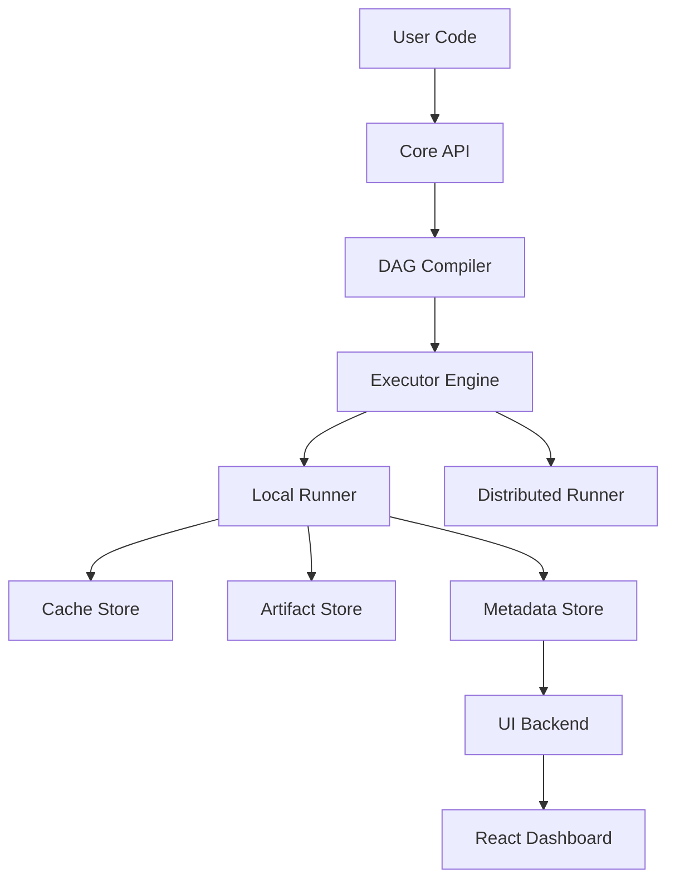

# Architecture 🏗️

flowyml is designed as a modular, layered system that separates pipeline definition, execution, storage, and visualization.

## High-Level Architecture 🗺️

## Core Components 🧩

### 1. Pipeline Definition Layer
- **Pipeline**: The container for steps and configuration.
- **Step**: A unit of work, wrapped by the `@step` decorator.
- **Context**: Manages parameters and runtime state.

### 2. Execution Engine
- **DAG**: Directed Acyclic Graph representing dependencies.
- **Executor**: Handles the execution of the DAG.
    - `LocalExecutor`: Runs steps in the current process/thread.
    - `DistributedExecutor`: (Planned) Runs steps on remote workers.
- **Cache**: Intercepts execution to return stored results if inputs haven't changed.

### 3. Storage Layer
- **Artifact Store**: Stores large binary objects (datasets, models).
    - Local Filesystem
    - S3 / GCS / Azure Blob (via `fsspec`)
- **Metadata Store**: Stores lightweight metadata about runs, steps, and artifacts.
    - SQLite (default)
    - PostgreSQL / MySQL

### 4. UI Architecture

The UI follows a decoupled client-server architecture.

#### Backend (FastAPI)
- **API Endpoints**: REST API for pipelines, runs, and assets.
- **Static File Serving**: Serves the compiled React frontend.
- **State Management**: Reads from the Metadata Store.

#### Frontend (React + Vite)
- **SPA**: Single Page Application.
- **Visualization**: Uses `reactflow` for DAG visualization.
- **Real-time**: Polls backend for updates (WebSocket planned).

## Data Flow 🔄

1.  **Definition**: User defines `@pipeline` and `@step` functions.
2.  **Compilation**: When `pipeline()` is called, flowyml builds a DAG based on data dependencies.
3.  **Execution**:
    - Executor traverses the DAG topologically.
    - For each step:
        - Check Cache: If valid cache exists, skip execution and return result.
        - Execute: Run the user function with injected context.
        - Store: Save output artifacts and metadata.
4.  **Monitoring**:
    - Metadata is written to SQLite.
    - UI Backend reads SQLite and serves data to Frontend.

## Design Principles 💡

- **Zero Config**: Works out of the box with sensible defaults.
- **Asset-Centric**: Focus on the data (artifacts) produced, not just the tasks.
- **Framework Agnostic**: Works with PyTorch, TensorFlow, sklearn, or raw Python.
- **Progressive Disclosure**: Simple for beginners, powerful for experts.
