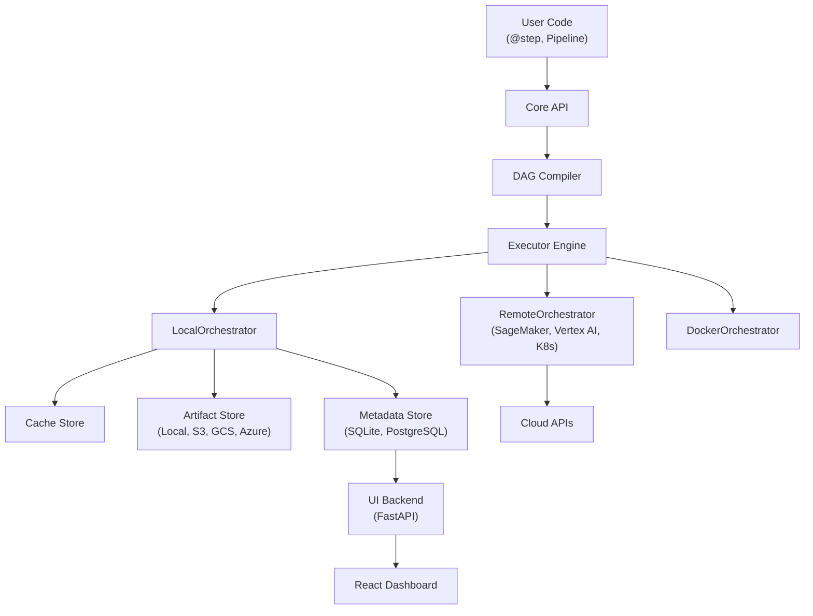
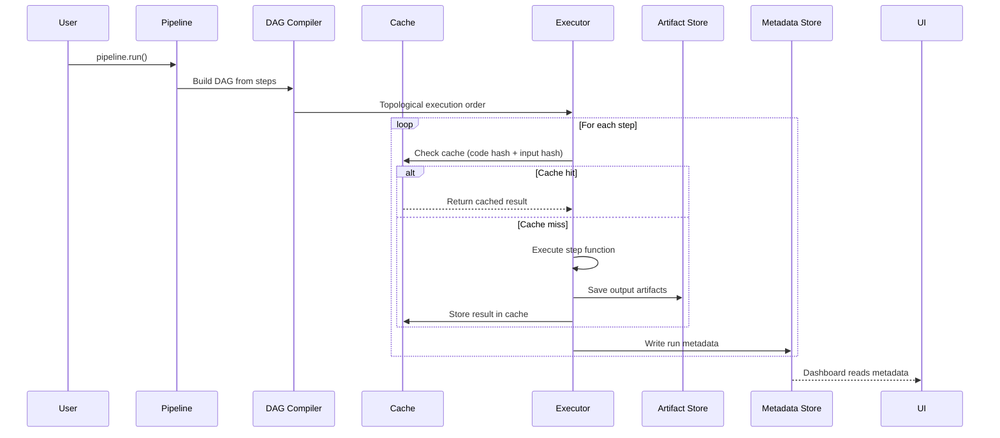

<div class="hero-section" markdown>

## 🏗️ Architecture

Understand how FlowyML is structured internally — from pipeline definition through DAG construction, step execution, artifact routing, and dashboard visualization. Essential knowledge for power users and contributors.

<span class="feature-badge">🎢 Pipeline Engine</span>
<span class="feature-badge">📦 Artifact Store</span>
<span class="feature-badge">🗄️ Metadata Store</span>
<span class="feature-badge">🖥️ Dashboard</span>

</div>

!!! info "What you'll learn"
    How FlowyML is structured internally — from pipeline definition to execution, storage, and visualization. Understanding the architecture helps you make better design decisions and troubleshoot issues.

FlowyML is designed as a modular, layered system that separates **pipeline definition**, **execution**, **storage**, and **visualization** into independent components.

---

## High-Level Architecture


```mermaid
graph TD
    User["User Code<br/>(@step, Pipeline)"] --> API["Core API"]
    API --> Compiler["DAG Compiler"]
    Compiler --> Executor["Executor Engine"]

    Executor --> Local["LocalOrchestrator"]
    Executor --> Remote["RemoteOrchestrator<br/>(SageMaker, Vertex AI, K8s)"]
    Executor --> Docker["DockerOrchestrator"]

    Local --> Cache["Cache Store"]
    Local --> Artifacts["Artifact Store<br/>(Local, S3, GCS, Azure)"]
    Local --> Metadata["Metadata Store<br/>(SQLite, PostgreSQL)"]

    Metadata --> UIBackend["UI Backend<br/>(FastAPI)"]
    UIBackend --> Frontend["React Dashboard"]

    Remote --> CloudAPI["Cloud APIs"]
```

---

## Core Components

### 1. Pipeline Definition Layer

The user-facing API for defining ML workflows:

| Component | Role |
|---|---|
| **Pipeline** | Container for steps, config, and execution |
| **Step** | Unit of work, wrapped by `@step` decorator |
| **Context** | Manages parameters and runtime state injection |
| **Assets** | Typed artifacts (Model, Dataset, Metric) with lineage |

### 2. Execution Engine

Handles DAG compilation and execution:

| Component | Role |
|---|---|
| **DAG Compiler** | Builds dependency graph from step inputs/outputs |
| **LocalOrchestrator** | Executes steps in current process/thread |
| **DockerOrchestrator** | Runs steps in isolated Docker containers |
| **RemoteOrchestrator** | Submits jobs to cloud platforms (async) |
| **Cache** | Intercepts execution; returns stored results if unchanged |

### 3. Storage Layer

Persists artifacts and metadata:

| Store | Default | Alternatives |
|---|---|---|
| **Artifact Store** | Local filesystem | S3, GCS, Azure Blob (via `fsspec`) |
| **Metadata Store** | SQLite | PostgreSQL, MySQL |

### 4. UI Architecture

Decoupled client-server architecture:

| Layer | Technology | Role |
|---|---|---|
| **Backend** | FastAPI | REST API for pipelines, runs, assets, traces |
| **Frontend** | React + Vite | SPA with DAG visualization (`reactflow`) |
| **Transport** | REST (WebSocket planned) | Real-time updates via polling |

---

## Data Flow


```mermaid
sequenceDiagram
    participant User
    participant Pipeline
    participant Compiler as DAG Compiler
    participant Cache
    participant Executor
    participant Store as Artifact Store
    participant Meta as Metadata Store
    participant UI

    User->>Pipeline: pipeline.run()
    Pipeline->>Compiler: Build DAG from steps
    Compiler->>Executor: Topological execution order

    loop For each step
        Executor->>Cache: Check cache (code hash + input hash)
        alt Cache hit
            Cache-->>Executor: Return cached result
        else Cache miss
            Executor->>Executor: Execute step function
            Executor->>Store: Save output artifacts
            Executor->>Cache: Store result in cache
        end
        Executor->>Meta: Write run metadata
    end

    Meta-->>UI: Dashboard reads metadata
```

---

## Design Principles

| Principle | What It Means |
|---|---|
| **Zero Config** | Works out of the box with sensible defaults |
| **Asset-Centric** | Focus on data produced (artifacts), not just tasks |
| **Framework Agnostic** | Works with PyTorch, TensorFlow, sklearn, or raw Python |
| **Progressive Disclosure** | Simple for beginners, powerful for experts |
| **Infrastructure as Config** | Change deployment target via env variable, not code |

---

## Module Map

```
flowyml/
├── core/               # Pipeline, Step, Context, DAG
├── io/                 # Materializers (serialization/deserialization)
├── storage/            # Artifact Store, Metadata Store, Cache
├── integrations/       # Cloud providers, ML frameworks
├── monitoring/         # Alerts, System/Pipeline monitors, Data drift
├── tracking/           # Experiment tracking, Model leaderboard
├── evals/              # Evaluation framework (17+ scorers)
├── plugins/            # Plugin system (native + external)
├── stacks/             # Stack management (local, cloud, hybrid)
└── ui/                 # FastAPI backend + React frontend
```

---

## 📍 What's Next?

<div class="header-grid" markdown>

<div class="header-card" markdown>
### 💎 Artifact-Centric Philosophy
The design principles behind FlowyML.

[Philosophy →](artifact-centric.md)
</div>

<div class="header-card" markdown>
### 🔌 Plugin System
How the extensible plugin architecture works.

[Plugins →](plugins/overview.md)
</div>

<div class="header-card" markdown>
### 🏛️ Stack Architecture
Multi-cloud infrastructure abstraction layer.

[Stacks →](architecture/stacks.md)
</div>

</div>
