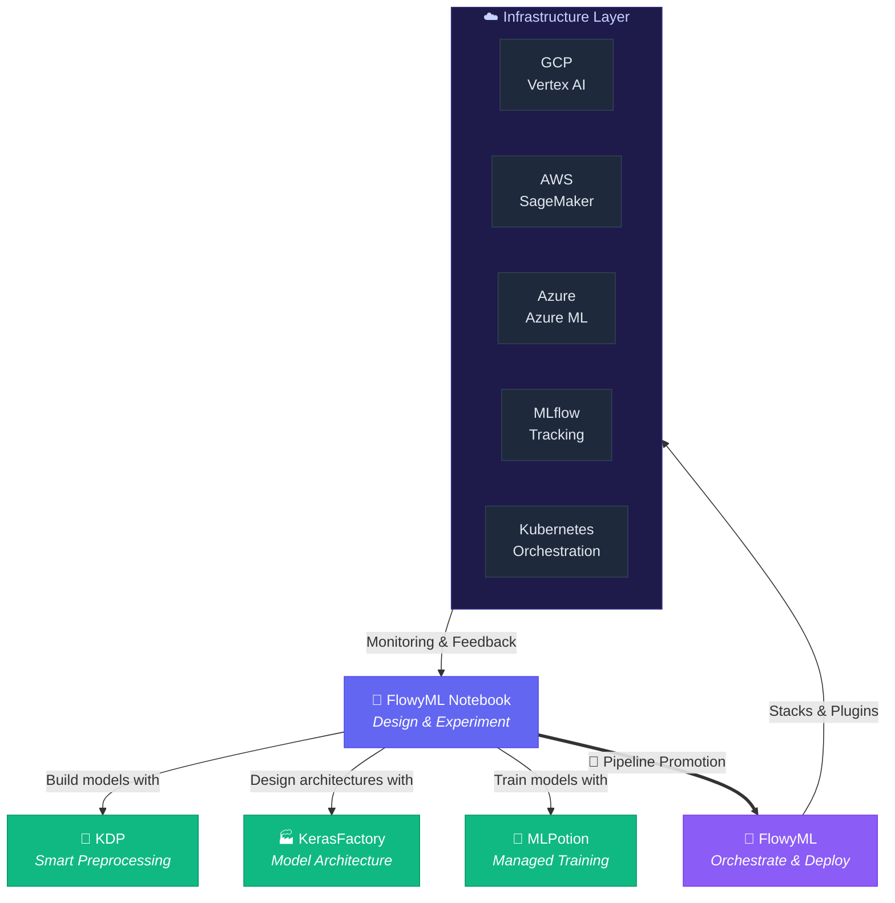

<div class="hero-section" markdown>

# 🌐 The FlowyML Ecosystem

**FlowyML-Universe** provides a complete, end-to-end suite of tools for the modern ML team — from interactive experimentation in a reactive notebook, through artifact-centric pipeline orchestration, to one-click cloud deployment. Every tool is designed to work together seamlessly so you can focus on **the science, not the plumbing.**

<div class="badge-row">
<span class="feature-badge">📓 Reactive Notebook</span>
<span class="feature-badge">🌊 Pipeline Orchestration</span>
<span class="feature-badge">🧠 Keras Ecosystem</span>
<span class="feature-badge">☁️ Multi-Cloud</span>
<span class="feature-badge">🔌 50+ Integrations</span>
</div>

<div class="stats-strip">
<div class="stat-item"><span class="stat-number">5</span><span class="stat-label">Core Products</span></div>
<div class="stat-item"><span class="stat-number">43</span><span class="stat-label">Built-in Recipes</span></div>
<div class="stat-item"><span class="stat-number">50+</span><span class="stat-label">Integrations</span></div>
<div class="stat-item"><span class="stat-number">3</span><span class="stat-label">Clouds Supported</span></div>
</div>

</div>

---

## 📓 FlowyML Notebook <span class="feature-pill new">NEW</span>

> **The Reactive Notebook That Ships to Production**

FlowyML Notebook is a **reactive, DAG-powered notebook** that replaces Jupyter for production ML workflows. Write pure Python cells, get automatic dependency tracking, and ship directly to FlowyML pipelines, dashboards, and interactive apps — all without leaving the notebook.

<div class="hero-section" markdown>

### 🚀 Why FlowyML Notebook?

Jupyter gave us **exploration**. Marimo gave us **reactivity**. FlowyML Notebook gives you **both** — plus a direct bridge to **production pipelines**, **one-click deployments**, and an **AI-powered development experience** that no other notebook offers.

<div class="badge-row">
<span class="feature-badge">⚡ Reactive DAG</span>
<span class="feature-badge">🐍 Pure .py</span>
<span class="feature-badge">🚀 Pipeline Promotion</span>
<span class="feature-badge">🤖 AI Assistant</span>
<span class="feature-badge">📊 SmartPrep</span>
<span class="feature-badge">🔬 43 Recipes</span>
</div>

</div>

### ⚡ Quick Start

=== "Standard Install"

    ```bash
    pip install flowyml-notebook
    ```

=== "Full Install (all extras)"

    ```bash
    pip install "flowyml-notebook[all]"
    ```

=== "Development Server"

    ```bash
    # Hot-reload for development
    fml-notebook dev

    # Production mode
    fml-notebook start
    ```

### 🧬 Core Capabilities

<div class="pitch-grid" markdown>

<div class="pitch-card" markdown>
### ⚡ Reactive DAG Engine
Cells form a **dependency graph**. Change a variable, and only the dependent cells re-execute — no stale state, no manual re-runs. Think spreadsheet-meets-notebook.
</div>

<div class="pitch-card" markdown>
### 🐍 Pure .py Storage
Notebooks are saved as **plain Python files** — not `.ipynb` JSON. That means real `git diff`, linting, importing, and code review. Your notebooks are now **first-class code**.
</div>

<div class="pitch-card" markdown>
### 📊 Rich Data Exploration
Every DataFrame gets an automatic **10-tab profiling panel** — statistics, distributions, correlations, missing values, and more. Understand your data before you model it.
</div>

</div>

<div class="pitch-grid" markdown>

<div class="pitch-card" markdown>
### 🧹 SmartPrep Advisor <span class="feature-pill pro">PRO</span>
Auto-detects **data quality issues** — missing values, outliers, skew, cardinality — and generates **one-click fix code** directly into your notebook. Data cleaning on autopilot.
</div>

<div class="pitch-card" markdown>
### 🎯 Algorithm Matchmaker <span class="feature-pill pro">PRO</span>
Tell it your task type and target column. It **auto-ranks ML algorithms**, benchmarks them, and generates ready-to-run **scikit-learn pipeline code** tailored to your data.
</div>

<div class="pitch-card" markdown>
### 📚 43 Built-in Recipes
Reusable code templates across **9 categories** — data loading, preprocessing, modeling, evaluation, visualization, deployment, and more. Stop writing boilerplate.
</div>

</div>

### 🔧 Full Feature Set

<div class="header-grid" markdown>

<div class="header-card" markdown>
#### 🔗 GitHub Integration
Branch, commit, push, and pull from the **notebook sidebar**. No terminal needed — version control is built into your workflow.
</div>

<div class="header-card" markdown>
#### 🚀 Pipeline Promotion
Promote notebooks directly to **production FlowyML pipelines** with a single click. Your experiment becomes your deployment.
</div>

<div class="header-card" markdown>
#### 📦 One-Click Deploy
Export as **REST API**, **Docker container**, **HTML/PDF report**, or **interactive web app**. From notebook to production in seconds.
</div>

<div class="header-card" markdown>
#### 🤖 AI Assistant
Context-aware code generation powered by **OpenAI**, **Google AI**, **Ollama**, or **Anthropic**. It knows your data, your cells, and your intent.
</div>

<div class="header-card" markdown>
#### 🗄️ SQL First-Class
Mixed **Python + SQL** cells with built-in **DuckDB** for in-memory analytics or **SQLAlchemy** for remote databases. Query results flow into the DAG.
</div>

<div class="header-card" markdown>
#### 🖥️ App Mode
Turn any notebook into a **web application** with 5 layout options — dashboard, report, slides, sidebar, and custom. Share insights, not code.
</div>

<div class="header-card" markdown>
#### 🧠 Keras Ecosystem
Native integration with **KDP**, **KerasFactory**, and **MLPotion** — the UnicoLab Keras stack is a first-class citizen inside the notebook.
</div>

<div class="header-card" markdown>
#### 🔄 Live Collaboration <span class="feature-pill beta">BETA</span>
Real-time multiplayer editing with **cursor presence**, **cell locking**, and **conflict resolution**. Pair-program inside the notebook.
</div>

<div class="header-card" markdown>
#### 📈 Experiment Tracking
Every run is automatically logged — **parameters**, **metrics**, **artifacts**, and **lineage**. Compare experiments without leaving the notebook.
</div>

</div>

### 📊 FlowyML Notebook vs. The Competition

| Feature | Jupyter | Deepnote | Marimo | **FlowyML Notebook** |
|---|:---:|:---:|:---:|:---:|
| **Reactive DAG** | ❌ | ❌ | ✅ | ✅ |
| **Pure .py Storage** | ❌ | ❌ | ✅ | ✅ |
| **Git-Native** | ❌ | ⚠️ | ❌ | ✅ |
| **Pipeline Integration** | ❌ | ❌ | ❌ | ✅ |
| **Reusable Recipes** | ❌ | ❌ | ❌ | ✅ |
| **One-Click Deploy** | ❌ | ⚠️ | ❌ | ✅ |
| **SQL First-Class** | ❌ | ✅ | ✅ | ✅ |
| **AI Assistant** | ❌ | ✅ | ❌ | ✅ |
| **Self-Hosted** | ✅ | ❌ | ✅ | ✅ |
| **SmartPrep Advisor** | ❌ | ❌ | ❌ | ✅ |
| **Algorithm Matchmaker** | ❌ | ❌ | ❌ | ✅ |

!!! success "FlowyML Notebook is the only notebook that combines reactivity, pure Python storage, and direct pipeline integration with production ML orchestration."

### 🔗 Links & Resources

<div class="header-grid" markdown>

<div class="header-card" markdown>
#### :fontawesome-brands-github: GitHub
Source code, issues, and contributions

[:octicons-arrow-right-24: github.com/UnicoLab/flowyml-notebook](https://github.com/UnicoLab/flowyml-notebook)
</div>

<div class="header-card" markdown>
#### :material-book-open-variant: Documentation
Guides, tutorials, and API reference

[:octicons-arrow-right-24: unicolab.github.io/flowyml-notebook](https://unicolab.github.io/flowyml-notebook/latest/)
</div>

<div class="header-card" markdown>
#### :fontawesome-brands-python: PyPI
Install via pip

[:octicons-arrow-right-24: pypi.org/project/flowyml-notebook](https://pypi.org/project/flowyml-notebook/)
</div>

</div>

---

## 🧠 UnicoLab Keras Ecosystem {#keras-ecosystem}

The UnicoLab Keras Ecosystem is a trio of libraries that supercharges **Keras** and **TensorFlow** workflows — from data preprocessing to model architecture to managed training. Every component integrates natively with FlowyML Notebook and FlowyML Pipelines.

<div class="pitch-grid" markdown>

<div class="pitch-card" markdown>
### 🔮 KDP — Keras Data Processor

**Smart preprocessing layers** that plug directly into your Keras model. Handle tabular features, text, images, and mixed-modality inputs with learnable preprocessing — no separate pipeline needed.

```python
from kdp import PreprocessingModel

preprocessor = PreprocessingModel(
    path_data="train.csv",
    features_specs={
        "age": FeatureType.FLOAT_NORMALIZED,
        "city": FeatureType.STRING_CATEGORICAL,
        "bio": FeatureType.TEXT,
    }
)
model = preprocessor.build_preprocessor()
```

<span class="feature-pill pro">PRO</span> Learnable preprocessing inside the model graph

[:octicons-arrow-right-24: KDP on GitHub](https://github.com/UnicoLab/keras-data-processor)
</div>

<div class="pitch-card" markdown>
### 🏭 KerasFactory

**38+ reusable Keras layers and architectures** — attention blocks, residual connections, transformer encoders, tabular heads, and more. Stop reimplementing the same layers project after project.

```python
from keras_factory import TabularModel

model = TabularModel(
    numerical_features=["age", "income"],
    categorical_features=["city", "plan"],
    architecture="residual_attention",
    output_units=1,
    output_activation="sigmoid",
)
model.compile(optimizer="adam", loss="binary_crossentropy")
```

<span class="feature-pill new">NEW</span> 38+ production-tested layer recipes

[:octicons-arrow-right-24: KerasFactory on GitHub](https://github.com/UnicoLab/KerasFactory)
</div>

<div class="pitch-card" markdown>
### 🧪 MLPotion

**Managed training pipelines** for Keras models — experiment tracking, hyperparameter sweeps, early stopping strategies, and reproducible training runs, all configurable via YAML or Python.

```python
from mlpotion import TrainingPipeline

pipeline = TrainingPipeline(
    model=model,
    data=dataset,
    config="training_config.yaml",
    experiment_name="fraud_detection_v3",
)
results = pipeline.run()
print(results.best_metrics)
```

<span class="feature-pill beta">BETA</span> YAML-driven training orchestration

[:octicons-arrow-right-24: MLPotion on GitHub](https://github.com/UnicoLab/MLPotion)
</div>

</div>

!!! info "🔗 End-to-End Keras Workflow"
    **KDP** prepares your data → **KerasFactory** builds your architecture → **MLPotion** manages training → **FlowyML** orchestrates everything in production. All from a single **FlowyML Notebook**.

---

## 🔌 Integration Ecosystem

FlowyML connects to the tools you already use. Swap backends, cloud providers, and experiment trackers without touching your pipeline code.

<div class="pitch-grid" markdown>

<div class="pitch-card" markdown>
### 🤖 ML Frameworks

First-class support for the leading ML frameworks — use any of them inside FlowyML steps.

- **Keras** / **TensorFlow** — Native callbacks & asset types
- **PyTorch** — Checkpoint tracking & model serialization
- **Scikit-learn** — Pipeline wrapping & artifact capture
- **HuggingFace** 🤗 — Tokenizers, models, and datasets
- **XGBoost** / **LightGBM** — Tree-based model support
</div>

<div class="pitch-card" markdown>
### 📊 Experiment Tracking

Log metrics, parameters, and artifacts to your tracking platform of choice.

- **MLflow** — Full experiment tracker plugin
- **Weights & Biases** — Native W&B integration
- **FlowyML UI** — Built-in dashboard at `localhost:8080`
- **TensorBoard** — Keras callback support
</div>

<div class="pitch-card" markdown>
### ☁️ Cloud Providers

Same pipeline code, different infrastructure. One YAML change to switch clouds.

- **GCP** — Vertex AI orchestration, GCS artifact store, Vertex Model Registry
- **AWS** — SageMaker orchestration, S3 artifact store
- **Azure** — Azure ML orchestration, Blob Storage artifact store
</div>

</div>

<div class="header-grid" markdown>

<div class="header-card" markdown>
#### 🐳 Infrastructure
**Docker** containers, **Kubernetes** orchestration, and **Helm** chart deployment — run anywhere at any scale.
</div>

<div class="header-card" markdown>
#### 💬 Communication
**Slack** notifications, **email** alerts, and **webhook** integrations — keep your team informed on every pipeline event.
</div>

<div class="header-card" markdown>
#### 🗃️ Data & Storage
**DuckDB**, **PostgreSQL**, **BigQuery**, **Snowflake**, and file-based stores — connect to any data source your pipelines need.
</div>

</div>

---

## 🔄 How They Work Together

The FlowyML ecosystem is designed as a **continuous loop** — from experimentation to production and back. Here's how the pieces connect:



### 🔁 The Development Loop

<div class="step-timeline" markdown>

<div class="timeline-step" markdown>

#### 1. Explore & Design
Open **FlowyML Notebook**, load data, run SmartPrep Advisor, and prototype your model using **KDP** + **KerasFactory** layers. The reactive DAG keeps every cell fresh.
</div>

<div class="timeline-step" markdown>

#### 2. Train & Evaluate
Use **MLPotion** or the built-in **Algorithm Matchmaker** to run training sweeps. Compare results with the 10-tab profiler and experiment tracking.
</div>

<div class="timeline-step" markdown>

#### 3. Promote to Pipeline
One click to promote your notebook into a **FlowyML production pipeline**. Steps, artifacts, and dependencies are auto-extracted from your cells.
</div>

<div class="timeline-step" markdown>

#### 4. Orchestrate & Deploy
**FlowyML** runs your pipeline on Vertex AI, SageMaker, or Kubernetes. Artifacts are routed to GCS, S3, or MLflow based on your stack config.
</div>

<div class="timeline-step" markdown>

#### 5. Monitor & Iterate
Track data drift, model performance, and LLM traces in the FlowyML dashboard. When things change — loop back to the notebook.
</div>

</div>

---

## 🏁 Get Started

<div class="header-grid" markdown>

<div class="header-card" markdown>
#### 📓 Start with the Notebook
The fastest path to production ML.

```bash
pip install "flowyml-notebook[all]"
fml-notebook dev
```

[:octicons-arrow-right-24: Notebook Docs](https://unicolab.github.io/flowyml-notebook/latest/)
</div>

<div class="header-card" markdown>
#### 🌊 Start with Pipelines
Already have code? Orchestrate it.

```bash
pip install flowyml
flowyml init
```

[:octicons-arrow-right-24: Getting Started](getting-started.md)
</div>

<div class="header-card" markdown>
#### 🧠 Explore the Keras Stack
Supercharge your Keras workflows.

```bash
pip install kdp keras-factory mlpotion
```

[:octicons-arrow-right-24: Keras Ecosystem](#keras-ecosystem)
</div>

</div>

---

<p align="center">
  <b>One ecosystem. Every stage of ML.</b><br>
  <i>Design in the notebook. Ship with the pipeline. Scale on the cloud.</i>
</p>
