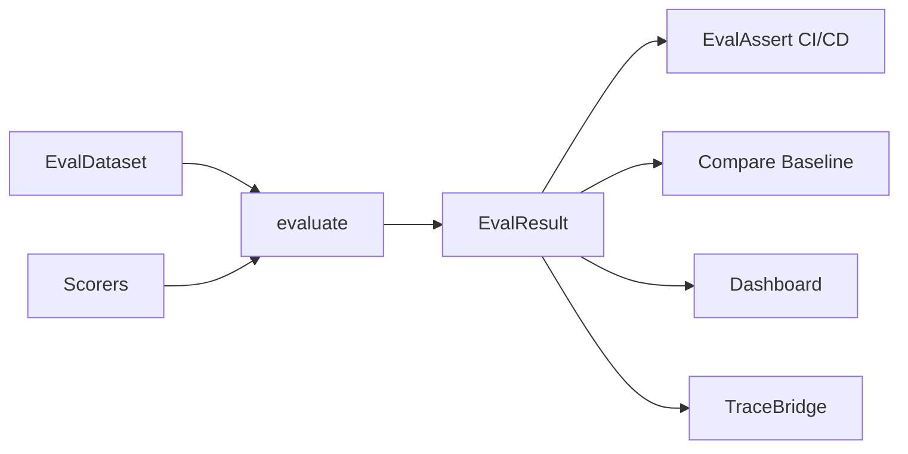
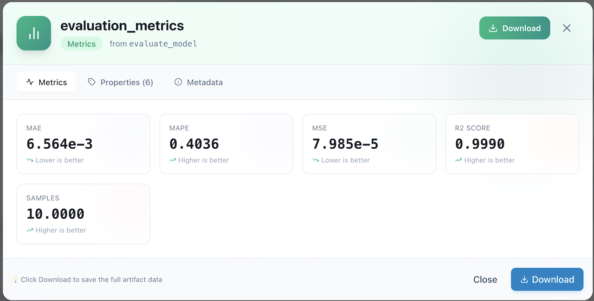

<div class="hero-section" markdown>

## 🎯 FlowyML Evaluations

Production-grade evaluation for classical ML and GenAI. 29+ built-in scorers, LLM-as-a-Judge, adapter ecosystem, CI/CD quality gates, and continuous monitoring — all as first-class pipeline citizens.

<span class="feature-badge">🎯 29+ Scorers</span>
<span class="feature-badge">🤖 LLM-as-Judge</span>
<span class="feature-badge">🛡️ CI/CD Gates</span>
<span class="feature-badge">🔌 DeepEval + RAGAS</span>
<span class="feature-badge">🏟️ Judge Arena</span>

</div>





## Quick Start

```python
from flowyml.evals import evaluate, EvalDataset, Accuracy, F1Score

# Create a dataset
data = EvalDataset.create_classical(
    "my_model_v2",
    predictions=[1, 0, 1, 1, 0],
    targets=[1, 0, 0, 1, 0],
)

# Run evaluation
result = evaluate(data=data, scorers=[Accuracy(threshold=0.9), F1Score()])

print(result.summary)      # {'accuracy': 0.8, 'f1_score': 0.8}
print(result.passed)        # False (accuracy < 0.9)
print(result.pass_rate)     # 0.8
```

---

## Built-in Scorers

### Classification (7 scorers)

| Scorer | Description | Lower is better? |
|---|---|---|
| `Accuracy` | Overall correct predictions / total | No |
| `Precision` | True positives / predicted positives | No |
| `Recall` | True positives / actual positives | No |
| `F1Score` | Harmonic mean of precision and recall | No |
| `AUCROC` | Area under the ROC curve | No |
| `ConfusionMatrixScorer` | Full confusion matrix + accuracy | No |
| `LogLoss` | Logarithmic loss | Yes |

```python
from flowyml.evals import Accuracy, Precision, Recall, F1Score, LogLoss

scorer = Accuracy(threshold=0.9)
result = scorer.score(predictions=[1, 0, 1], targets=[1, 1, 1])
print(result.value, result.passed)  # 0.666667, False
```

### Regression (6 scorers)

| Scorer | Description | Lower is better? |
|---|---|---|
| `MSE` | Mean Squared Error | Yes |
| `RMSE` | Root Mean Squared Error | Yes |
| `MAE` | Mean Absolute Error | Yes |
| `R2Score` | R-squared (coefficient of determination) | No |
| `MAPE` | Mean Absolute Percentage Error | Yes |
| `MaxError` | Maximum absolute error | Yes |

```python
from flowyml.evals import MSE, R2Score

scorer = R2Score()
result = scorer.score(predictions=[2.5, 3.0], targets=[3.0, 3.5])
print(result.value)  # R² value
```

### GenAI / LLM-as-a-Judge (4 scorers)

| Scorer | Description | Model |
|---|---|---|
| `Relevance` | Is the output relevant to the input? | OpenAI/Gemini |
| `Coherence` | Is the output well-structured and coherent? | OpenAI/Gemini |
| `Toxicity` | Does the output contain harmful content? | OpenAI/Gemini |
| `Faithfulness` | Is the output faithful to the context? | OpenAI/Gemini |

```python
from flowyml.evals import Relevance, Faithfulness

scorer = Relevance(model="openai:/gpt-4o-mini", threshold=0.7)
result = scorer.score(
    inputs="What is FlowyML?",
    outputs="FlowyML is a next-gen ML pipeline framework.",
    context="FlowyML documentation",
)
print(result.value, result.rationale)
```

---

## EvalDataset

Versioned, trackable evaluation datasets:

```python
from flowyml.evals import EvalDataset

# Classical ML
data = EvalDataset.create_classical(
    "classification_test",
    predictions=[1, 0, 1, 1],
    targets=[1, 0, 0, 1],
    version="2.0",
    tags={"model": "xgboost"},
)

# GenAI
data = EvalDataset.create_genai(
    "rag_golden_set",
    examples=[
        {
            "inputs": {"query": "What is FlowyML?"},
            "expected": "FlowyML is an ML pipeline framework...",
            "context": ["FlowyML docs"],
        },
    ],
    version="1.0",
)

# From CSV
data = EvalDataset.from_csv("test_data.csv")

# Versioning
data.save()
data.tag("production-golden-set")
```

---

## EvalSuite — Reusable Scorer Collections

```python
from flowyml.evals import EvalSuite, Accuracy, F1Score, Precision

# Define a reusable suite
classification_suite = EvalSuite(
    name="classification_quality",
    scorers=[Accuracy(threshold=0.9), F1Score(threshold=0.85), Precision()],
    description="Standard classification quality gates",
)

# Run it
result = classification_suite.run(data=eval_dataset)

# Fluent API
suite = EvalSuite("custom").add(Accuracy()).add(F1Score())
```

---

## Custom Scorers

### make_judge() — Custom LLM Judges

```python
from flowyml.evals import make_judge

quality_judge = make_judge(
    name="response_quality",
    instructions="Evaluate response accuracy, completeness, and tone.",
    model="openai:/gpt-4o-mini",
)

# With rubric
rubric_judge = make_judge(
    name="technical_accuracy",
    instructions="Evaluate technical accuracy.",
    rubric={
        5: "Perfectly accurate",
        3: "Partially accurate",
        1: "Completely wrong",
    },
    model="openai:/gpt-4o",
)
```

### make_scorer() — Wrap Any Function

```python
from flowyml.evals import make_scorer

def word_count_score(*, outputs=None, **kwargs):
    words = len(str(outputs).split())
    return min(words / 100, 1.0)  # Normalize to 0-1

scorer = make_scorer("word_count", word_count_score, scorer_type="genai")
```

---

## Judge Arena — A/B Testing Evaluators

Compare judges against each other and human labels:

```python
from flowyml.evals import JudgeArena, Relevance, Faithfulness, make_judge

arena = JudgeArena(
    judges=[Relevance(), Faithfulness(), make_judge("custom", "Evaluate quality")],
)

result = arena.evaluate(data=eval_data, human_labels=[0.9, 0.5, 0.8])

# Which judge is best?
print(result.best_judge())
print(result.rankings)               # Elo rankings
print(result.correlation_matrix())   # Inter-judge correlations
print(result.agreement_scores())     # Human agreement per judge
print(result.cost_analysis())        # Cost per evaluation per judge
```

---

## Regression Detection

```python
result = evaluate(
    data=eval_data,
    scorers=[Accuracy(), F1Score()],
    experiment="model_v2",
    baseline=previous_result,
)

# Check regressions
regressions = result.regressions_from(previous_result, threshold=0.05)
for metric, info in regressions.items():
    print(f"⚠️ {metric}: {info['baseline']:.4f} → {info['current']:.4f}")

# Auto-notify on regression
result.notify_if_regression(previous_result, channel="slack")
```

---

## Pipeline Integration — EvalStep

```python
from flowyml import Pipeline
from flowyml.evals import EvalStep, Accuracy, F1Score

pipeline = Pipeline("training_with_eval")
pipeline.add_step(train_step)

eval_step = EvalStep(
    name="quality_gate",
    scorers=[Accuracy(threshold=0.9), F1Score(threshold=0.85)],
    fail_on_regression=True,
    baseline_experiment="model_v1",
)
pipeline.add_step(eval_step)
```

---

## CI/CD Assertions — EvalAssert

```python
from flowyml.evals import EvalAssert, Accuracy, F1Score

# In tests/test_eval_quality.py
def test_model_quality():
    result = evaluate(data=golden_set, scorers=[Accuracy(), F1Score()])

    assertion = EvalAssert(result=result)
    assertion.assert_min_score("accuracy", 0.9)
    assertion.assert_min_score("f1_score", 0.85)
    assertion.assert_pass_rate(0.95)
```

**CLI:**
```bash
flowyml eval run --data golden_set.csv --scorers accuracy,f1_score
flowyml eval assert -d golden_set.csv -s accuracy --min-score accuracy 0.9
flowyml eval compare --baseline v1 --current v2
```

---

## Continuous Evaluation — EvalSchedule

```python
from flowyml.evals import EvalSchedule, Relevance, Faithfulness

schedule = EvalSchedule(
    name="nightly_rag_eval",
    dataset_name="production_golden_set",
    scorers=[Relevance(), Faithfulness()],
    cron="0 2 * * *",  # Daily at 2am
    baseline_experiment="rag_v2",
    alert_on_regression=True,
)
schedule.start()
```

---

## Trace Bridge — Evaluate LLM Traces

```python
from flowyml.evals import evaluate_traces, Relevance, Toxicity

# Evaluate specific traces
results = evaluate_traces(
    trace_ids=["trace-001", "trace-002"],
    scorers=[Relevance(), Toxicity()],
    experiment="trace_quality_audit",
)

# Or with a TraceBridge instance for more control
from flowyml.evals import TraceBridge

bridge = TraceBridge()
results = bridge.evaluate_traces(
    tracer=my_tracer,
    scorers=[Relevance()],
    experiment="production_traces",
)
```

---

## Scorer Registry

```python
from flowyml.evals import get_scorer, list_scorers, register_scorer

# List all available
all_scorers = list_scorers()
classification_only = list_scorers("classification")

# Get by name
scorer = get_scorer("accuracy", threshold=0.9)

# Register custom scorer
register_scorer("my_scorer", MyCustomScorer)
```

---

## REST API

| Endpoint | Method | Description |
|---|---|---|
| `/api/evaluations/run` | POST | Run an evaluation |
| `/api/evaluations/runs` | GET | List evaluation runs |
| `/api/evaluations/runs/{id}` | GET | Get specific run |
| `/api/evaluations/compare` | POST | Compare two runs |
| `/api/evaluations/scorers` | GET | List available scorers |

---

## Architecture

```
flowyml/evals/
├── __init__.py          # Public API — all exports
├── base.py              # Scorer protocol, ScorerFeedback, ScorerType
├── core.py              # evaluate(), EvalResult
├── dataset.py           # EvalDataset (versioned asset)
├── suite.py             # EvalSuite (reusable scorer collections)
├── run.py               # EvalRun (extends Run)
├── arena.py             # JudgeArena (A/B testing)
├── bridge.py            # TraceBridge, evaluate_traces()
├── assertions.py        # EvalAssert (CI/CD gates)
├── pipeline.py          # EvalStep (pipeline integration)
├── schedule.py          # EvalSchedule (continuous eval)
└── scorers/
    ├── __init__.py      # Registry + auto-discovery
    ├── classification.py # 7 classification scorers
    ├── regression.py     # 6 regression scorers
    ├── genai.py          # 4 LLM-as-a-judge scorers
    └── custom.py         # make_judge(), make_scorer()
```

---

## 📍 What's Next?

<div class="header-grid" markdown>

<div class="header-card" markdown>
### 🔌 Eval Adapters
Integrate DeepEval, RAGAS, and Phoenix scorers.

[Adapters →](advanced/eval-adapters.md)
</div>

<div class="header-card" markdown>
### 🏟️ Judge Arena
A/B test evaluators against human labels.

[Arena →](advanced/eval-arena.md)
</div>

<div class="header-card" markdown>
### 🛡️ CI/CD Quality Gates
Automate evaluation in your deployment pipeline.

[CI/CD →](advanced/eval-ci-cd.md)
</div>

</div>
