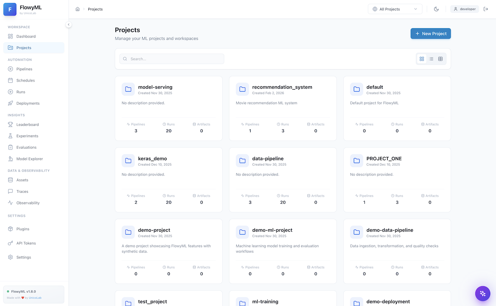
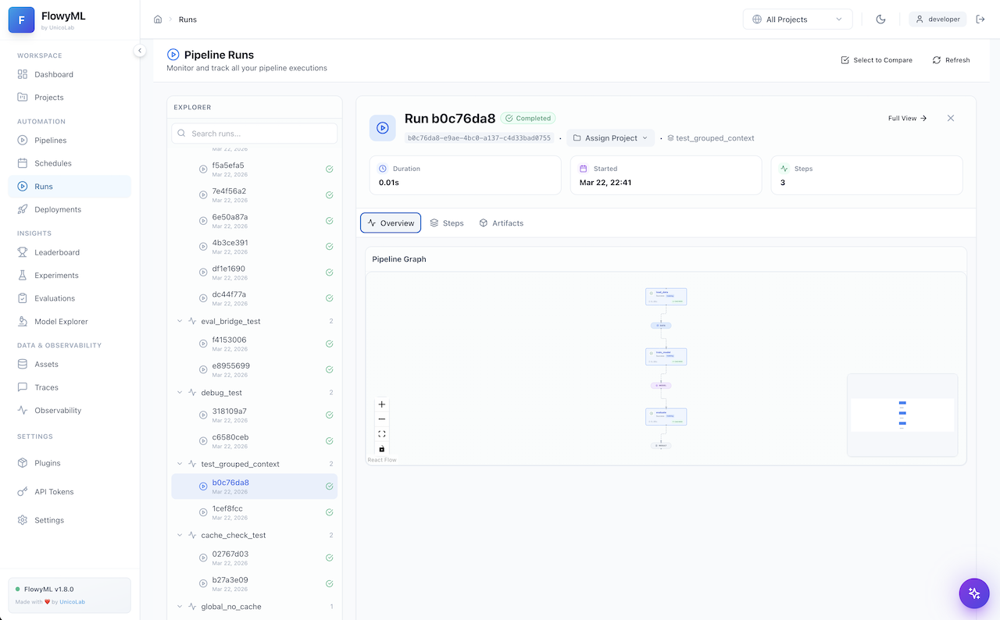
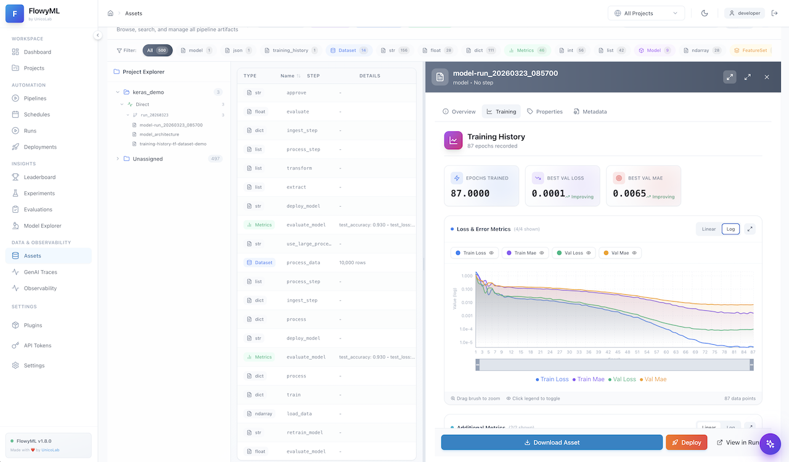
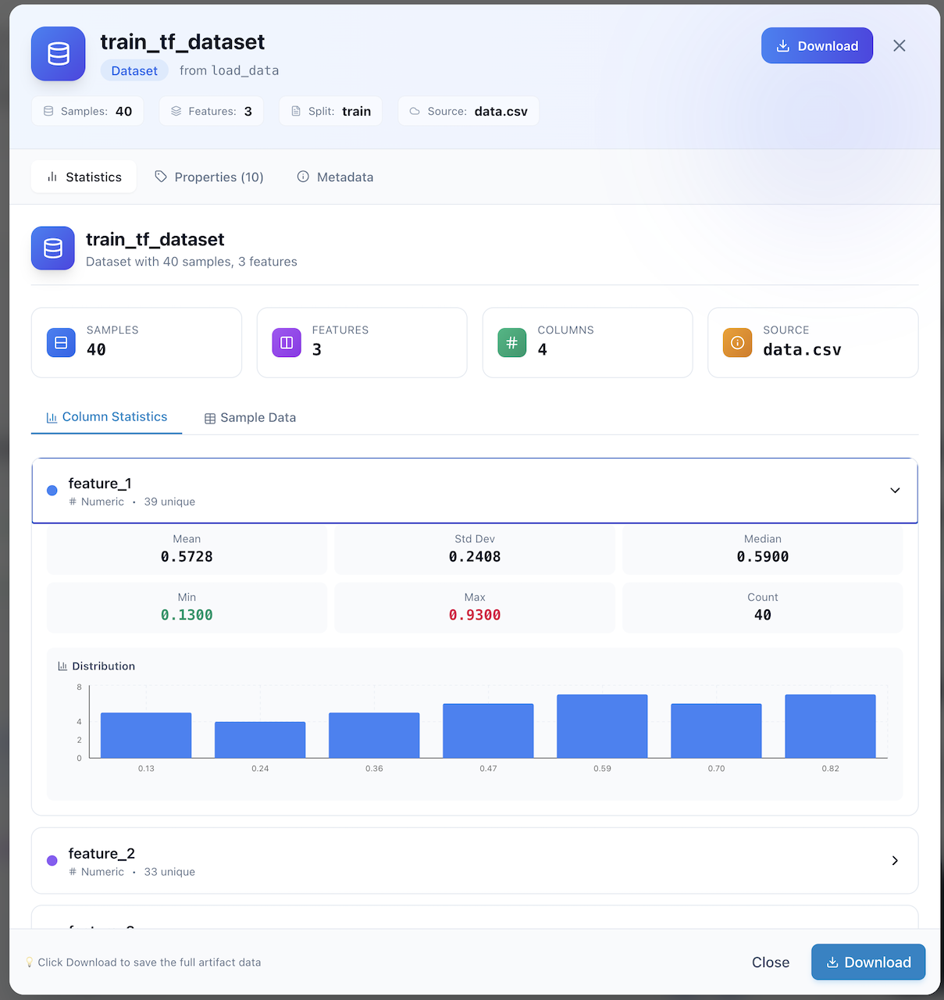
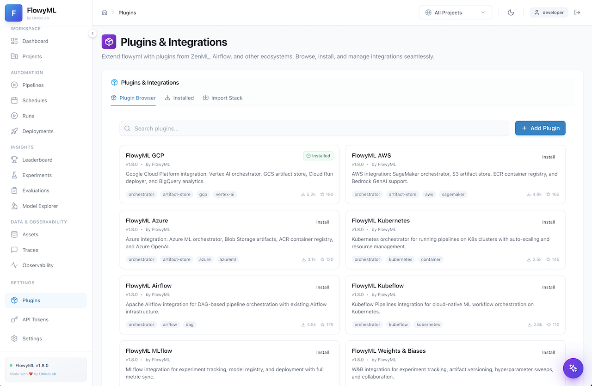
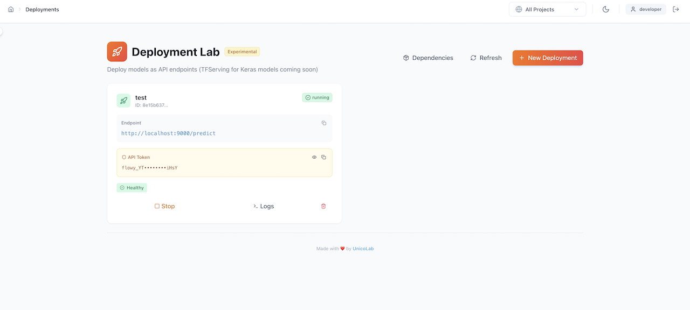
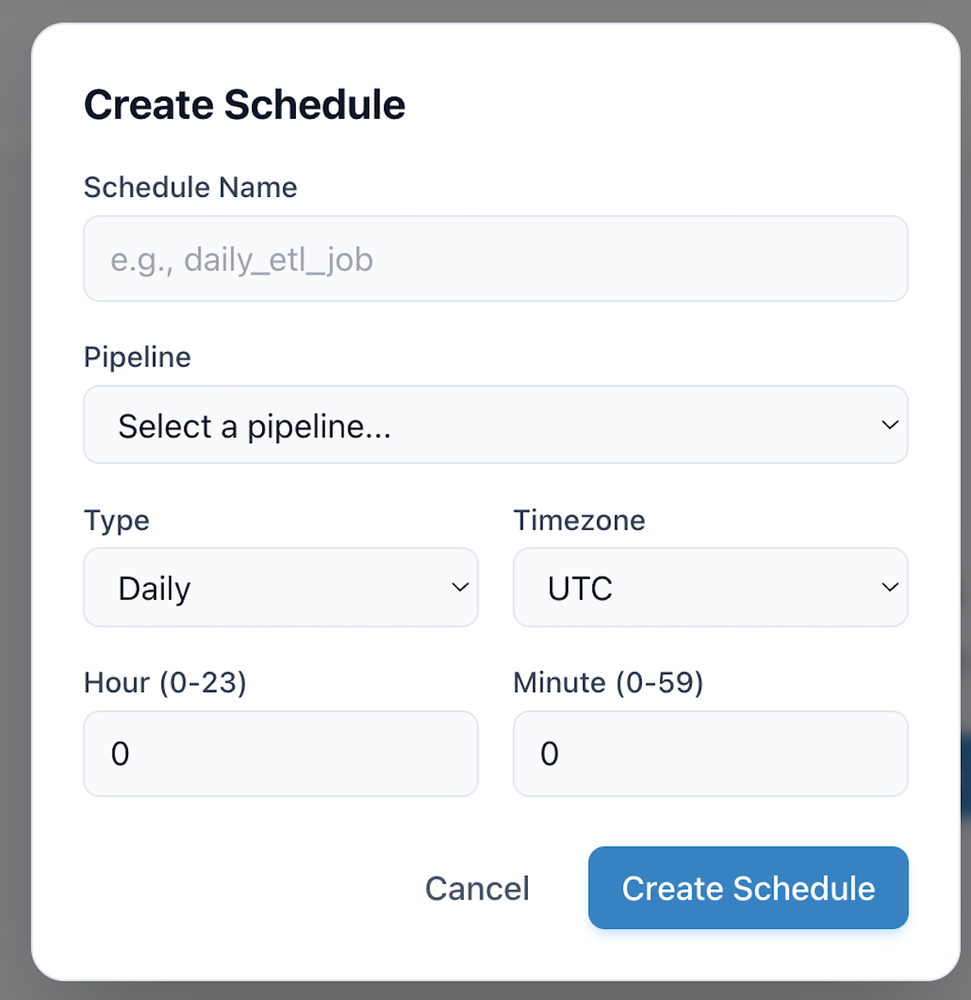

<div class="hero-section" markdown>

## 🖥️ FlowyML GUI — Visual Interface Guide

FlowyML ships with a **full-featured web dashboard** that lets you manage every aspect of your ML lifecycle — from pipeline execution and artifact inspection to model evaluation and GenAI observability — all without leaving your browser.

<span class="feature-badge">🌐 Web Dashboard</span>
<span class="feature-badge">📊 Real-Time Metrics</span>
<span class="feature-badge">🔗 DAG Visualization</span>
<span class="feature-badge">🧪 Experiment Tracking</span>
<span class="feature-badge">🤖 GenAI Traces</span>
<span class="feature-badge">🔌 Plugin Marketplace</span>
<span class="feature-badge">🚀 One-Click Deploy</span>

</div>

## Launching the Dashboard

Start the FlowyML GUI with a single command:

```bash
flowyml ui
```

This starts the local web server (default: `http://localhost:8501`). The dashboard is also available via the centralized **FlowyML Server** deployment for team collaboration.

!!! tip "Pro Tip"
    Use `flowyml ui --port 9000` to run on a custom port, or `flowyml ui --host 0.0.0.0` to expose the dashboard on your network.

---

## Dashboard — Command Center

The **Dashboard** is your landing page — a high-level command center showing the health and activity across your entire ML workspace.

<div class="screenshot-gallery" markdown>
<div class="screenshot-card" markdown>


</div>
</div>

**Key elements:**

| Area | Description |
|------|-------------|
| **Workspace Sidebar** | Quick navigation across all sections: Pipelines, Runs, Assets, Traces, and more |
| **Project Selector** | Filter the entire view by project via the top-right dropdown |
| **Activity Feed** | Recent pipeline runs, evaluations, and system events at a glance |
| **Quick Stats** | KPI cards showing run counts, success rates, and active deployments |

!!! info "Dark Mode"
    Toggle between light and dark themes using the 🌙 icon in the top-right corner. All screenshots in this guide use the light theme, but every page is fully styled for both modes.

---

## Projects — Organize Your Work

The **Projects** page provides a structured view of all your ML projects with metadata, pipeline associations, and quick-access links.

<div class="screenshot-gallery" markdown>
<div class="screenshot-card" markdown>



</div>
</div>

**What you can do:**

- **Create & manage projects** — Group related pipelines, runs, and assets under a single project umbrella
- **Search & filter** — Quickly locate projects by name or tags
- **View project details** — See associated pipelines, run counts, and last activity timestamps
- **Assign runs** — Tag any pipeline run to a specific project for organized tracking

!!! tip "Best Practice"
    Use projects to separate different ML initiatives (e.g., `fraud-detection`, `recommendation-engine`). This keeps your workspace clean and makes team collaboration easier.

---

## Pipeline Runs — Monitor & Inspect

The **Pipeline Runs** page is the operational hub for monitoring all pipeline executions. It features a dual-pane layout with a run explorer on the left and detailed run inspection on the right.

<div class="screenshot-gallery" markdown>
<div class="screenshot-card" markdown>



</div>
</div>

### Run Explorer (Left Panel)

- **Searchable run list** — Filter by run ID, pipeline name, or status
- **Grouped by pipeline** — Runs are organized under their parent pipeline with expandable sections
- **Status indicators** — Green checkmarks (✅) for completed, red (❌) for failed, spinner for in-progress
- **Timestamp tracking** — See exactly when each run was executed

### Run Detail (Right Panel)

- **Run Header** — Shows run ID, completion status, project assignment, and pipeline context
- **KPI Cards** — Duration, start time, and step count at a glance
- **Tabbed Views:**
    - **Overview** — Pipeline graph visualization (interactive React Flow DAG)
    - **Steps** — Detailed per-step execution breakdown with inputs/outputs
    - **Artifacts** — All artifacts produced by the run, downloadable

!!! note "Pipeline Graph"
    The interactive DAG visualization lets you zoom, pan, and click on individual steps to inspect their execution details. Use the controls (➕, ➖, 🔍, 🔒) in the bottom-left corner.

---

## Run Detail — Deep Dive

Clicking on any specific run opens the full **Run Detail** view with comprehensive execution information.

<div class="screenshot-gallery" markdown>
<div class="screenshot-card" markdown>


</div>
</div>

**Features available:**

- **Full pipeline graph** — Interactive DAG showing step dependencies and execution flow
- **Step-by-step inspection** — Click any step node for its inputs, outputs, duration, and logs
- **Artifact browser** — Browse, preview, and download all artifacts from the run
- **Execution metadata** — Complete context including timestamps, orchestrator info, and stack configuration
- **Run comparison** — Use the "Select to Compare" button to diff two runs side-by-side

---

## Assets — Artifact Inspector

The **Assets** page provides a centralized view of all artifacts produced across your pipeline runs, organized by type.

<div class="screenshot-gallery" markdown>
<div class="screenshot-card" markdown>



</div>
</div>

**Asset types include:**

| Type | Description |
|------|-------------|
| **Models** 🤖 | Trained ML models with framework metadata (Keras, PyTorch, Scikit-learn, etc.) |
| **Metrics** 📊 | Evaluation metrics (MAE, MSE, R², MAPE) with trend indicators |
| **DataFrames** 📋 | Tabular data artifacts with column previews and row counts |
| **Visualizations** 📈 | Charts, plots, and training curves generated during runs |
| **Custom** 🗂️ | Any user-defined artifact type via materializers |

**Actions per asset:**

- **Preview** — Quick inline preview of metrics, data, or model metadata
- **Download** — Export any artifact to your local filesystem
- **Properties** — View up to 18+ properties including framework, layers, parameters, and epochs
- **Metadata** — Full provenance info: which step produced it, when, and in which run

---

## Data Details — Rich Previews

Clicking on a data artifact opens a **rich detail panel** with multi-tab inspection.

<div class="screenshot-gallery" markdown>
<div class="screenshot-card" markdown>



</div>
</div>

**Tabs available:**

- **Data Preview** — Rendered table view of DataFrame contents with column types
- **Properties** — Schema information, row/column counts, and custom tags
- **Metadata** — Full lineage: producing step, pipeline, run ID, and timestamps

!!! info "Large DataFrames"
    For large datasets, the preview shows the first N rows with a download link for the complete data. This keeps the UI responsive even with millions of rows.

---

## Evaluation Metrics — Model Performance

The **Evaluation Details** panel provides a focused view of model performance metrics produced by evaluation steps.

<div class="screenshot-gallery" markdown>
<div class="screenshot-card" markdown>


</div>
</div>

**Highlights:**

- **Metric Cards** — Large, scannable KPI cards for each metric (MAE, MAPE, MSE, R²)
- **Trend Indicators** — Each metric shows whether *lower is better* (↘) or *higher is better* (↗)
- **Sample Count** — Shows the number of samples used in the evaluation
- **Multi-tab View** — Switch between Metrics, Properties (6+), and Metadata tabs
- **Download** — Export the full evaluation data for offline analysis

!!! success "R² Score"
    The screenshot shows an R² score of **0.9990**, indicating near-perfect model fit. FlowyML automatically surfaces these key metrics so you can validate model quality at a glance.

---

## Model Training Curves — Visualization

The **Model Visualization** panel provides deep insight into your trained models, including interactive training history charts.

<div class="screenshot-gallery" markdown>
<div class="screenshot-card" markdown>


</div>
</div>

**What you get:**

- **Model Header** — Framework (Keras), parameter count (801), layer count (8), epochs (87)
- **Training Summary Cards** — Epochs trained, best validation loss, best validation MAE with improvement indicators
- **Interactive Charts:**
    - **Loss & Error Metrics** — Train Loss, Train MAE, Val Loss, Val MAE plotted over epochs
    - **Log/Linear toggle** — Switch between logarithmic and linear scale
    - **Brush-to-zoom** — Drag to select a region for detailed inspection
    - **Legend toggle** — Click legend items to show/hide individual series
- **Additional Metrics** — Supplementary metrics below the main chart

!!! tip "Zoom & Explore"
    Use the brush tool at the bottom of the chart to zoom into specific epoch ranges. Click the expand icon (↗️) for a full-screen chart view.

---

## GenAI Traces — LLM Observability

The **Traces** page provides enterprise-grade observability for all GenAI and LLM operations in your pipelines.

<div class="screenshot-gallery" markdown>
<div class="screenshot-card" markdown>


</div>
</div>

### Summary Bar (Top)

| Metric | Description |
|--------|-------------|
| **Total Traces** | Count of all traced GenAI operations |
| **Avg Latency** | Mean response time per trace |
| **Total Tokens** | Cumulative token usage across all LLM calls |
| **Est. Cost** | Estimated cost based on token usage and model pricing |

### Trace List (Left Panel)

- **Filterable** — Search by name, trace ID, or model name
- **Color-coded status** — Green dots for successful traces, red for errors
- **Model badges** — Shows the LLM model used (e.g., `text-embedding-3-sm...`, `gpt-4o-mini`)
- **Duration bars** — Visual progress bars showing relative execution time
- **Token counts** — Number of tokens used per trace

### Trace Detail (Right Panel)

- **Span Waterfall** — Hierarchical breakdown of trace spans (Session → Event)
- **Quick Preview** — Prompt/Input and Completion/Output at a glance
- **Duration & Cost** — Per-trace timing, span count, and cost
- **Inputs/Outputs** — Full JSON view of inputs and outputs for each span

!!! warning "Cost Tracking"
    GenAI cost tracking requires model pricing configuration. See the [GenAI Observability guide](integrations/genai-observability.md) for setup instructions.

---

## Plugins & Integrations — Extend FlowyML

The **Plugins** page is your marketplace for extending FlowyML with cloud providers, orchestrators, and third-party ML platforms.

<div class="screenshot-gallery" markdown>
<div class="screenshot-card" markdown>



</div>
</div>

### Plugin Browser

Browse the available plugins organized in a card-grid layout:

| Plugin | Description |
|--------|-------------|
| **FlowyML GCP** | Vertex AI orchestrator, GCS artifact store, Cloud Run deployer, BigQuery analytics |
| **FlowyML AWS** | SageMaker orchestrator, S3 artifact store, ECR container registry, Bedrock GenAI |
| **FlowyML Azure** | Azure ML orchestrator, Blob Storage artifacts, ACR registry, Azure OpenAI |
| **FlowyML Kubernetes** | K8s orchestrator with auto-scaling and resource management |
| **FlowyML Airflow** | DAG-based pipeline orchestration with Airflow infrastructure |
| **FlowyML Kubeflow** | Cloud-native ML workflow orchestration on Kubernetes |
| **FlowyML MLflow** | Experiment tracking, model registry, and full metric sync |
| **FlowyML W&B** | Weights & Biases integration for experiment tracking and hyperparameter sweeps |

**Features:**

- **One-click install** — Install plugins directly from the UI
- **Search & filter** — Find plugins by name, tag, or category
- **Tag system** — Each plugin shows capability tags (orchestrator, artifact-store, etc.)
- **Download stats** — See community adoption with download counts and star ratings
- **Import Stack** — Import a complete stack configuration from a file

!!! tip "Stack Import"
    Use the "Import Stack" tab to load a pre-configured stack YAML file that bundles multiple plugins together for a specific deployment target.

---

## Deployment Lab — Ship Models to Production

The **Deployment Lab** lets you deploy trained models as API endpoints with a few clicks.

<div class="screenshot-gallery" markdown>
<div class="screenshot-card" markdown>



</div>
</div>

**Deployment features:**

- **Endpoint management** — View active deployments with their URLs and status
- **API Token** — Secure your endpoints with auto-generated API tokens (shown masked, reveal on click)
- **Health monitoring** — Real-time health status indicators (✅ Healthy)
- **Lifecycle controls:**
    - **Stop** — Gracefully stop a running deployment
    - **Logs** — View real-time deployment logs
    - **Delete** — Remove a deployment and its resources
- **Dependencies** — View model dependencies required by the endpoint
- **New Deployment** — One-click wizard to deploy a new model

!!! warning "Experimental"
    The Deployment Lab is currently marked as *Experimental*. TFServing for Keras models is coming soon.

---

## Scheduler — Automate Pipeline Execution

The **Scheduler** dialog allows you to set up automated, recurring pipeline executions.

<div class="screenshot-gallery" markdown>
<div class="screenshot-card" markdown>



</div>
</div>

**Configuration options:**

| Field | Description |
|-------|-------------|
| **Schedule Name** | A human-readable name (e.g., `daily_etl_job`) |
| **Pipeline** | Select which pipeline to schedule from the dropdown |
| **Type** | Schedule frequency: Daily, Hourly, Weekly, Monthly, or Cron |
| **Timezone** | Timezone for schedule execution (UTC, US/Eastern, Europe/London, etc.) |
| **Hour / Minute** | Specific time for daily/weekly/monthly schedules |

!!! info "Cron Expressions"
    For advanced scheduling, select "Cron" type and provide a standard cron expression (e.g., `0 */6 * * *` for every 6 hours).

---

## Navigation Reference

The sidebar provides organized access to every feature:

```
WORKSPACE
  ├── Dashboard          → Command center overview
  └── Projects           → Project management

AUTOMATION
  ├── Pipelines          → Pipeline definitions
  ├── Schedules          → Automated scheduling
  ├── Runs               → Execution history & monitoring
  └── Deployments        → Model serving endpoints

INSIGHTS
  ├── Leaderboard        → Model comparison rankings
  ├── Experiments        → Experiment tracking
  ├── Evaluations        → Evaluation management
  └── Model Explorer     → Trained model browser

DATA & OBSERVABILITY
  ├── Assets             → Artifact catalog
  ├── Traces             → GenAI/LLM observability
  └── Observability      → System-wide dashboards

SETTINGS
  ├── Plugins            → Plugin marketplace
  ├── API Tokens         → Token management
  └── Settings           → System configuration
```

---

## Tips & Keyboard Shortcuts

!!! tip "Power User Tips"

    - **Project Filtering** — Use the top-right "All Projects" dropdown to scope every page to a specific project
    - **Dark Mode** — Toggle with the 🌙 icon for a reduced-glare experience
    - **Full View** — Click "Full View →" on any run or artifact detail for an expanded, dedicated page
    - **Compare Runs** — Select multiple runs via checkboxes, then click "Select to Compare" for side-by-side diff
    - **Quick Search** — Use the search bars on the Runs, Assets, Traces, and Plugins pages for instant filtering
    - **Download Artifacts** — Every artifact view includes a Download button for offline analysis

---

## What's Next?

<div class="header-grid" markdown>

<div class="header-card" markdown>

### 🚀 Get Started
Set up your first pipeline and see results in the GUI.

[Getting Started →](getting-started.md)

</div>

<div class="header-card" markdown>

### 🔌 Install Plugins
Extend FlowyML with cloud and ML platform integrations.

[Plugin Guide →](plugins/overview.md)

</div>

<div class="header-card" markdown>

### 📊 Observability
Set up dashboards for real-time pipeline monitoring.

[Observability →](user-guide/observability-dashboard.md)

</div>

</div>
