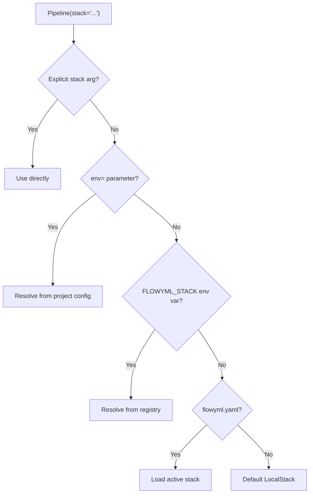

<div class="hero-section" markdown>

## 🏢 Enterprise Stacks

Centrally define, govern, and version execution stacks — platform teams own infrastructure, data scientists focus on code.

<span class="feature-badge">📋 StackDefinition</span>
<span class="feature-badge">🔍 StackResolver</span>
<span class="feature-badge">🛡️ PolicyEngine</span>
<span class="feature-badge">🔒 AuditStore</span>

</div>

# 🏢 Enterprise Stacks

!!! info "What you'll learn"
    How to define governed execution stacks using YAML manifests, resolve them from multiple sources, enforce policies, and manage stack lifecycles in enterprise environments.

---

## Overview

Enterprise Stacks decouple **infrastructure configuration** from **pipeline code**. Platform teams define stacks centrally; data scientists consume them by name.

```python
# Data scientist's code — no infrastructure details
pipeline = Pipeline("training", stack="prod-gpu-large")
pipeline.run()
```

The stack `prod-gpu-large` is resolved, validated against policies, and wired into the pipeline automatically.

---

## Stack Resolution Flow

When a pipeline references a stack, FlowyML resolves it through a priority chain:



The stack argument accepts:

| Input Type | Example | Resolution |
|---|---|---|
| `str` (name) | `"prod-gpu"` | Registry / project config lookup |
| `str` (URI) | `"github://org/repo@v1#stack"` | Remote source resolution |
| `Stack` instance | `my_stack` | Used directly |
| `StackDefinition` | `definition` | Converted via `.to_stack()` |

---

## StackDefinition YAML

Define stacks as declarative YAML manifests:

```yaml
apiVersion: flowyml/v1
kind: StackDefinition
metadata:
  name: prod-gpu-large
  version: "2.1.0"
  labels:
    team: ml-platform
    environment: production
    approved: "true"
spec:
  compute:
    backend: azureml
    size: Standard_NC6s_v3
    min_nodes: 0
    max_nodes: 4
  runtime:
    python_version: "3.11"
    docker_image: myregistry.azurecr.io/flowyml:latest
  storage:
    artifact_store: abfs://artifacts@mystorage.dfs.core.windows.net
    metadata_store: sqlite:///shared/metadata.db
  tracking:
    experiment_tracker: mlflow
    mlflow_uri: https://mlflow.company.com
  secrets:
    provider: azure_keyvault
    vault_url: https://my-vault.vault.azure.net
```

---

## Stack Sources

The `StackResolver` can load definitions from multiple sources:

### Local File

```yaml
# flowyml.yaml
stacks:
  dev:
    source: local
    path: ./stacks/dev.yaml
```

### GitHub / GitLab

```yaml
stacks:
  prod:
    source: github
    repo: my-org/ml-stacks
    ref: v2.1.0
    path: stacks/prod.yaml
```

```python
# Or programmatically via URI
pipeline = Pipeline("train", stack="github://my-org/ml-stacks@v2.1.0#prod")
```

### HTTP

```yaml
stacks:
  staging:
    source: http
    url: https://config.company.com/stacks/staging.yaml
```

### Stack Registry

```python
from flowyml.stacks.enterprise.resolver import StackResolver

resolver = StackResolver()
definition = resolver.resolve(stack="prod-gpu-large", env="production")
```

---

## Policy Engine

Enforce organizational policies on all stacks:

```yaml
# flowyml.yaml — project-level governance
project:
  name: fraud-detection
  org: fintech-corp
  policies:
    allowed_stacks:
      - prod-gpu-*
      - staging-*
    required_labels:
      - approved
      - team
    image_policy:
      allowed_registries:
        - myregistry.azurecr.io
        - gcr.io/my-project
      required_labels:
        - maintainer
        - version
```

The `PolicyEngine` validates stacks before execution:

- ✅ Stack name matches allowed patterns
- ✅ Required metadata labels are present
- ✅ Docker images come from approved registries
- ✅ Base images pass security checks

---

## Audit & Locking

### Audit Store

Every stack operation is recorded:

```python
from flowyml.stacks.enterprise.audit import AuditStore

audit = AuditStore()
events = audit.get_events(stack_name="prod-gpu-large")
# → [StackApplied, StackValidated, PolicyChecked, ...]
```

### Stack Locking

Prevent concurrent modifications:

```python
from flowyml.stacks.enterprise.lock import StackLockManager

lock_manager = StackLockManager()
with lock_manager.acquire("prod-gpu-large"):
    # Exclusive access to stack configuration
    ...
```

---

## CLI Commands

```bash
# List all available stacks
flowyml enterprise stack list

# Show stack details
flowyml enterprise stack show prod-gpu-large

# Validate a stack definition
flowyml enterprise stack validate ./stacks/prod.yaml

# Apply a stack (register/update)
flowyml enterprise stack apply ./stacks/prod.yaml
```

---

## Environment-Based Resolution

Map environments to stacks in your project config:

```yaml
# flowyml.yaml
environments:
  dev:
    stack: local
  staging:
    stack: staging-cpu
  production:
    stack: prod-gpu-large
```

```python
# Automatically resolves to the correct stack
pipeline = Pipeline("training", env="production")
```

---

## Best Practices

!!! tip "Version your stacks"
    Pin stack versions in production to ensure reproducibility. Use semantic versioning for stack definitions.

!!! tip "Separate concerns"
    Platform teams own stack definitions (compute, storage, networking). Data scientists own pipeline code (steps, models, metrics).

!!! warning "Policy enforcement"
    Always enable policy enforcement in production. Unapproved stacks should be blocked before execution, not after.

---

## 🚀 What's Next?

<div class="header-grid" markdown>

<div class="header-card" markdown>

### 🔐 Secrets Management
Unified secrets layer with 6 enterprise providers.

[Explore →](../deployment/secrets.md)

</div>

<div class="header-card" markdown>

### ⚡ Databricks
Run pipelines on Databricks with auto-managed clusters.

[Learn more →](../integrations/databricks.md)

</div>

<div class="header-card" markdown>

### 📊 Experiment Tracking
Transparent dual-write to FlowyML and external trackers.

[View Guide →](experiment-tracking.md)

</div>

</div>
