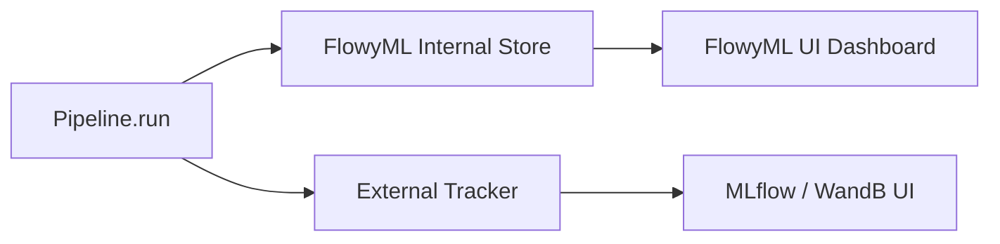
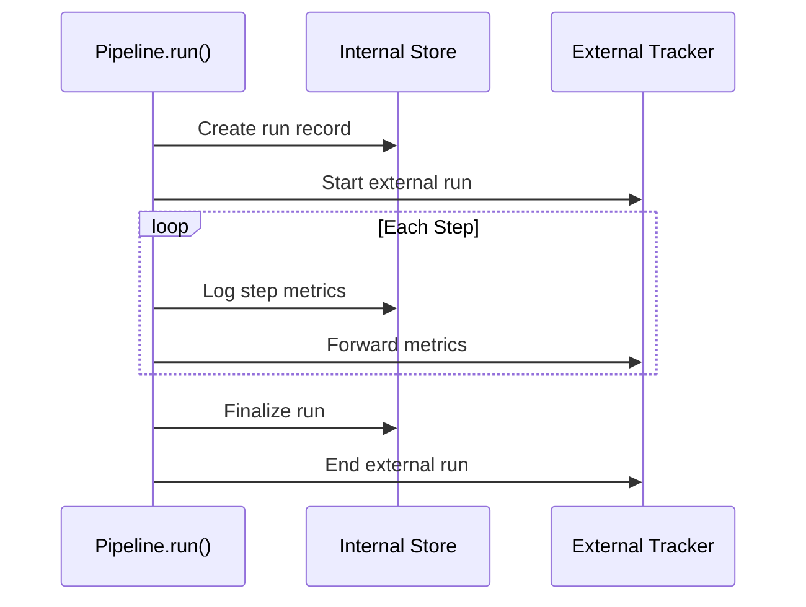

<div class="hero-section" markdown>

## 📊 Experiment Tracking

Transparent dual-write tracking — every metric, parameter, and artifact is automatically logged to FlowyML **and** your external tracker.

<span class="feature-badge">📈 MLflow</span>
<span class="feature-badge">📉 Weights & Biases</span>
<span class="feature-badge">💾 SQLite</span>
<span class="feature-badge">🔄 Auto-Sync</span>

</div>

# 📊 Experiment Tracking

!!! info "What you'll learn"
    How FlowyML's transparent dual-write tracking works — automatic metric/parameter forwarding to both the internal dashboard and external trackers like MLflow and WandB.

---

## How It Works

FlowyML implements **dual-write tracking**: every pipeline run automatically writes to two destinations:



| Destination | Purpose | Always Active |
|---|---|---|
| **FlowyML Internal** (SQLite) | Powers the FlowyML UI dashboard | ✅ Always |
| **External Tracker** (MLflow/WandB) | Team-wide experiment management | Configured via stack |

---

## Zero-Config Setup

Tracking is **enabled by default**. Every pipeline run automatically logs:

```python
from flowyml import Pipeline, step
from flowyml.assets import Metrics

@step
def evaluate(ctx):
    accuracy = 0.95
    # Metrics assets are auto-logged to BOTH stores
    return Metrics({"accuracy": accuracy, "f1": 0.93})

pipeline = Pipeline("training")
pipeline.add_step(evaluate)
pipeline.run()
# ✓ Metrics logged to FlowyML internal store
# ✓ Metrics forwarded to configured external tracker
```

---

## Stack Configuration

### MLflow

```yaml
# flowyml.yaml
stacks:
  prod:
    tracking:
      experiment_tracker: mlflow
      mlflow_uri: https://mlflow.company.com
      mlflow_experiment: fraud-detection
```

### Weights & Biases

```yaml
stacks:
  prod:
    tracking:
      experiment_tracker: wandb
      wandb_project: fraud-detection
      wandb_entity: ml-team
```

```bash
# WandB authentication
export WANDB_API_KEY=xxxxx
```

---

## What Gets Tracked

### Automatic (zero code changes)

| Data | Internal Store | External Tracker |
|---|---|---|
| Run metadata (ID, name, status, timestamps) | ✅ | ✅ |
| Pipeline parameters (Context) | ✅ | ✅ |
| `Metrics` asset values | ✅ | ✅ |
| Step durations | ✅ | ✅ |
| Run status transitions | ✅ | ✅ |

### Via Step Code

```python
@step
def train(ctx: Context):
    # Log custom metrics — auto-forwarded to external tracker
    ctx.log_metric("learning_rate", 0.001)
    ctx.log_metric("batch_size", 32)
    ctx.log_params({"optimizer": "adam", "epochs": 50})
```

---

## Pipeline Integration

The tracking lifecycle is managed by `PipelinePluginIntegration`:



### Control Tracking

```python
# Enable/disable tracking per pipeline
pipeline = Pipeline("training", enable_experiment_tracking=True)   # default
pipeline = Pipeline("quick-test", enable_experiment_tracking=False) # disable

# Or via config
# flowyml.yaml
# config:
#   auto_log_metrics: true  # default
```

---

## Viewing Results

### FlowyML UI Dashboard

```bash
# Start the FlowyML UI
flowyml ui start

# Navigate to:
# → Dashboard: overview of all runs
# → Experiments: compare metrics across runs
# → Runs: detailed step-by-step view
```

### External Tracker UI

- **MLflow**: Navigate to your `mlflow_uri` to see runs, metrics, and artifacts
- **WandB**: Visit `wandb.ai/<entity>/<project>` for interactive dashboards

### Both Simultaneously

The dual-write ensures your team can use whichever UI they prefer — FlowyML for pipeline-centric views, MLflow/WandB for experiment-centric analysis.

---

## Tracker Resolution

The external tracker is resolved from your stack configuration:

```
Pipeline(stack="prod")
    └─→ Stack.tracking.experiment_tracker = "mlflow"
        └─→ MLflowTracker(uri="https://mlflow.company.com")
            └─→ Auto-starts run at Pipeline.run()
            └─→ Auto-forwards metrics from Metrics assets
            └─→ Auto-ends run on completion
```

If no tracker is configured, only the internal store is used (FlowyML UI still works).

---

## Best Practices

!!! tip "Always use the internal store"
    The FlowyML internal store is always active and powers the UI dashboard. Don't disable it — it has zero overhead.

!!! tip "Use MLflow for team collaboration"
    MLflow's tracking server provides a shared view of all experiments. Deploy it centrally for team-wide visibility.

!!! warning "Tracker failures are non-fatal"
    If the external tracker is unreachable, the pipeline still runs and logs to the internal store. Check logs for tracker connection warnings.

!!! tip "Compare across trackers"
    Use the FlowyML UI for pipeline-level comparison (DAG, steps, timing) and MLflow/WandB for metric-level analysis (curves, distributions).

---

## 🚀 What's Next?

<div class="header-grid" markdown>

<div class="header-card" markdown>

### 📊 MLflow Integration
Deep dive into MLflow configuration and features.

[Explore →](../integrations/mlflow.md)

</div>

<div class="header-card" markdown>

### 📉 WandB Integration
Set up Weights & Biases for experiment tracking.

[Learn more →](../integrations/wandb.md)

</div>

<div class="header-card" markdown>

### 🏢 Enterprise Stacks
Configure stacks with tracking, compute, and secrets.

[View Guide →](enterprise-stacks.md)

</div>

</div>
