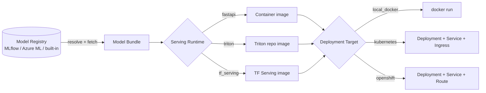

# 🚢 Model Serving & Deployment

FlowyML packages, versions, and serves your registered models **transparently** —
you reference a model by name and stage, pick a *serving runtime* and a
*deployment target*, and FlowyML handles the rest: fetching the artifact from the
registry, building the serving container, mounting the model, wiring health
probes and metrics, and rolling it out.

```python
from flowyml.deployment import DeploymentSpec, ModelRef, DeploymentService

spec = DeploymentSpec(
    name="churn-api",
    model=ModelRef("churn", stage="production"),  # resolved & fetched for you
    runtime="fastapi",                             # or "triton", "tensorflow_serving"
    target="openshift",                            # or "kubernetes", "local_docker"
    namespace="ml-prod",
    route_host="churn.apps.example.com",
    registry_uri="registry.apps.example.com/ml",
)

result = DeploymentService().deploy(spec)
print(result.endpoint_url)   # https://churn.apps.example.com
```

!!! tip "One model, many runtimes and targets"
    The **same** registered model can be served through FastAPI, NVIDIA Triton,
    or TensorFlow Serving, and deployed to your laptop (Docker), Kubernetes, or
    OpenShift — by changing two fields. No code changes to your model.

---

## The three axes

FlowyML separates deployment into three independent concerns:

| Axis | Question it answers | Options |
|------|--------------------|---------|
| **Model** (`ModelRef`) | *What* to deploy | any registered model, by `version` or `stage` |
| **Runtime** (`ServingRuntime`) | *How* it is served | `fastapi`, `triton`, `tensorflow_serving`, `torchserve` |
| **Target** (`DeploymentTarget`) | *Where* it runs | `local_docker`, `kubernetes`, `openshift` |



---

## Serving runtimes

=== "FastAPI (any framework)"

    A framework-agnostic FastAPI server ([`flowyml.deployment.serving_app`](#)),
    baked into a slim Python image. Loads sklearn, PyTorch, ONNX, **rule-based**,
    and **PyMC/Bayesian** models. Exposes `GET /health`, `GET /metadata`,
    `POST /predict`, and Prometheus `GET /metrics`.

    ```python
    DeploymentSpec(name="m", model=ModelRef("m", stage="production"), runtime="fastapi")
    ```

=== "NVIDIA Triton"

    Builds a Triton **model repository** (`config.pbtxt` + versioned artifact).
    Native backends for ONNX, TensorFlow SavedModel, and TorchScript; a Python
    backend fallback covers sklearn / PyMC / rule-based. Great for GPU inference
    and high throughput.

    ```python
    DeploymentSpec(name="m", model=ModelRef("m", stage="production"), runtime="triton")
    ```

=== "TensorFlow Serving"

    Serves TensorFlow **SavedModel** artifacts via the official
    `tensorflow/serving` image. Requires the model to be exported as a SavedModel.

    ```python
    DeploymentSpec(name="m", model=ModelRef("m", stage="production"), runtime="tensorflow_serving")
    ```

---

## Deployment targets

=== "Local Docker"

    Builds the serving image and runs it as a container on your machine — perfect
    for development and CI smoke tests.

    ```bash
    flowyml deploy churn --runtime fastapi --target local_docker --port 8080
    curl -X POST http://localhost:8080/predict -d '{"inputs": [[0.1, 0.9, 1.2]]}'
    ```

=== "OpenShift"

    Builds + pushes the serving image to your registry, then applies a
    `Deployment`, `Service`, and edge-TLS `Route` via `oc`. Autoscaling and
    Prometheus scrape annotations are generated automatically.

    ```bash
    flowyml deploy churn --stage production \
        --runtime fastapi --target openshift \
        --namespace ml-prod \
        --route-host churn.apps.example.com \
        --registry registry.apps.example.com/ml
    ```

=== "Kubernetes"

    Same as OpenShift but uses `kubectl` and generates an `Ingress` instead of a
    `Route`.

    ```bash
    flowyml deploy churn --stage production --runtime triton \
        --target kubernetes --namespace ml --registry gcr.io/acme/ml \
        --route-host churn.acme.io
    ```

!!! note "Render manifests without a cluster (GitOps)"
    Add `--dry-run` (CLI) or `extra={"dry_run": True}` (Python) to render the full
    manifest set to YAML without touching a cluster — commit it to your GitOps repo.

---

## How packaging works (the model bundle)

When you deploy, FlowyML resolves the `ModelRef` against a registry and builds a
portable **bundle**:

```
<bundle>/
  model/            # the raw artifact (verbatim: sklearn .pkl, SavedModel dir, .onnx, ...)
  metadata.json     # name, version, framework, metrics, signature, requirements
  requirements.txt  # runtime dependencies inferred from the framework
```

Bundles are what every runtime consumes, so packaging, model mounting, and
version pinning are identical no matter where you deploy. You can build one
directly:

```python
from flowyml.deployment import build_bundle, ModelRef

bundle = build_bundle(ModelRef("churn", stage="production"))
print(bundle.model_path, bundle.requirements)
```

!!! warning "Custom model code must ride along"
    Built-in frameworks (sklearn, PyTorch, ONNX, TensorFlow) need nothing extra.
    But if you serve **your own** classes — a
    [`RuleBasedModel`](../guides/model-flavors.md) subclass or a
    [`BayesianPredictor`](../guides/model-flavors.md) with a module-level
    `predict_fn` — the pickle can only re-load if those modules are importable
    inside the container. Pass them via `code_paths`, and FlowyML copies them
    onto the image's `PYTHONPATH`:

    ```python
    DeploymentSpec(
        name="risk-api",
        model=ModelRef("risk-bayesian", stage="production"),
        runtime="fastapi",
        code_paths=["models.py"],   # a file or a package dir
    )
    ```

---

## Champion / Challenger promotion

Deploy a new version **only if it beats the current production model** on a metric.

```python
from flowyml.deployment import promote_if_better, DeploymentSpec, ModelRef

decision = promote_if_better(
    "churn",
    candidate_version="v7",
    metric="auc",
    higher_is_better=True,
    min_improvement=0.005,          # require a meaningful gain
    to_stage="production",
    auto_deploy=True,               # deploy the winner
    deployment_spec=DeploymentSpec(
        name="churn-api",
        model=ModelRef("churn"),    # version is filled in with the promoted one
        runtime="fastapi",
        target="openshift",
        namespace="ml-prod",
        route_host="churn.apps.example.com",
        registry_uri="registry.apps.example.com/ml",
    ),
)

print(decision.promoted, decision.reason)
if decision.deployment:
    print("Deployed:", decision.deployment.endpoint_url)
```

Use it inside a pipeline step to make promotion part of your training run:

```python
from flowyml import step
from flowyml.deployment import promote_if_better

@step(inputs=["candidate_version"], outputs=["decision"])
def promotion_gate(candidate_version: str):
    return promote_if_better("churn", candidate_version, metric="auc", auto_deploy=True,
                             deployment_spec=...).to_dict()
```

---

## Batch (offline) inference

Score a dataset with the same transparent packaging path — locally or on any
remote stack (the step runs wherever your pipeline runs, e.g. Azure ML compute).

```python
from flowyml.deployment import run_batch_inference

result = run_batch_inference(
    "churn", "s3://data/scoring/2026-07-09.parquet",  # or a list / DataFrame
    stage="production",
    output_path="predictions.parquet",
    batch_size=5000,
)
print(result.num_rows, result.output_path)
```

---

## Observability

Every FastAPI serving container exposes Prometheus metrics at `/metrics`
(`flowyml_predict_requests_total`, `flowyml_predict_errors_total`,
`flowyml_predict_latency_seconds`). Generated Kubernetes/OpenShift manifests add
`prometheus.io/scrape` annotations and HTTP readiness/liveness probes, so your
cluster's Prometheus picks endpoints up automatically. Disable with
`extra={"metrics": False}`.

---

## CLI reference

| Command | Description |
|---------|-------------|
| `flowyml deploy MODEL [opts]` | Package and deploy a registered model |
| `flowyml serve MODEL` | Run the FastAPI server locally (no Docker) |
| `flowyml deployment list` | List recorded deployments |
| `flowyml deployment status NAME` | Live status of a deployment |
| `flowyml deployment predict NAME --json '...'` | Send a prediction |
| `flowyml deployment delete NAME` | Tear down a deployment |

---

## Configure deployers in `flowyml.yaml`

Attach a `model_deployer` to a stack so `DeploymentService` uses it by default:

```yaml
stacks:
  openshift-prod:
    orchestrator: { type: azure_ml, ... }
    artifact_store: { type: azure_blob, ... }
    model_registry:
      type: azureml_registry
      subscription_id: ${AZURE_SUBSCRIPTION_ID}
      resource_group: ml-rg
      workspace_name: ml-ws
    model_deployer:
      type: openshift
      namespace: ml-prod
      registry_uri: registry.apps.example.com/ml
```

See the full **[end-to-end tutorial](../tutorials/production-serving-openshift.md)**
for a complete, working setup: training on Azure ML, registering to Azure
ML/MLflow, champion/challenger promotion, and OpenShift serving.

---

## Related

- **[Model flavors](model-flavors.md)** — author rule-based and PyMC/Bayesian
  models that serve like any other.
- **[Model Registry](../user-guide/model-registry.md)** — version, stage, and
  resolve the models you deploy.
- **[Stack Architecture](../architecture/stacks.md)** — how the model deployer
  and model registry are stack components.
- **[Enterprise Stacks](enterprise-stacks.md)** — govern which deployers and
  registries teams may use.
- **[CLI Reference](../reference/cli.md)** — `flowyml deploy` / `serve` /
  `deployment` flags.
- **[Azure integration](../integrations/azure.md)** ·
  **[Kubernetes](../integrations/kubernetes.md)** ·
  **[Docker](../integrations/docker.md)**
