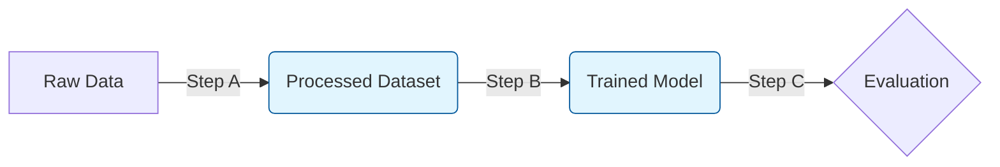
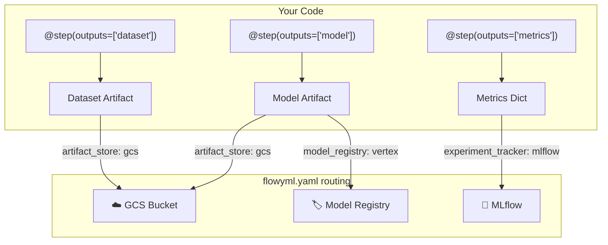

<div class="landing-hero">


<h1>FlowyML 🌊</h1>

<div class="tagline">
The <strong>Artifact-Centric</strong> ML Pipeline Framework that lets you focus on Machine Learning, not infrastructure plumbing. Define your data — we build the DAG.
</div>

<div class="badge-row">
<span class="feature-badge">📦 Artifact-Centric</span>
<span class="feature-badge">⚡ Auto-DAG</span>
<span class="feature-badge">🔬 GenAI Eval</span>
<span class="feature-badge">☁️ Multi-Cloud</span>
<span class="feature-badge">🐳 Cloud-Native</span>
<span class="feature-badge">🛡️ Production-Ready</span>
</div>

<div class="stats-strip">
<div class="stat-item"><span class="stat-number">17+</span><span class="stat-label">Eval Scorers</span></div>
<div class="stat-item"><span class="stat-number">∞</span><span class="stat-label">Plugin Ecosystem</span></div>
<div class="stat-item"><span class="stat-number">0</span><span class="stat-label">Arrows to Write</span></div>
<div class="stat-item"><span class="stat-number">3</span><span class="stat-label">Clouds Supported</span></div>
</div>

</div>

---

## 📦 Why Artifact-Centric Changes Everything

Typical orchestrators (Airflow, ZenML, Prefect) are **task-based** — you wire arrows between steps manually. FlowyML is **artifact-centric** — steps declare what data they **produce** and **consume**, and the DAG is built automatically.

<div class="pitch-grid" markdown>

<div class="pitch-card" markdown>
### 🧪 Beyond Tasks
Stop thinking about *what to run*. Think about *what you produce*. FlowyML builds the DAG from your **`inputs`** and **`outputs`** — no `>>` arrows, no `.set_downstream()`.
</div>

<div class="pitch-card" markdown>
### 🏗️ Unified Stacks
Same code runs locally, on **Kubernetes**, **Vertex AI**, or **SageMaker**. Swap infrastructure with a single YAML change — zero code rewrites.
</div>

<div class="pitch-card" markdown>
### 🛡️ Production First
Built-in **lineage tracking**, **intelligent caching**, **human-in-the-loop**, **distributed execution**, and **model leaderboards** as first-class citizens.
</div>

</div>

### 🔍 The Technical Paradigm Shift



| Concept | Task-Based (Traditional) | Artifact-Centric (FlowyML) |
|---------|-------------------------|----------------------------|
| **Core focus** | The order of operations ("The Verb") | The state of the data ("The Noun") |
| **DAG Construction** | Manual arrows (`step1 >> step2`) | **Auto-Inferred** from input/output signatures |
| **Data Handoff** | Manual paths (`s3://bucket/run_1/X.csv`) | **Global Catalog** resolution by name & version |
| **Validation** | Runtime failure ("File not found") | **Compile-time** type and lineage check |
| **Reproducibility** | Hope the script hasn't changed | **Immutable Lineage** (Parents → Child chain) |

---

## ⚡ The "Zen" Developer Experience

A complete, production-ready pipeline. Notice: **no arrows** (`>>`). The dependency between `load_data` and `train_model` is **auto-inferred** from the `dataset` artifact.

```python linenums="1"
from flowyml import Pipeline, step, context, Model
from typing import List

@step(outputs=["dataset"])
def load_data() -> List[int]:
    """Produces a list of integers as an Artifact."""
    return [1, 2, 3, 4, 5]

@step(inputs=["dataset"], outputs=["model"])
def train_model(dataset: List[int], learning_rate: float) -> Model:
    """Consumes 'dataset' and 'learning_rate' (from context)."""
    # 'learning_rate' is automatically injected from the execution context!
    print(f"Training on {len(dataset)} items with lr={learning_rate}")
    return Model(data="weights", name="mnist_model", version="1.0.0")

# 1. Define Execution Context (Hyperparameters, etc.)
ctx = context(learning_rate=0.05)

# 2. Build Pipeline
pipeline = Pipeline("quickstart", context=ctx)
pipeline.add_step(load_data).add_step(train_model)

# 3. Run (Auto-Discovered dependencies)
pipeline.run()
```

---

## 🔄 How Artifacts Flow Through Infrastructure

FlowyML **automatically routes artifacts** to your configured infrastructure. Here's exactly how the YAML config connects to your code:



!!! info "📌 The Golden Rule"
    **Without a stack configured** → artifacts are stored locally in `.flowyml/artifacts/`.
    **With a stack configured** → artifacts are automatically uploaded to the configured stores based on their **type** (`Model`, `Dataset`, `Metrics`).

### ⚙️ How YAML Maps to Code

```yaml linenums="1"
# flowyml.yaml — this is what controls WHERE artifacts go
plugins:
  experiment_tracker:           # ← Metrics & Parameters go here
    type: mlflow
    tracking_uri: http://localhost:5000

  artifact_store:               # ← Datasets & general artifacts go here
    type: gcs
    bucket: my-ml-artifacts
    prefix: experiments/

  model_registry:               # ← Models get registered here (if enabled)
    type: vertex_model_registry

  orchestrator:                 # ← WHERE steps execute (local, cloud, K8s)
    type: vertex_ai
    project: my-gcp-project
```

```python linenums="1"
from flowyml import step
from flowyml.core import Model, Metrics

@step(outputs=["model"])
def train() -> Model:
    """FlowyML sees the return type is `Model`:
    → Saves to artifact_store (GCS bucket)
    → Registers in model_registry (Vertex AI)
    → All automatic — zero extra code!
    """
    clf = train_classifier(data)
    return Model(data=clf, name="fraud_detector", version="1.0.0")

@step(outputs=["metrics"])
def evaluate() -> Metrics:
    """FlowyML sees the return type is `Metrics`:
    → Logs to experiment_tracker (MLflow)
    → Automatic — no mlflow.log_metrics() call needed!
    """
    return Metrics({"accuracy": 0.95, "f1": 0.92})

@step(outputs=["dataset"])
def preprocess() -> list:
    """Return type is `list` (not a typed artifact):
    → Saved to artifact_store (GCS bucket) as serialized data
    → FlowyML uses materializers to serialize/deserialize
    """
    return [1, 2, 3, 4, 5]
```

!!! tip "💡 What triggers an upload?"
    | Scenario | What Happens |
    |----------|-------------|
    | **No stack / local stack** | Artifacts saved to `./artifacts/` on disk — no upload |
    | **Stack with `artifact_store: gcs`** | All step outputs uploaded to GCS bucket |
    | **Step returns `Model` type** | Saved to artifact store **+ registered** in model registry (if configured) |
    | **Step returns `Metrics` type** | Logged to experiment tracker (MLflow/W&B) **+ saved** to artifact store |
    | **`artifact_routing` rules defined** | Fine-grained control: deploy models, set paths, conditional deploy |
    | **No `model_registry` configured** | Models saved to artifact store only — no registration |

---

## 🤖 GenAI & LLM Evaluation

FlowyML natively supports **LLM observability** and **evaluation**:

- **🕵️ LLM Tracing** — Capture every LLM call, token count, latency, and cost with `@trace_llm`
- **🎯 17+ Built-in Scorers** — Relevance, Faithfulness, Toxicity, and LLM-as-a-Judge evaluators
- **🏟️ Judge Arena** — A/B test evaluators against human labels in real-time
- **🛡️ CI/CD Gates** — Block bad models with quality assertions in your test suite

```python linenums="1"
from flowyml.evals import evaluate, EvalDataset, Relevance, Faithfulness

# 1. Capture traces or use a static dataset
data = EvalDataset.create_genai("rag_quality", examples=[...])

# 2. Run multi-scorer evaluation
result = evaluate(data=data, scorers=[Relevance(), Faithfulness()])

# 3. Quality Gate
assert result.pass_rate >= 0.9
```

---

## 🎯 Why Teams Choose FlowyML

<div class="pitch-grid" markdown>

<div class="pitch-card" markdown>
### 💡 Zero Arrow Wiring
Define `inputs` and `outputs` on your steps. FlowyML **auto-discovers** the DAG — no `.set_downstream()` or `>>` plumbing.
</div>

<div class="pitch-card" markdown>
### 🔄 Same Code, Everywhere
Write once, deploy anywhere. Swap from local SQLite → GCS + Vertex AI → S3 + SageMaker with a single **Stack** config change.
</div>

<div class="pitch-card" markdown>
### 📊 Built-In Observability
Real-time UI dashboard, lineage graphs, Gantt-chart timelines, and LLM token tracking — no extra plugins needed.
</div>

</div>

---

## 🗺️ Master the Platform

<div class="grid cards" markdown>

-   :rocket: **[Getting Started](getting-started.md)**
    ---
    Build your first pipeline in 5 minutes. Learn the basics of Steps and Pipelines.

-   :book: **[Core Concepts](core/pipelines.md)**
    ---
    Deep dive into the heart of FlowyML: Pipelines, Steps, Context, and Asset Lineage.

-   :package: **[Artifact-Centric Philosophy](artifact-centric.md)**
    ---
    Understand *why* focusing on Artifacts instead of Tasks changes everything for ML stability.

-   :zap: **[Advanced Features](advanced_features.md)**
    ---
    Master Caching, Parallelism, Conditional Execution, Step Grouping, and more.

-   :chart_with_upwards_trend: **[User Guide](user-guide/projects.md)**
    ---
    Manage projects, deployments, versioning, scheduling, and observability dashboards.

-   :plug: **[Plugins & Stacks](plugins/overview.md)**
    ---
    Cloud integrations, model registries, type-based routing, and stack management.

</div>

---

## 🏗️ Practical Examples {#practical-examples}

Explore real-world implementations in the [examples/](https://github.com/UnicoLab/FlowyML/tree/main/examples) directory:

-   **[Complete Demo](https://github.com/UnicoLab/FlowyML/blob/main/examples/complete_demo.py)**: A massive tour of versioning, projects, notifications, and drift detection.
-   **[Pipeline Showcase](https://github.com/UnicoLab/FlowyML/blob/main/examples/pipeline_showcase.py)**: Complex branching, caching, and multi-asset management.
-   **[UI Integration](https://github.com/UnicoLab/FlowyML/blob/main/examples/ui_integration_example.py)**: Real-time monitoring with the web dashboard.
-   **[Simple Pipeline](https://github.com/UnicoLab/FlowyML/blob/main/examples/simple_pipeline.py)**: The absolute basics.

---

<p align="center">
  <b>FlowyML is for those who are tired of plumbing.</b><br>
  <i>Focus on the ML. We'll handle the flow.</i>
</p>
