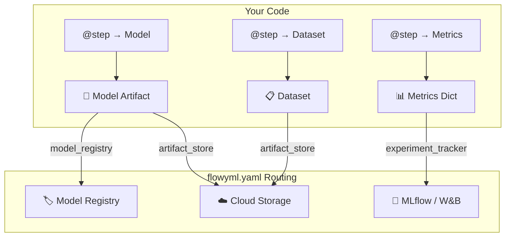

<!-- ============================================================
     HERO — Immersive landing with animated orbs, logo & CTAs
     ============================================================ -->

<div class="landing-hero landing-hero--v2">

<div class="hero-orb hero-orb--1"></div>
<div class="hero-orb hero-orb--2"></div>
<div class="hero-orb hero-orb--3"></div>

<div class="hero-content">


<h1>FlowyML <span class="hero-wave">🌊</span></h1>

<div class="hero-subtitle">
Write ML code once. Run it <strong>anywhere</strong> — local, Docker, GCP, AWS, Azure.<br>
<span class="hero-accent">Your code stays the same. Only the infrastructure changes.</span>
</div>

<div class="badge-row">
<span class="feature-badge">🔓 Code ≠ Infra</span>
<span class="feature-badge">📦 Artifact-Centric</span>
<span class="feature-badge">⚡ Auto-DAG</span>
<span class="feature-badge">🔬 29+ Eval Scorers</span>
<span class="feature-badge">☁️ Multi-Cloud</span>
<span class="feature-badge">🤖 GenAI Observability</span>
</div>

<div class="hero-cta-row">
<a href="getting-started/" class="cta-button cta-primary cta-glow">🚀 Get Started</a>
<a href="why-flowyml/" class="cta-button cta-secondary">🤔 Why FlowyML?</a>
<a href="FEATURES/" class="cta-button cta-secondary">✨ Explore Features</a>
</div>

<div class="stats-strip">
<div class="stat-item"><span class="stat-number">0</span><span class="stat-label">Infra Rewrites</span></div>
<div class="stat-item"><span class="stat-number">29+</span><span class="stat-label">Eval Scorers</span></div>
<div class="stat-item"><span class="stat-number">3</span><span class="stat-label">Cloud Providers</span></div>
<div class="stat-item"><span class="stat-number">0</span><span class="stat-label">Arrows to Write</span></div>
<div class="stat-item"><span class="stat-number">∞</span><span class="stat-label">Plugin Ecosystem</span></div>
</div>

</div>

</div>

<!-- ============================================================
     WHAT IS FLOWYML — Split layout with value prop
     ============================================================ -->

<div class="landing-section" markdown>

<div class="section-header" markdown>

## 💡 What is FlowyML?

The open-source Python framework that **completely decouples** your ML code from infrastructure.

</div>

<div class="value-prop" markdown>

<div class="value-prop-text" markdown>

Most ML teams waste months wrestling with infrastructure instead of building models. FlowyML fixes this with **three core principles**:

</div>

</div>

<div class="pitch-grid" markdown>

<div class="pitch-card" markdown>

### 🔓 Code ≠ Infrastructure

Your ML code is **completely independent** of where it runs. Develop locally on a laptop, then deploy the **exact same code** to GCP Vertex AI, AWS SageMaker, or Azure ML. Switch clouds with one environment variable — zero code changes, zero rewrites, zero vendor lock-in.

</div>

<div class="pitch-card" markdown>

### 📦 Artifact-Centric DAGs

Forget manual DAG wiring. Steps declare what data they **produce** and **consume** — FlowyML builds the execution graph automatically. Models, Datasets, and Metrics are first-class citizens with automatic lineage, versioning, and type-safe connections.

</div>

<div class="pitch-card" markdown>

### 🏭 Production from Day One

Every pipeline gets smart caching, parallel execution, drift monitoring, 29+ evaluation scorers, a beautiful dark-mode dashboard, and built-in GenAI observability. Not as add-ons — **out of the box**.

</div>

</div>

!!! success "The Bottom Line"
    Write a Python function → Add the `@step` decorator → Get a production pipeline with caching, lineage tracking, cloud deployment, and a monitoring dashboard. **No arrows. No DSLs. No YAML hell. No infrastructure rewrites.**

</div>

<!-- ============================================================
     BEFORE / AFTER — Side-by-side comparison
     ============================================================ -->

<div class="landing-section landing-section--alt" markdown>

<div class="section-header" markdown>

## ⚡ See the Difference

</div>

<div class="comparison-grid" markdown>

<div class="comparison-panel comparison-panel--before" markdown>

<div class="comparison-label comparison-label--before">❌ Traditional Orchestrator</div>

```python
# Airflow / Prefect style
@task
def load_data():
    data = fetch_dataset()
    save_to_s3("s3://bucket/data.csv", data)
    return "s3://bucket/data.csv"

@task
def train(data_path: str):
    data = load_from_s3(data_path)
    model = fit(data)
    save_to_s3("s3://bucket/model.pkl", model)

# Manual wiring required!
load_task = load_data()
train_task = train(load_task)
load_task >> train_task  # 😩 Arrows everywhere
```

</div>

<div class="comparison-panel comparison-panel--after" markdown>

<div class="comparison-label comparison-label--after">✅ FlowyML</div>

```python
from flowyml import Pipeline, step, context, Model

@step(outputs=["dataset"])
def load_data() -> list:
    """Produces a dataset artifact."""
    return fetch_dataset()

@step(inputs=["dataset"], outputs=["model"])
def train(dataset: list) -> Model:
    """Auto-wired via 'dataset' artifact."""
    return Model(fit(dataset))

# Zero arrows — DAG builds itself!
pipeline = Pipeline("my_pipeline")
pipeline.add_step(load_data).add_step(train)
pipeline.run()  # 🎉 Done!
```

</div>

</div>

!!! tip "💡 What just happened?"
    FlowyML **auto-discovered** that `train` depends on `load_data` through the `dataset` artifact. No `>>` arrows, no `.set_downstream()`, no manual S3 paths. **Just Python.**

</div>

<!-- ============================================================
     HOW IT WORKS — 3 numbered steps
     ============================================================ -->

<div class="landing-section" markdown>

<div class="section-header" markdown>

## 🏗️ How FlowyML Works

</div>

<div class="how-it-works-grid" markdown>

<div class="how-step" markdown>
<div class="how-step-number">1</div>

### Define Steps
Decorate Python functions with `@step`. Declare `inputs` and `outputs` — that's it.

```python
@step(outputs=["model"])
def train(dataset, lr: float) -> Model:
    return Model(train_classifier(dataset))
```
</div>

<div class="how-step" markdown>
<div class="how-step-number">2</div>

### Configure Infrastructure
One YAML file controls where everything runs. Switch clouds with a single env var.

```bash
export FLOWYML_STACK=production
python pipeline.py  # Now on Vertex AI
```
</div>

<div class="how-step" markdown>
<div class="how-step-number">3</div>

### Monitor & Ship
Beautiful dark-mode dashboard with DAGs, metrics, artifacts, and GenAI traces.

```bash
flowyml ui start
# → http://localhost:8080
```
</div>

</div>

</div>

<!-- ============================================================
     INTEGRATION STRIP — Works with everything
     ============================================================ -->

<div class="landing-section landing-section--alt" markdown>

<div class="section-header" markdown>

## 🔌 Works With the Tools You Already Use

15+ integrations across the ML ecosystem — from scikit-learn to LangChain, PyTorch to Vertex AI.

</div>

<div class="integration-strip">
<div class="integration-logos">
<div class="integration-logo-item"><span class="integration-emoji">🔬</span> scikit-learn</div>
<div class="integration-logo-item"><span class="integration-emoji">🔥</span> PyTorch</div>
<div class="integration-logo-item"><span class="integration-emoji">🧠</span> TensorFlow</div>
<div class="integration-logo-item"><span class="integration-emoji">🎯</span> Keras</div>
<div class="integration-logo-item"><span class="integration-emoji">🤗</span> Hugging Face</div>
<div class="integration-logo-item"><span class="integration-emoji">🦜</span> LangChain</div>
<div class="integration-logo-item"><span class="integration-emoji">📊</span> MLflow</div>
<div class="integration-logo-item"><span class="integration-emoji">📈</span> W&B</div>
<div class="integration-logo-item"><span class="integration-emoji">☁️</span> GCP Vertex AI</div>
<div class="integration-logo-item"><span class="integration-emoji">🟧</span> AWS SageMaker</div>
<div class="integration-logo-item"><span class="integration-emoji">🔵</span> Azure ML</div>
<div class="integration-logo-item"><span class="integration-emoji">🐳</span> Docker</div>
<div class="integration-logo-item"><span class="integration-emoji">☸️</span> Kubernetes</div>
<div class="integration-logo-item"><span class="integration-emoji">💬</span> Slack</div>
<div class="integration-logo-item"><span class="integration-emoji">🤖</span> OpenAI SDK</div>
<!-- Duplicate set for seamless marquee loop -->
<div class="integration-logo-item"><span class="integration-emoji">🔬</span> scikit-learn</div>
<div class="integration-logo-item"><span class="integration-emoji">🔥</span> PyTorch</div>
<div class="integration-logo-item"><span class="integration-emoji">🧠</span> TensorFlow</div>
<div class="integration-logo-item"><span class="integration-emoji">🎯</span> Keras</div>
<div class="integration-logo-item"><span class="integration-emoji">🤗</span> Hugging Face</div>
<div class="integration-logo-item"><span class="integration-emoji">🦜</span> LangChain</div>
<div class="integration-logo-item"><span class="integration-emoji">📊</span> MLflow</div>
<div class="integration-logo-item"><span class="integration-emoji">📈</span> W&B</div>
<div class="integration-logo-item"><span class="integration-emoji">☁️</span> GCP Vertex AI</div>
<div class="integration-logo-item"><span class="integration-emoji">🟧</span> AWS SageMaker</div>
<div class="integration-logo-item"><span class="integration-emoji">🔵</span> Azure ML</div>
<div class="integration-logo-item"><span class="integration-emoji">🐳</span> Docker</div>
<div class="integration-logo-item"><span class="integration-emoji">☸️</span> Kubernetes</div>
<div class="integration-logo-item"><span class="integration-emoji">💬</span> Slack</div>
<div class="integration-logo-item"><span class="integration-emoji">🤖</span> OpenAI SDK</div>
</div>
</div>

<div style="text-align: center; margin-top: 0.5rem;">
<a href="ecosystem/" class="cta-button cta-secondary" style="display: inline-flex;">See All Integrations →</a>
</div>

</div>

<!-- ============================================================
     HOW DECOUPLING WORKS — Visual stack diagram
     ============================================================ -->

<div class="landing-section" markdown>

<div class="section-header" markdown>

## 🔓 How Infrastructure Decoupling Works

Your code, FlowyML's orchestration layer, and your infrastructure are **three independent layers**. Swap any layer without touching the others.

</div>

<div class="stack-visual">
<div class="stack-visual-content">
<div class="stack-layers">

<div class="stack-layer stack-layer--code">
<div class="stack-layer-icon">🐍</div>
<div class="stack-layer-content">
<div class="stack-layer-title">Your ML Code</div>
<div class="stack-layer-desc">Pure Python. @step decorators. No infrastructure imports. Never changes.</div>
</div>
</div>

<div class="stack-arrow">↕️</div>

<div class="stack-layer stack-layer--flowyml">
<div class="stack-layer-icon">🌊</div>
<div class="stack-layer-content">
<div class="stack-layer-title">FlowyML Orchestration Layer</div>
<div class="stack-layer-desc">Auto-DAG, artifact catalog, caching, lineage, evaluation, dashboard.</div>
</div>
</div>

<div class="stack-arrow">↕️</div>

<div class="stack-layer stack-layer--infra">
<div class="stack-layer-icon">☁️</div>
<div class="stack-layer-content">
<div class="stack-layer-title">Infrastructure (Swappable via flowyml.yaml)</div>
<div class="stack-layer-desc">Local → Docker → Vertex AI → SageMaker → Azure ML. One env var to switch.</div>
</div>
</div>

</div>
</div>
</div>

!!! info "The Key Insight"
    Traditional frameworks mix infrastructure into your code (`save_to_s3()`, `load_from_gcs()`). FlowyML **eliminates this entirely**. Your steps produce artifacts by name — FlowyML routes them to the right infrastructure based on your stack config. Switch from local development to GCP production with `export FLOWYML_STACK=production`. **Zero code changes.**

</div>

<!-- ============================================================
     USE CASES — What you can build
     ============================================================ -->

<div class="landing-section landing-section--alt" markdown>

<div class="section-header" markdown>

## 🚀 Built For Every ML Workflow

</div>

<div class="usecase-grid" markdown>

<div class="usecase-card" markdown>
<div class="usecase-icon">🏋️</div>

### Model Training
End-to-end training pipelines with data loading, preprocessing, training, evaluation, and model registry. Smart caching skips unchanged steps.

[Example pipeline →](getting-started.md)
</div>

<div class="usecase-card" markdown>
<div class="usecase-icon">🤖</div>

### GenAI & LLM Apps
Build RAG pipelines, fine-tuning workflows, and LLM evaluation suites. Built-in tracing tracks every token, cost, and latency across LangChain, OpenAI, and more.

[GenAI observability →](integrations/genai-observability.md)
</div>

<div class="usecase-card" markdown>
<div class="usecase-icon">📊</div>

### Evaluation & CI/CD
29+ built-in scorers for classification, regression, and LLM-as-a-Judge. Automatic quality gates block bad models from production.

[Evaluation docs →](evaluations.md)
</div>

<div class="usecase-card" markdown>
<div class="usecase-icon">🔄</div>

### Continuous Training
Scheduled re-training with drift detection, data validation, and automatic model promotion. Full experiment lineage for audit and reproducibility.

[Advanced workflows →](advanced/dynamic-workflows.md)
</div>

</div>

</div>

<!-- ============================================================
     FEATURE HIGHLIGHTS — Premium card grid
     ============================================================ -->

<div class="landing-section" markdown>

<div class="section-header" markdown>

## 🎯 Feature Highlights

</div>

<div class="feature-showcase" markdown>

<div class="feature-card" markdown>
<div class="feature-icon">🔓</div>

### Decouple Code from Infrastructure
Your ML code **never touches infrastructure**. Develop on a laptop, deploy to Vertex AI, SageMaker, or Azure ML. Switch clouds with `export FLOWYML_STACK=prod` — zero code changes.

[Learn more →](plugins/stack-configuration.md)
</div>

<div class="feature-card" markdown>
<div class="feature-icon">📦</div>

### Artifact-Centric Pipelines
Steps declare what data they produce and consume. The DAG builds itself — no manual wiring. Models, Datasets, and Metrics are **first-class citizens** with automatic lineage.

[Learn more →](core/assets.md)
</div>

<div class="feature-card" markdown>
<div class="feature-icon">🤖</div>

### GenAI Observability
Built-in LLM tracing for **LangGraph**, **LangChain**, **OpenAI SDK**, or any framework. Track every token, cost, and latency. No LangSmith needed.

[Learn more →](integrations/genai-observability.md)
</div>

<div class="feature-card" markdown>
<div class="feature-icon">🎯</div>

### 29+ Evaluation Scorers
Production-grade evaluation: classification, regression, and GenAI (LLM-as-a-Judge). Adapters for **DeepEval**, **RAGAS**, and **Phoenix**. CI/CD quality gates built in.

[Learn more →](evaluations.md)
</div>

<div class="feature-card" markdown>
<div class="feature-icon">🖥️</div>

### Beautiful Dashboard
Dark-mode web UI with pipeline DAG visualization, experiment comparison, artifact inspection, GenAI traces, and model training curves — all in real-time.

[Learn more →](gui-overview.md)
</div>

<div class="feature-card" markdown>
<div class="feature-icon">⚡</div>

### Smart Caching & Performance
Content-based hashing skips unchanged steps. Parallel execution, map tasks, step grouping, and lazy evaluation keep your pipelines fast.

[Learn more →](advanced/caching.md)
</div>

<div class="feature-card" markdown>
<div class="feature-icon">🔀</div>

### Dynamic Workflows
Generate sub-pipelines at runtime with `@dynamic`. Run hyperparameter sweeps, conditional branches, and human-in-the-loop approvals.

[Learn more →](advanced/dynamic-workflows.md)
</div>

<div class="feature-card" markdown>
<div class="feature-icon">🔌</div>

### Plugin Ecosystem
Extensible architecture with plugins for MLflow, W&B, Slack, Docker, Kubernetes, and more. Import 50+ ZenML integrations with one line.

[Learn more →](plugins/overview.md)
</div>

</div>

</div>

<!-- ============================================================
     DASHBOARD SHOWCASE — Featured screenshot with gallery
     ============================================================ -->

<div class="landing-section" markdown>

<div class="section-header" markdown>

## 🖥️ The Dashboard

FlowyML ships with a **full-featured web dashboard** for monitoring, debugging, and managing your entire ML lifecycle.

</div>

<div class="dashboard-showcase" markdown>

<div class="dashboard-featured" markdown>

</div>

<div class="dashboard-grid" markdown>

<div class="dashboard-thumb" markdown>


**Pipeline DAG** — Real-time step status
</div>

<div class="dashboard-thumb" markdown>


**Training Curves** — Interactive charts
</div>

<div class="dashboard-thumb" markdown>


**GenAI Traces** — Token & cost monitoring
</div>

</div>

</div>

<div style="text-align: center; margin-top: 1.5rem;">
<a href="gui-overview/" class="cta-button cta-secondary" style="display: inline-flex;">📸 Full GUI Tour →</a>
</div>

</div>

<!-- ============================================================
     COMPARISON TABLE — FlowyML vs Others
     ============================================================ -->

<div class="landing-section landing-section--alt" markdown>

<div class="section-header" markdown>

## 📊 FlowyML vs. The Rest

Most ML frameworks force you to choose between simplicity and power. FlowyML gives you both.

</div>

<div class="impact-strip">
<div class="impact-item">
<span class="impact-number">0</span>
<span class="impact-label">Infrastructure rewrites when switching clouds</span>
</div>
<div class="impact-item">
<span class="impact-number">10x</span>
<span class="impact-label">Less boilerplate vs. Airflow / Prefect</span>
</div>
<div class="impact-item">
<span class="impact-number">29+</span>
<span class="impact-label">Built-in eval scorers (vs. 0 in most frameworks)</span>
</div>
<div class="impact-item">
<span class="impact-number">5 min</span>
<span class="impact-label">From install to first pipeline running</span>
</div>
</div>

| Concept | Airflow / Prefect / ZenML | **FlowyML** |
|---------|:-------------------------:|:-----------:|
| **Infrastructure Coupling** | Code references cloud paths | **Code never touches infrastructure** |
| **DAG Construction** | Manual arrows or task wiring | **Auto-Inferred** from artifact names |
| **Data Handoff** | `s3://bucket/file.csv` in code | **Catalog** resolution by name & version |
| **Type Safety** | Runtime failures | **Build-time** validation |
| **Cloud Deployment** | Vendor lock-in or complex adapters | **One env var** — `FLOWYML_STACK=prod` |
| **GenAI Observability** | Requires LangSmith or external tools | **Built-in** tracing & evaluation |
| **Evaluation Scorers** | Bring your own (manual scripting) | **29+ built-in** with CI/CD quality gates |
| **Dashboard** | Separate tool (MLflow, etc.) | **Included** — dark mode, DAGs, traces |
| **Developer Experience** | YAML configs or rigid DSLs | **Pure Python** decorators — no DSLs |
| **Caching** | File-timestamp or none | **Content-hash** (code + data inputs) |
| **Notebook → Pipeline** | Manual conversion | **One-click** via FlowyML Notebook |

</div>

<!-- ============================================================
     ARTIFACT FLOW DIAGRAM
     ============================================================ -->

<div class="landing-section" markdown>

<div class="section-header" markdown>

## 🔄 How Artifacts Flow Through Infrastructure

FlowyML **automatically routes artifacts** to your configured infrastructure based on their **type**.

</div>



!!! info "The Golden Rule"
    **No stack configured?** → Artifacts saved locally. **Stack configured?** → Artifacts auto-routed to cloud based on type. Zero code changes.

</div>

<!-- ============================================================
     NOTEBOOK CALLOUT — Immersive dark section
     ============================================================ -->

<div class="notebook-callout" markdown>

<div class="notebook-callout-content" markdown>

### 🌊 FlowyML Notebook — The Reactive Notebook That Ships to Production

**FlowyML Notebook** is a companion reactive notebook environment that replaces Jupyter for ML workflows. Write Python cells with **automatic dependency tracking**, then promote directly to FlowyML pipelines with one click.

<div class="badge-row" style="margin: 1rem 0;">
<span class="feature-badge">🔄 Reactive DAG</span>
<span class="feature-badge">📝 Pure .py Files</span>
<span class="feature-badge">🚀 One-Click Deploy</span>
<span class="feature-badge">🤖 AI Assistant</span>
<span class="feature-badge">🧾 43 Recipes</span>
</div>

**Key features:** SmartPrep Advisor · Algorithm Matchmaker · GitHub Integration · SQL First-Class · App Mode · Rich Data Exploration

```bash
pip install flowyml-notebook
fml-notebook dev  # 🔥 Launch with hot-reload
```

[:octicons-arrow-right-24: Learn more about FlowyML Notebook](flowyml-notebook.md){ .md-button } [:octicons-mark-github-16: GitHub](https://github.com/UnicoLab/flowyml-notebook){ .md-button .md-button--primary }

</div>

</div>

<!-- ============================================================
     EXPLORE DOCS — Navigation grid
     ============================================================ -->

<div class="landing-section landing-section--alt" markdown>

<div class="section-header" markdown>

## 🗺️ Explore the Documentation

</div>

<div class="grid cards" markdown>

-   :rocket: **[Getting Started](getting-started.md)**
    ---
    Build your first pipeline in 5 minutes. Install, create, run, and monitor.

-   :package: **[Core Concepts](core/pipelines.md)**
    ---
    Master Pipelines, Steps, Context, and Artifact Lineage — the heart of FlowyML.

-   :sparkles: **[Features Explorer](FEATURES.md)**
    ---
    Deep dive into 20+ features: evaluations, caching, drift detection, templates, and more.

-   :art: **[GUI Dashboard](gui-overview.md)**
    ---
    Visual tour of the web dashboard: DAGs, metrics, traces, and deployments.

-   :electric_plug: **[Plugins & Stacks](plugins/overview.md)**
    ---
    Multi-cloud deployment, artifact routing, and the extensible plugin architecture.

-   :globe_with_meridians: **[Ecosystem](ecosystem.md)**
    ---
    FlowyML Notebook, UnicoLab Keras tools, and the full integration landscape.

</div>

</div>

<!-- ============================================================
     INSTALLATION — Tabbed install + CTA
     ============================================================ -->

<div class="landing-section" markdown>

<div class="section-header" markdown>

## 📦 Installation

</div>

=== "Quick Install"

    ```bash
    pip install flowyml
    ```

=== "Full Install (Recommended)"

    ```bash
    pip install "flowyml[all]"
    ```

=== "Cloud Extras"

    ```bash
    pip install "flowyml[gcp]"    # Google Cloud
    pip install "flowyml[aws]"    # Amazon Web Services
    pip install "flowyml[azure]"  # Microsoft Azure
    ```

</div>

<!-- ============================================================
     CLOSING CTA — Full-width immersive banner
     ============================================================ -->

<div class="closing-banner">

<div class="closing-banner-content">

<h2>Ready to stop plumbing?</h2>
<p>Focus on the ML. We'll handle the flow.</p>

<div class="hero-cta-row" style="margin-top: 1.5rem;">
<a href="getting-started/" class="cta-button cta-primary cta-glow">🚀 Start Building</a>
<a href="https://github.com/UnicoLab/FlowyML" class="cta-button cta-secondary">⭐ Star on GitHub</a>
</div>

</div>

</div>
