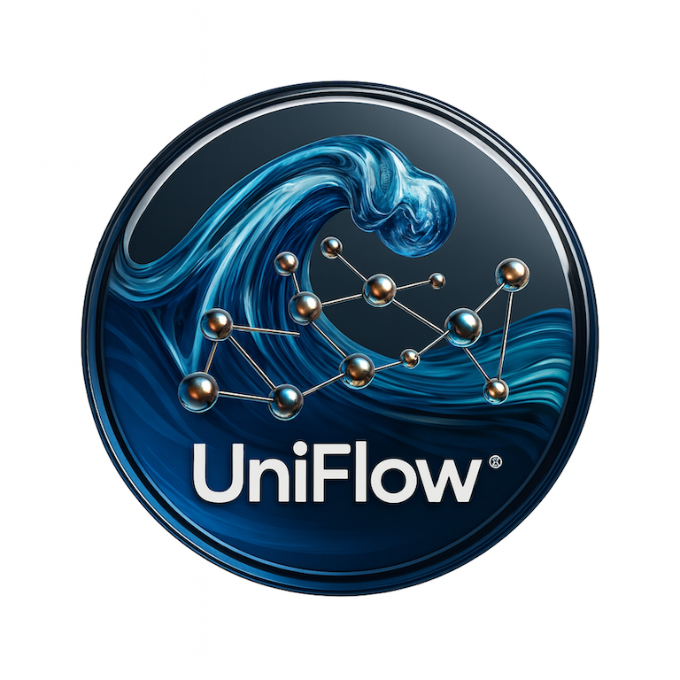
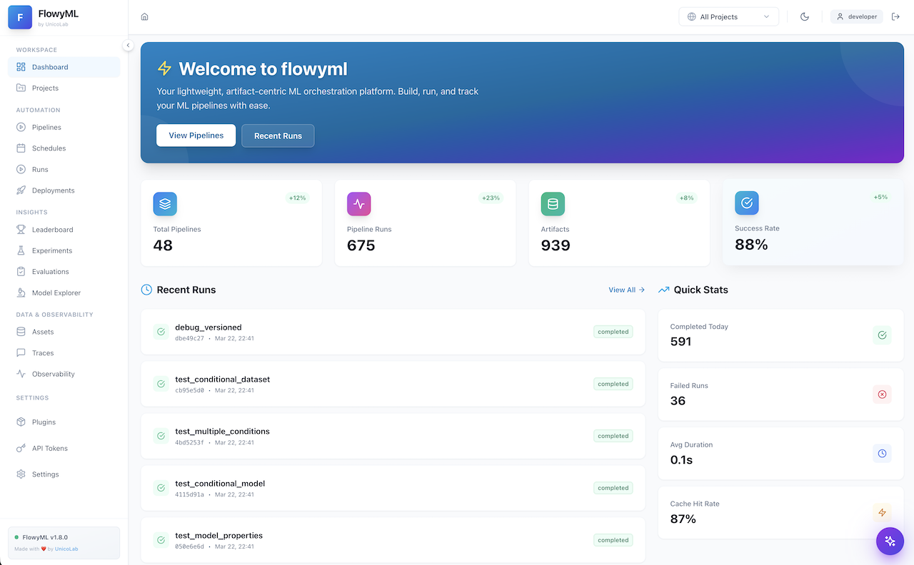
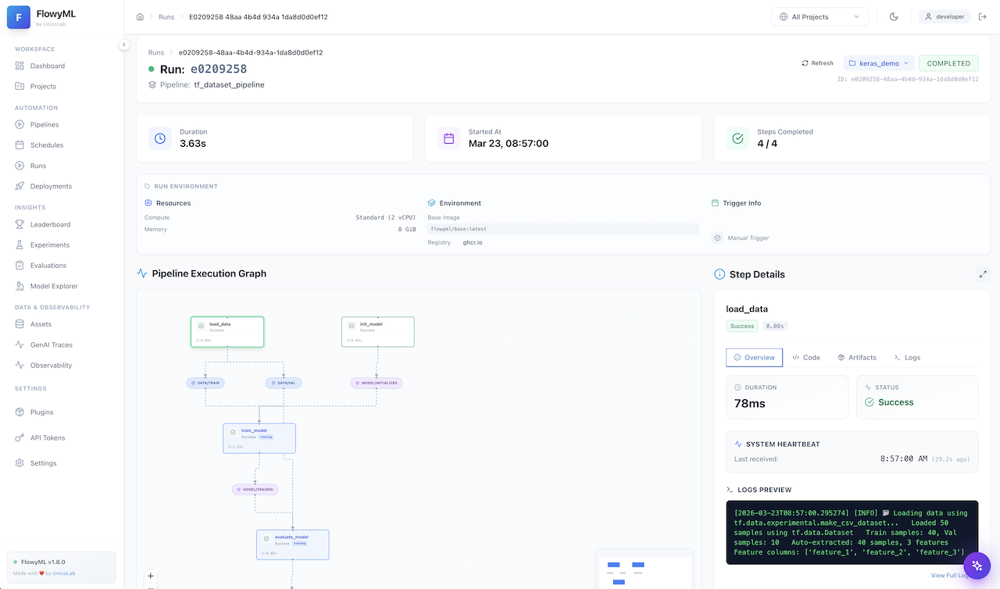
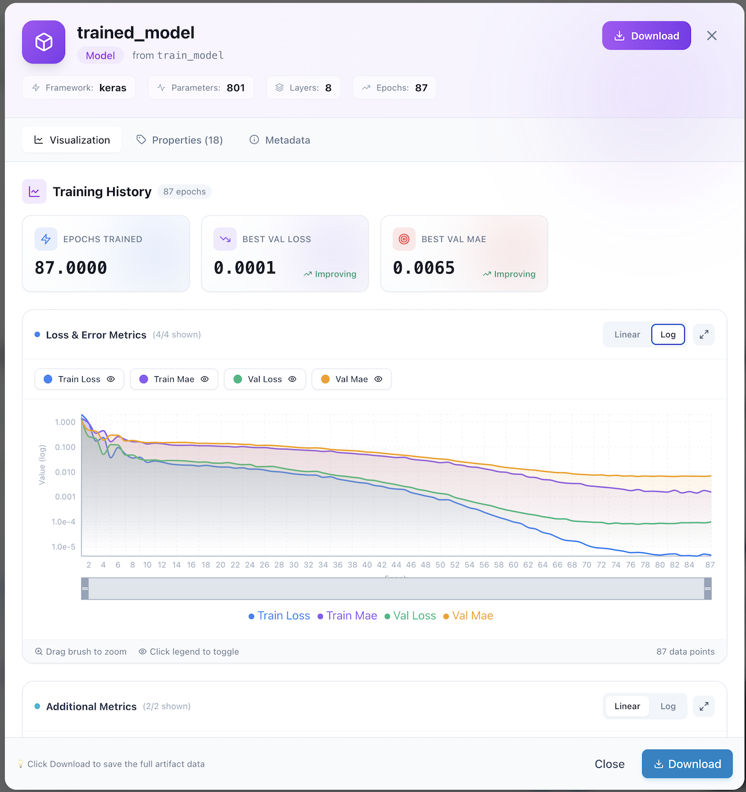
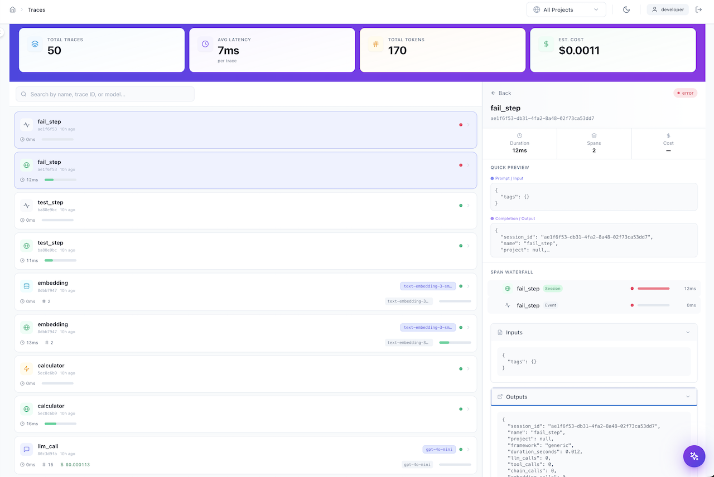
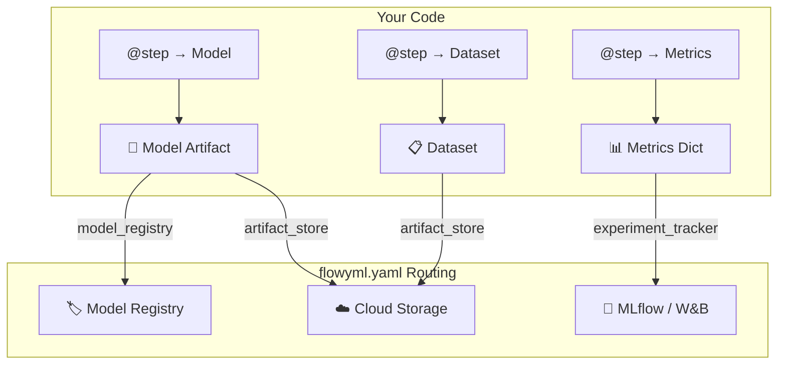

<!-- ============================================================
     HERO — Immersive landing with logo, tagline & CTAs
     ============================================================ -->

<div class="landing-hero">



<h1>FlowyML 🌊</h1>

<div class="tagline">
The <strong>Artifact-Centric</strong> ML Pipeline Framework that lets you focus on Machine Learning, not infrastructure plumbing.<br>
<em>Define your data — we build the DAG.</em>
</div>

<div class="badge-row">
<span class="feature-badge">📦 Artifact-Centric</span>
<span class="feature-badge">⚡ Auto-DAG</span>
<span class="feature-badge">🔬 GenAI Eval</span>
<span class="feature-badge">☁️ Multi-Cloud</span>
<span class="feature-badge">🐳 Cloud-Native</span>
<span class="feature-badge">🛡️ Production-Ready</span>
</div>

<div class="stats-strip">
<div class="stat-item"><span class="stat-number">29+</span><span class="stat-label">Eval Scorers</span></div>
<div class="stat-item"><span class="stat-number">3</span><span class="stat-label">Cloud Providers</span></div>
<div class="stat-item"><span class="stat-number">0</span><span class="stat-label">Arrows to Write</span></div>
<div class="stat-item"><span class="stat-number">∞</span><span class="stat-label">Plugin Ecosystem</span></div>
</div>

<div class="hero-cta-row">
<a href="getting-started/" class="cta-button cta-primary">🚀 Get Started</a>
<a href="why-flowyml/" class="cta-button cta-secondary">🤔 Why FlowyML?</a>
<a href="FEATURES/" class="cta-button cta-secondary">✨ Explore Features</a>
</div>

</div>

---

## 💡 What is FlowyML?

**FlowyML** is an open-source Python framework that turns ML experiments into production-ready pipelines with **zero infrastructure code**. Unlike traditional orchestrators that force you to wire steps manually, FlowyML uses an **artifact-centric** approach: declare what data your steps produce and consume, and the execution graph builds itself.

!!! success "The Bottom Line"
    Write a Python function → Add the `@step` decorator → Get a production pipeline with caching, lineage tracking, cloud deployment, and a monitoring dashboard. **No arrows. No DSLs. No YAML hell.**

---

## ⚡ See It in Action — 30 Seconds to a Pipeline

```python linenums="1"
from flowyml import Pipeline, step, context, Model

@step(outputs=["dataset"])
def load_data() -> list:
    """Produces a dataset artifact."""
    return [1, 2, 3, 4, 5]

@step(inputs=["dataset"], outputs=["model"])
def train_model(dataset: list, learning_rate: float) -> Model:
    """Consumes 'dataset', receives 'learning_rate' from context."""
    print(f"Training on {len(dataset)} items with lr={learning_rate}")
    return Model(data="weights", name="my_model", version="1.0.0")

# Configure, build, and run
ctx = context(learning_rate=0.05)
pipeline = Pipeline("quickstart", context=ctx)
pipeline.add_step(load_data).add_step(train_model)
pipeline.run()
```

!!! tip "💡 What just happened?"
    FlowyML **auto-discovered** that `train_model` depends on `load_data` through the `dataset` artifact. The `learning_rate` was **automatically injected** from context. No `>>` arrows, no `.set_downstream()`. Just Python.

---

## 🏗️ How FlowyML Works

<div class="how-it-works-grid" markdown>

<div class="how-step" markdown>
<div class="how-step-number">1</div>

### Define Steps
Decorate Python functions with `@step`. Declare `inputs` and `outputs` — that's it. FlowyML figures out the rest.

```python
@step(outputs=["model"])
def train(dataset, lr: float) -> Model:
    return Model(train_classifier(dataset))
```
</div>

<div class="how-step" markdown>
<div class="how-step-number">2</div>

### Configure Infrastructure
One YAML file controls where everything runs. Switch from local to cloud with a single environment variable.

```bash
export FLOWYML_STACK=production
python pipeline.py  # Now on Vertex AI
```
</div>

<div class="how-step" markdown>
<div class="how-step-number">3</div>

### Monitor & Ship
Beautiful dark-mode dashboard shows pipeline DAGs, metrics, artifacts, and GenAI traces in real-time.

```bash
flowyml ui start
# → http://localhost:8080
```
</div>

</div>

---

## 🎯 Feature Highlights

<div class="feature-showcase" markdown>

<div class="feature-card" markdown>
<div class="feature-icon">📦</div>

### Artifact-Centric Pipelines
Steps declare data dependencies. The DAG builds itself — no manual wiring. Models, Datasets, and Metrics are **first-class citizens** with automatic lineage tracking.

[Learn more →](core/assets.md)
</div>

<div class="feature-card" markdown>
<div class="feature-icon">☁️</div>

### Multi-Cloud, Zero Rewrites
Same code runs on **GCP Vertex AI**, **AWS SageMaker**, or **Azure ML**. Switch infrastructure with one YAML change — your pipeline code stays identical.

[Learn more →](plugins/stack-configuration.md)
</div>

<div class="feature-card" markdown>
<div class="feature-icon">🤖</div>

### GenAI Observability
Built-in LLM tracing for **LangGraph**, **LangChain**, **OpenAI SDK**, or any framework. Track every token, cost, and latency. No LangSmith needed.

[Learn more →](integrations/genai-observability.md)
</div>

<div class="feature-card" markdown>
<div class="feature-icon">🎯</div>

### 29+ Evaluation Scorers
Production-grade evaluation: classification, regression, and GenAI (LLM-as-a-Judge). Adapters for **DeepEval**, **RAGAS**, and **Phoenix**. CI/CD quality gates built in.

[Learn more →](evaluations.md)
</div>

<div class="feature-card" markdown>
<div class="feature-icon">🖥️</div>

### Beautiful Dashboard
Dark-mode web UI with pipeline DAG visualization, experiment comparison, artifact inspection, GenAI traces, and model training curves — all in real-time.

[Learn more →](gui-overview.md)
</div>

<div class="feature-card" markdown>
<div class="feature-icon">⚡</div>

### Smart Caching & Performance
Content-based hashing skips unchanged steps. Parallel execution, map tasks, step grouping, and lazy evaluation keep your pipelines fast.

[Learn more →](advanced/caching.md)
</div>

<div class="feature-card" markdown>
<div class="feature-icon">🔀</div>

### Dynamic Workflows
Generate sub-pipelines at runtime with `@dynamic`. Run hyperparameter sweeps, conditional branches, and human-in-the-loop approvals.

[Learn more →](advanced/dynamic-workflows.md)
</div>

<div class="feature-card" markdown>
<div class="feature-icon">🔌</div>

### Plugin Ecosystem
Extensible architecture with plugins for MLflow, W&B, Slack, Docker, Kubernetes, and more. Import 50+ ZenML integrations with one line.

[Learn more →](plugins/overview.md)
</div>

</div>

---

## 📊 FlowyML vs. Traditional Orchestrators

| Concept | Traditional Orchestrators | **FlowyML** |
|---------|:-------------------------:|:-----------:|
| **Core Paradigm** | Task-based ("The Verb") | **Artifact-centric** ("The Noun") |
| **DAG Construction** | Manual arrows (`step1 >> step2`) | **Auto-Inferred** from inputs/outputs |
| **Data Handoff** | Manual paths (`s3://bucket/file.csv`) | **Catalog** resolution by name & version |
| **Type Safety** | Runtime failures | **Build-time** validation |
| **Cloud Deployment** | Vendor lock-in or rewrites | **One env var** to switch clouds |
| **GenAI Observability** | Requires external tools | **Built-in** tracing & evaluation |
| **Developer Experience** | Complex YAML or rigid DSLs | **Pure Python** — no DSLs |
| **Caching** | Basic file-timestamp checks | **Content-hash** based (code + inputs) |
| **Model Management** | Generic file paths | **First-class** Model, Dataset, Metrics |
| **Evaluation** | Manual scripting | **29+ built-in** scorers with CI/CD gates |

---

## 🖥️ The Dashboard

FlowyML ships with a **full-featured web dashboard** for monitoring, debugging, and managing your entire ML lifecycle.

<div class="screenshot-gallery" markdown>

<div class="screenshot-card" markdown>


**Command Center** — Overview of pipeline health, recent runs, and workspace activity
</div>

<div class="screenshot-card" markdown>


**Pipeline DAG** — Interactive visualization with real-time step status
</div>

<div class="screenshot-card" markdown>


**Training Curves** — Interactive charts with zoom, log scale, and metric comparison
</div>

<div class="screenshot-card" markdown>


**GenAI Traces** — LLM call monitoring with token counts, latency, and cost
</div>

</div>

<div style="text-align: center; margin-top: 1rem;">
<a href="gui-overview/" class="cta-button cta-secondary" style="display: inline-flex;">📸 Full GUI Tour →</a>
</div>

---

## 🔄 How Artifacts Flow Through Infrastructure

FlowyML **automatically routes artifacts** to your configured infrastructure based on their **type**:



!!! info "The Golden Rule"
    **No stack configured?** → Artifacts saved locally. **Stack configured?** → Artifacts auto-routed to cloud based on type. Zero code changes.

---

## 📓 Design Pipelines Visually — FlowyML Notebook

<div class="notebook-callout" markdown>

<div class="notebook-callout-content" markdown>

### 🌊 FlowyML Notebook — The Reactive Notebook That Ships to Production

**FlowyML Notebook** is a companion reactive notebook environment that replaces Jupyter for ML workflows. Write Python cells with **automatic dependency tracking**, then promote directly to FlowyML pipelines with one click.

<div class="badge-row" style="margin: 1rem 0;">
<span class="feature-badge">🔄 Reactive DAG</span>
<span class="feature-badge">📝 Pure .py Files</span>
<span class="feature-badge">🚀 One-Click Deploy</span>
<span class="feature-badge">🤖 AI Assistant</span>
<span class="feature-badge">🧾 43 Recipes</span>
</div>

**Key features:** SmartPrep Advisor · Algorithm Matchmaker · GitHub Integration · SQL First-Class · App Mode · Rich Data Exploration

```bash
pip install flowyml-notebook
fml-notebook dev  # 🔥 Launch with hot-reload
```

[:octicons-arrow-right-24: Learn more about FlowyML Notebook](flowyml-notebook.md){ .md-button } [:octicons-mark-github-16: GitHub](https://github.com/UnicoLab/flowyml-notebook){ .md-button .md-button--primary }

</div>

</div>

---

## 🗺️ Explore the Documentation

<div class="grid cards" markdown>

-   :rocket: **[Getting Started](getting-started.md)**
    ---
    Build your first pipeline in 5 minutes. Install, create, run, and monitor.

-   :package: **[Core Concepts](core/pipelines.md)**
    ---
    Master Pipelines, Steps, Context, and Artifact Lineage — the heart of FlowyML.

-   :sparkles: **[Features Explorer](FEATURES.md)**
    ---
    Deep dive into 20+ features: evaluations, caching, drift detection, templates, and more.

-   :art: **[GUI Dashboard](gui-overview.md)**
    ---
    Visual tour of the web dashboard: DAGs, metrics, traces, and deployments.

-   :electric_plug: **[Plugins & Stacks](plugins/overview.md)**
    ---
    Multi-cloud deployment, artifact routing, and the extensible plugin architecture.

-   :globe_with_meridians: **[Ecosystem](ecosystem.md)**
    ---
    FlowyML Notebook, UnicoLab Keras tools, and the full integration landscape.

</div>

---

## 📦 Installation

=== "Quick Install"

    ```bash
    pip install flowyml
    ```

=== "Full Install (Recommended)"

    ```bash
    pip install "flowyml[all]"
    ```

=== "Cloud Extras"

    ```bash
    pip install "flowyml[gcp]"    # Google Cloud
    pip install "flowyml[aws]"    # Amazon Web Services
    pip install "flowyml[azure]"  # Microsoft Azure
    ```

---

<p align="center" class="closing-tagline">
  <strong>FlowyML is for teams who are tired of plumbing.</strong><br>
  <em>Focus on the ML. We'll handle the flow.</em><br><br>
  <a href="getting-started/" class="cta-button cta-primary">🚀 Start Building</a>
</p>
