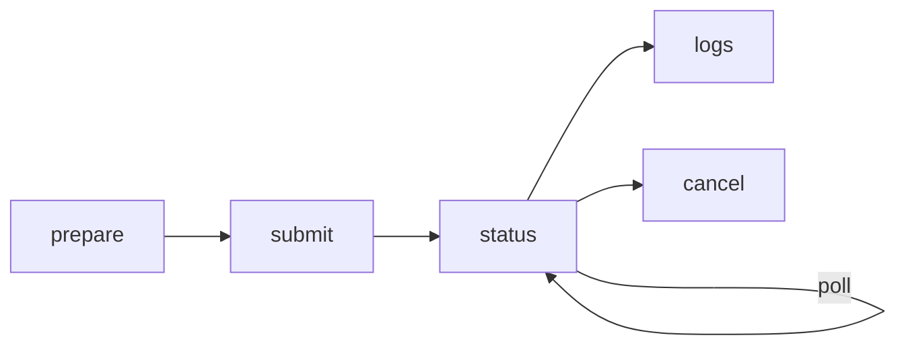

<div class="hero-section" markdown>

## ⚡ Databricks Integration

Run FlowyML pipelines on Databricks with automatic cluster management, job submission, and native MLflow integration.

<span class="feature-badge">🔥 Spark</span>
<span class="feature-badge">📊 MLflow</span>
<span class="feature-badge">🔐 Unity Catalog</span>
<span class="feature-badge">☁️ Multi-Cloud</span>

</div>

# ⚡ Databricks

!!! info "What you'll learn"
    How to run FlowyML pipelines on Databricks — from cluster provisioning to job submission, log streaming, and secret management — with zero infrastructure code.

FlowyML maps seamlessly onto Databricks primitives:

| FlowyML Concept | Databricks Primitive |
|---|---|
| **Stack** | Cluster + Runtime |
| **Pipeline** | Workflow / Job Run |
| **Artifacts** | MLflow / DBFS |
| **Secrets** | Databricks Secrets / Vault |

---

## Prerequisites

```bash
# Install the Databricks SDK (optional dependency)
pip install "flowyml[databricks]"
# or
pip install databricks-sdk
```

!!! tip "Authentication"
    The Databricks adapter uses the SDK's **unified auth** — no credentials are hard-coded. It respects `DATABRICKS_HOST`, `DATABRICKS_TOKEN`, Azure AD, AWS profiles, and all other [native credential providers](https://docs.databricks.com/en/dev-tools/auth/index.html).

---

## Stack Configuration

Configure a Databricks stack in your `flowyml.yaml`:

```yaml
stacks:
  databricks-prod:
    compute:
      backend: databricks
      cluster_name: flowyml-training
      node_type_id: i3.xlarge
      num_workers: 4
      spark_version: "14.3.x-scala2.12"
    runtime:
      python_version: "3.11"
    secrets:
      provider: vault
      vault_url: https://vault.company.com
```

Or via environment variables:

```bash
export DATABRICKS_HOST=https://adb-xxxx.azuredatabricks.net
export DATABRICKS_TOKEN=dapi-xxxxx
export FLOWYML_STACK=databricks-prod
```

---

## Execution Flow

The `DatabricksBackendAdapter` manages the full lifecycle:



### 1. Prepare — Cluster Management

```python
from flowyml import Pipeline

pipeline = Pipeline("training", stack="databricks-prod")
pipeline.run()  # prepare() is called automatically
```

What happens under the hood:

- **Reuse**: Finds an existing cluster with matching name in `RUNNING` or `RESIZING` state
- **Restart**: Restarts a `TERMINATED` cluster instead of creating a new one
- **Create**: Provisions a new cluster from the stack spec if none exists

### 2. Submit — Job Submission

The pipeline graph is submitted as a Databricks Job Run using `python_wheel_task`:

```python
# The adapter builds a Databricks job definition:
{
    "run_name": "flowyml-training-a1b2c3d4",
    "tasks": [{
        "task_key": "flowyml_pipeline",
        "python_wheel_task": {
            "package_name": "flowyml",
            "entry_point": "run_pipeline",
            "parameters": ["--pipeline-name", "training", "--run-id", "..."]
        },
        "existing_cluster_id": "0123-456789-abc"
    }]
}
```

### 3. Status Monitoring

Databricks lifecycle states are mapped to FlowyML's `RunStatus`:

| Databricks State | Result | FlowyML Status |
|---|---|---|
| `PENDING` / `RUNNING` | — | `RUNNING` |
| `TERMINATED` | `SUCCESS` | `SUCCEEDED` |
| `TERMINATED` | `FAILED` / `TIMEDOUT` | `FAILED` |
| `TERMINATED` | `CANCELED` | `CANCELLED` |
| `SKIPPED` | — | `CANCELLED` |
| `INTERNAL_ERROR` | — | `FAILED` |

### 4. Log Streaming

```python
# Logs are streamed from the Databricks run output:
# - Notebook output results
# - Job stdout/stderr logs
# - Error traces (if any)
```

### 5. Cancellation

Runs can be cancelled at any time via `WorkspaceClient.jobs.cancel_run()`.

---

## Cluster Configuration

### Fixed Workers

```yaml
compute:
  backend: databricks
  cluster_name: flowyml-fixed
  node_type_id: i3.xlarge
  num_workers: 4
```

### Autoscaling

```yaml
compute:
  backend: databricks
  cluster_name: flowyml-autoscale
  node_type_id: i3.xlarge
  autoscale:
    min_workers: 1
    max_workers: 8
```

### GPU Instances

```yaml
compute:
  backend: databricks
  cluster_name: flowyml-gpu
  node_type_id: p3.2xlarge  # NVIDIA V100
  num_workers: 2
```

---

## Full Example

```python
from flowyml import Pipeline, step, Context
from flowyml.assets import Dataset, Model, Metrics

@step
def load_data(ctx: Context) -> Dataset:
    import pandas as pd
    df = pd.read_csv("/dbfs/data/training.csv")
    return Dataset(df, name="training_data")

@step
def train(ctx: Context, data: Dataset) -> Model:
    from sklearn.ensemble import RandomForestClassifier
    clf = RandomForestClassifier(n_estimators=100)
    clf.fit(data.data.drop("target", axis=1), data.data["target"])
    return Model(clf, name="fraud_detector", framework="sklearn")

@step
def evaluate(ctx: Context, model: Model, data: Dataset) -> Metrics:
    preds = model.data.predict(data.data.drop("target", axis=1))
    accuracy = (preds == data.data["target"]).mean()
    return Metrics({"accuracy": accuracy, "n_samples": len(data.data)})

# Run on Databricks — cluster is auto-managed
pipeline = Pipeline("fraud_detection", stack="databricks-prod")
pipeline.add_steps([load_data, train, evaluate])
pipeline.run()
```

---

## Best Practices

!!! tip "Use autoscaling for variable workloads"
    Autoscaling clusters optimize cost by scaling down during idle periods and up during heavy computation.

!!! tip "Pin Spark versions"
    Always specify `spark_version` in your stack config to ensure reproducible environments across runs.

!!! warning "Cluster startup time"
    New clusters take 5–10 minutes to start. Reuse existing clusters by keeping `cluster_name` consistent across runs.

---

## 🚀 What's Next?

<div class="header-grid" markdown>

<div class="header-card" markdown>

### 🏢 Enterprise Stacks
Learn about governed stack definitions and policy enforcement.

[Explore →](../guides/enterprise-stacks.md)

</div>

<div class="header-card" markdown>

### 🔐 Secrets Management
Configure Vault, Azure KV, or AWS SM for secure credential access.

[Learn more →](../deployment/secrets.md)

</div>

<div class="header-card" markdown>

### 📊 Experiment Tracking
Dual-write tracking to FlowyML and MLflow/WandB simultaneously.

[View Guide →](../guides/experiment-tracking.md)

</div>

</div>
