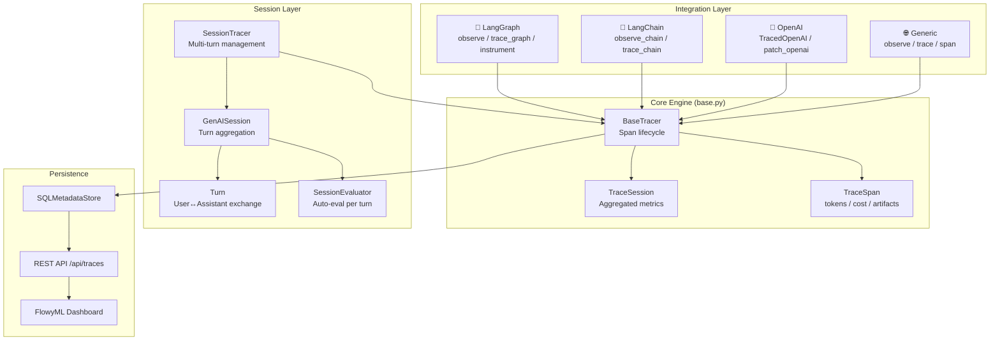

<div class="hero-section" markdown>

## 🔗 GenAI Observability

Built-in LLM tracing for LangChain, LangGraph, OpenAI SDK, and any framework. Monitor tokens, latency, and costs without external tools.

<span class="feature-badge">🔍 LLM Tracing</span>
<span class="feature-badge">💰 Cost Tracking</span>
<span class="feature-badge">⚡ Latency Monitoring</span>

</div>

# 🔗 GenAI Observability — Full-Stack Tracing for Any AI Framework

FlowyML provides **zero-config GenAI observability** — just import, decorate, and get
full tracing, token tracking, cost estimation, and UI visualization automatically.

!!! tip "New to GenAI observability?"
    Start with the [30-Second Quick Start](#30-second-quick-start) below. You'll have full tracing in 3 lines of code.

---

## 30-Second Quick Start

```python
# For LangGraph agents
from flowyml import observe, trace_graph

@observe(name="my_agent", project="chatbot")
def handle_query(query, flowyml_session=None):
    return graph.invoke(
        {"messages": [HumanMessage(content=query)]},
        config=flowyml_session.config,  # Auto-injected!
    )

result = handle_query("What is AI?")
# ═══════════════════════════════════════════════════
#   🔗 FlowyML Trace — my_agent (langgraph)
# ═══════════════════════════════════════════════════
#   🤖 LLM Calls  : 2
#   🔧 Tool Calls : 1
#   📊 Tokens     : 1,234 (prompt: 800 / completion: 434)
#   💰 Est. Cost  : $0.0042
#   🏷  Models     : gpt-4o-mini
#   🛠  Tools      : web_search
# ═══════════════════════════════════════════════════
```

---

## Installation

```bash
# Core (always available — no external deps)
pip install flowyml

# With LangGraph/LangChain support
pip install "flowyml[langgraph]"

# With OpenAI support
pip install "flowyml[openai]"

# Everything
pip install "flowyml[genai]"
```

---

## Supported Frameworks

| Framework | Integration | Code Change |
|-----------|------------|-------------|
| **LangGraph** | `@observe()` / `trace_graph()` / `instrument()` | 1-2 lines |
| **LangChain** | `@observe_chain()` / `trace_chain()` / `instrument_chain()` | 1-2 lines |
| **OpenAI SDK** | `TracedOpenAI()` / `patch_openai()` | 1 line |
| **Any Framework** | `@observe()` / `trace()` / `span()` / `log_llm_call()` | 1-3 lines |

---

## 1. LangGraph Integration

### Method A: `@observe()` Decorator (Recommended)

The simplest way — decorate your function and everything is traced automatically:

```python
from flowyml import observe

@observe(name="customer_agent", project="support")
def handle_ticket(ticket_id: str, flowyml_session=None):
    # flowyml_session.config has the callbacks pre-configured
    result = graph.invoke(
        {"messages": [HumanMessage(content=f"Handle ticket {ticket_id}")]},
        config=flowyml_session.config,
    )
    return result

# Just call normally — tracing happens automatically
handle_ticket("TICKET-1234")
```

#### Async Support

`@observe()` works seamlessly with `async def` functions — critical for LangGraph's `ainvoke()`:

```python
from flowyml import observe

@observe(name="async_agent", project="chatbot")
async def handle_query_async(query: str, flowyml_session=None):
    result = await graph.ainvoke(
        {"messages": [HumanMessage(content=query)]},
        config=flowyml_session.config,
    )
    return result

# Works with asyncio
import asyncio
result = asyncio.run(handle_query_async("What is AI?"))
```

!!! tip "Async Works Everywhere"
    Both `@observe()` and `@observe_chain()` auto-detect sync vs async functions.
    No separate decorator needed — just `async def` your function and it works.

### Method B: `trace_graph()` Context Manager

For more control over the tracing scope:

```python
from flowyml import trace_graph

with trace_graph("research_agent", project="analytics") as session:
    # Multi-turn conversation — all traced as one session
    result1 = graph.invoke(
        {"messages": [HumanMessage(content="Research AI trends")]},
        config=session.config,
    )
    result2 = graph.invoke(
        {"messages": [HumanMessage(content="Now summarize")]},
        config=session.config,
    )
# Summary prints automatically at end of block
```

### Method C: `instrument()` — Wrap Once, Trace Forever

Permanently instrument a compiled graph:

```python
from flowyml import instrument_graph

# One-time setup
traced_graph = instrument_graph(graph, name="my_agent", project="prod")

# Every call is now auto-traced — no config needed!
result = traced_graph.invoke({"messages": [HumanMessage(content="Hello")]})
result = traced_graph.invoke({"messages": [HumanMessage(content="Bye")]})
```

### Method D: Direct Callback Handler

Maximum control for advanced use cases:

```python
from flowyml import FlowyMLCallbackHandler

handler = FlowyMLCallbackHandler(session_name="my_agent", project="demo")
result = graph.invoke(
    {"messages": [HumanMessage(content="Hello")]},
    config={"callbacks": [handler]},
)
handler.session.print_summary()
```

---

## 2. LangChain Integration

Works with any LangChain chain, runnable, or agent — no LangGraph needed.

```python
from flowyml.integrations.langchain import trace_chain, observe_chain

# Context Manager
with trace_chain("qa_chain", project="support") as session:
    result = chain.invoke(
        {"question": "What is quantum computing?"},
        config=session.config,
    )

# Decorator
@observe_chain(name="summarizer", project="nlp")
def summarize(text: str, flowyml_session=None):
    return chain.invoke({"text": text}, config=flowyml_session.config)

# Permanent instrumentation
from flowyml.integrations.langchain import instrument_chain
traced = instrument_chain(chain, name="qa_chain")
result = traced.invoke({"question": "..."})  # Auto-traced!
```

---

## 3. OpenAI SDK Integration

Track every OpenAI API call without LangChain — works directly with the `openai` package.

### Drop-in Replacement (Easiest)

```python
from flowyml import TracedOpenAI

# Replace openai.OpenAI() with TracedOpenAI()
client = TracedOpenAI(project="my_app")

response = client.chat.completions.create(
    model="gpt-4o-mini",
    messages=[{"role": "user", "content": "Explain quantum computing"}],
)

# Tokens, cost, and latency tracked automatically
client.finalize()  # Prints summary & saves to FlowyML
```

### Patch Existing Client

```python
import openai
from flowyml import patch_openai

client = openai.OpenAI()
tracer = patch_openai(client, project="my_app")

# Use normally — everything is traced behind the scenes
response = client.chat.completions.create(
    model="gpt-4o",
    messages=[{"role": "user", "content": "Hello"}],
)

# Embeddings are tracked too
embedding = client.embeddings.create(
    model="text-embedding-3-small",
    input="Hello world",
)

tracer.session.print_summary()
```

### Streaming Support

Streaming responses are automatically tracked — tokens are counted and cost
is calculated when the stream completes:

```python
client = TracedOpenAI(project="my_app")

stream = client.chat.completions.create(
    model="gpt-4o-mini",
    messages=[{"role": "user", "content": "Write a poem"}],
    stream=True,
)

for chunk in stream:
    if chunk.choices[0].delta.content:
        print(chunk.choices[0].delta.content, end="")

client.finalize()  # Full token count & cost available
```

---

## 4. Generic / Any Framework

Works with CrewAI, AutoGen, Haystack, DSPy, or any custom code.

### Decorator

```python
from flowyml.integrations.generic import observe

@observe(name="research_crew", project="analytics")
def run_crew(topic: str, flowyml_session=None):
    crew = Crew(agents=[...], tasks=[...])
    result = crew.kickoff(inputs={"topic": topic})

    # Log the LLM calls manually if the framework doesn't expose callbacks
    from flowyml.integrations.generic import log_llm_call
    log_llm_call(
        model="gpt-4o",
        prompt=topic,
        response=str(result),
        prompt_tokens=500,
        completion_tokens=300,
        tracer=flowyml_session,
    )
    return result
```

### Context Manager

```python
from flowyml.integrations.generic import trace

with trace("my_pipeline", project="demo") as tracer:
    # Start a span for each step
    span = tracer.start_span("llm", "embeddings_step")
    embeddings = compute_embeddings(texts)
    span.set_tokens(prompt_tokens=len(texts) * 10, model="text-embedding-3-small")
    tracer.end_span(span, outputs={"count": len(embeddings)})

    span2 = tracer.start_span("llm", "generation_step")
    result = generate_response(embeddings)
    span2.set_tokens(prompt_tokens=200, completion_tokens=500, model="gpt-4o")
    tracer.end_span(span2, outputs={"response": result})
```

### `span()` Context Manager (Simplest)

```python
from flowyml.integrations.generic import span

with span("my_llm_call", "llm") as s:
    result = my_custom_llm(prompt="Hello")
    s.set_tokens(prompt_tokens=5, completion_tokens=10, model="my-model")
    s.outputs = {"response": result}
```

### Fire-and-Forget Logging

```python
from flowyml import log_llm_call, log_tool_call, log_embedding_call

# Log individual calls without any wrapping
log_llm_call(
    model="gpt-4o",
    prompt="Summarize this",
    response="Here's the summary...",
    prompt_tokens=50,
    completion_tokens=100,
)

log_tool_call(
    name="web_search",
    tool_input="latest AI news",
    tool_output="Found 10 results...",
)

log_embedding_call(
    model="text-embedding-3-small",
    input_text=["Hello", "World"],
    token_count=4,
)
```

---

## What Gets Tracked Automatically

Every integration captures the same comprehensive telemetry:

| Metric | Description |
|--------|-------------|
| 🤖 **LLM Calls** | Count, model, prompts, responses |
| 🔧 **Tool Calls** | Name, input, output, duration |
| 🔗 **Chain Steps** | Execution order, parent-child relationships |
| 📊 **Token Usage** | Prompt, completion, and total tokens |
| 💰 **Cost Estimation** | Per-call and session-total USD cost |
| ⏱ **Latency** | Per-step and total duration |
| ❌ **Errors** | Full error context and stack traces |
| 🏷 **Models** | All models used in the session |
| 📐 **Embeddings** | Embedding calls, dimensions, token count |
| 📋 **Trace Tree** | Full parent-child span hierarchy |

### Supported Models for Cost Estimation

| Provider | Models |
|----------|--------|
| **OpenAI** | GPT-4o, GPT-4o-mini, GPT-4-Turbo, GPT-4, GPT-3.5-Turbo, o1, o1-mini, o3-mini |
| **Anthropic** | Claude 3.5 Sonnet/Haiku, Claude 3 Opus/Sonnet/Haiku |
| **Google** | Gemini 2.0 Flash, Gemini 1.5 Pro/Flash |
| **Mistral** | Large, Medium, Small |
| **Cohere** | Command R+, Command R |

---

## Viewing Traces in FlowyML UI

All traces are automatically saved and visible in the FlowyML dashboard:

```bash
# Start UI
flowyml ui
# Navigate to http://localhost:8765 → GenAI Traces
```

### Dashboard Features

The **GenAI Traces** page provides a premium observability experience:

| Feature | Description |
|---------|-------------|
| **Master-Detail Layout** | Trace list on the left, full detail panel on the right |
| **KPI Dashboard** | Total traces, avg latency, total tokens, estimated cost |
| **Waterfall Bars** | Visual latency comparison across traces and spans |
| **Collapsible Span Tree** | Expand/collapse nested spans with color-coded event types |
| **Token Progress Bars** | Prompt (indigo) vs completion (violet) split visualization |
| **Expandable I/O Sections** | View inputs, outputs, errors, and metadata per span |
| **11 Event Type Icons** | LLM, Tool, Chain, Agent, Embedding, Retriever, Graph Node, Session, etc. |
| **Smart Filters** | Filter by event type, search by name/model/trace ID |
| **Relative Timestamps** | "2m ago", "1h ago" for quick temporal context |

### REST API Reference

| Endpoint | Method | Description |
|----------|--------|-------------|
| `/api/traces` | `GET` | List traces (filters: `event_type`, `project`, `model`, `status`) |
| `/api/traces` | `POST` | Create a trace event |
| `/api/traces/{trace_id}` | `GET` | Get full trace tree with all spans |
| `/api/traces/{trace_id}` | `DELETE` | Delete a trace |
| `/api/traces/stats` | `GET` | Aggregated GenAI statistics (tokens, cost, model distribution) |
| `/api/traces/sessions` | `GET` | List session-level traces only |

#### Example: Get Aggregated Stats

```bash
curl http://localhost:8765/api/traces/stats
# {
#   "total_traces": 247,
#   "total_tokens": 1234567,
#   "total_cost": 4.23,
#   "models": {"gpt-4o-mini": 180, "gpt-4o": 67},
#   "event_types": {"llm": 300, "tool": 120, "chain": 50}
# }
```

### Programmatic Access

```python
from flowyml.storage.sql import SQLMetadataStore

store = SQLMetadataStore()
traces = store.get_trace(session_id)
```

---

## Configuration Reference

All integration functions accept these common parameters:

| Parameter | Type | Default | Description |
|-----------|------|---------|-------------|
| `name` | `str` | Function name / `"genai_session"` | Name for the trace session |
| `project` | `str \| None` | `None` | Project name for organization |
| `tags` | `dict` | `{}` | Custom tags for filtering |
| `auto_log` | `bool` | `True` | Persist traces to FlowyML storage |
| `verbose` | `bool` | `False` | Log each event to console |
| `print_summary` | `bool` | `True` | Print summary table on completion |

---

## Architecture Overview



---

## 5. Session-Level Tracing (Multi-Turn)

For chatbots, multi-turn agents, and interactive AI apps, FlowyML provides **session-level tracing** that aggregates turns, tracks conversation threads, and attaches evaluations per turn.

### `session_trace()` — Context Manager

```python
from flowyml.integrations.base import session_trace

with session_trace("support_bot", project="customer_support") as tracer:
    # Turn 1: User asks a question
    with tracer.turn("user") as t:
        t.content = "How do I reset my password?"
        span = tracer.start_span("llm", "gpt4_reply")
        response = call_llm("How do I reset my password?")
        span.set_tokens(prompt_tokens=50, completion_tokens=100, model="gpt-4o-mini")
        tracer.end_span(span, outputs={"response": response})
        t.content = response

    # Turn 2: Follow-up
    with tracer.turn("user") as t:
        t.content = "What if I forgot my email too?"
        span = tracer.start_span("llm", "gpt4_followup")
        response2 = call_llm("What if I forgot my email too?")
        span.set_tokens(prompt_tokens=80, completion_tokens=120, model="gpt-4o-mini")
        tracer.end_span(span, outputs={"response": response2})
        t.content = response2

# ═══════════════════════════════════════════════════
#   🧠 FlowyML GenAI Session — support_bot
# ═══════════════════════════════════════════════════
#   💬 Turns      : 2
#   📊 Tokens     : 350 (in: 130 / out: 220)
#   💰 Est. Cost  : $0.0002
#   ⚡ Avg Latency: 0.45s/turn
# ═══════════════════════════════════════════════════
```

### `TracedOpenAISession` — Drop-in Multi-Turn OpenAI

```python
from flowyml.integrations.openai_integration import TracedOpenAISession

client = TracedOpenAISession(
    project="support",
    name="ticket_bot",
    thread_id="thread_abc123",    # Links to a conversation thread
    user_id="user_456",           # Tracks per-user metrics
)

# Each call is automatically tracked as a turn
resp1 = client.chat.completions.create(
    model="gpt-4o-mini",
    messages=[{"role": "user", "content": "Hello, I need help!"}],
)

resp2 = client.chat.completions.create(
    model="gpt-4o-mini",
    messages=[
        {"role": "user", "content": "Hello, I need help!"},
        {"role": "assistant", "content": resp1.choices[0].message.content},
        {"role": "user", "content": "Can you check my order status?"},
    ],
)

client.finalize()  # Prints session summary with all turns
```

---

## 6. Automatic Evaluations on Sessions

Attach evaluators that **automatically score every turn** — quality monitoring in real-time.

```python
from flowyml.integrations.base import session_trace
from flowyml.integrations.eval_bridge import SessionEvaluator
from flowyml.evals import Relevance, Toxicity

# Create evaluator with scorers
evaluator = SessionEvaluator([
    Relevance(model="gpt-4o-mini", threshold=0.7),
    Toxicity(model="gpt-4o-mini", threshold=0.1),
], async_mode=True)   # Runs evals in background threads

with session_trace(
    "qa_bot",
    project="support",
    evaluator=evaluator,  # ← Attach here
) as tracer:
    with tracer.turn("user") as t:
        t.content = user_response
        # Evals run AUTOMATICALLY after each turn finishes

# Session summary includes eval scores:
# ═══════════════════════════════════════════════════
#   📈 Eval Scores:
#      relevance: mean=0.92 (min=0.85, max=0.98, n=5)
#      toxicity:  mean=0.02 (min=0.00, max=0.05, n=5)
# ═══════════════════════════════════════════════════
```

!!! tip "Experiment Tracking Integration"
    Session eval scores are automatically exported as experiment metrics:
    ```python
    metrics = tracer.genai_session.to_experiment_metrics()
    # {'total_turns': 5.0, 'total_tokens': 2340.0,
    #  'eval_relevance_mean': 0.92, 'eval_toxicity_mean': 0.02}
    ```

---

## 7. Saving Artifacts

Attach prompts, retrieved documents, intermediate results, or any structured data to spans:

```python
with trace("rag_pipeline", project="knowledge_base") as tracer:
    # Save the system prompt as an artifact
    tracer.save_artifact(
        "system_prompt",
        "prompt",
        "You are a helpful assistant that answers questions about FlowyML.",
    )

    span = tracer.start_span("retriever", "vector_search")
    docs = search_vector_db(query)
    tracer.end_span(span, outputs={"count": len(docs)})

    # Save retrieved documents as artifacts
    for i, doc in enumerate(docs):
        tracer.save_artifact(
            f"retrieved_doc_{i}",
            "document",
            doc.page_content,
            span=span,
            metadata={"source": doc.metadata.get("source")},
        )

    # Spans also support inline artifacts
    llm_span = tracer.start_span("llm", "generate_answer")
    llm_span.add_artifact("final_prompt", "prompt", full_prompt)
    # ...
```

!!! info "Artifact Types"
    Supported types: `prompt`, `response`, `document`, `embedding`, `image`, `config`, `intermediate`, `code`.

---

## 8. Real-World Examples

### Example A: Full LangGraph ReAct Agent

```python
from langchain_openai import ChatOpenAI
from langgraph.prebuilt import create_react_agent
from langchain_core.tools import tool
from flowyml import observe

@tool
def search_docs(query: str) -> str:
    """Search internal documentation."""
    return f"Found 3 results for: {query}"

@tool
def create_ticket(title: str, description: str) -> str:
    """Create a support ticket."""
    return f"Ticket created: {title}"

# Build agent
llm = ChatOpenAI(model="gpt-4o-mini")
agent = create_react_agent(llm, [search_docs, create_ticket])

# ✨ One decorator = full observability
@observe(name="support_agent", project="helpdesk")
def handle_support(query: str, flowyml_session=None):
    return agent.invoke(
        {"messages": [("human", query)]},
        config=flowyml_session.config,
    )

# Every LLM call, tool invocation, and graph node is traced
result = handle_support("My login isn't working, I've tried resetting my password")
```

### Example B: Custom Agent with Anthropic

```python
from flowyml.integrations.generic import observe, log_llm_call
import anthropic

@observe(name="analysis_agent", project="research", framework="anthropic")
def analyze_data(query: str, flowyml_session=None):
    client = anthropic.Anthropic()

    # Each API call is logged with full token/cost tracking
    response = client.messages.create(
        model="claude-3-5-sonnet-20241022",
        max_tokens=1024,
        messages=[{"role": "user", "content": query}],
    )

    # Log the call manually (Anthropic SDK doesn't have callbacks)
    log_llm_call(
        model="claude-3-5-sonnet",
        prompt=query,
        response=response.content[0].text,
        prompt_tokens=response.usage.input_tokens,
        completion_tokens=response.usage.output_tokens,
        tracer=flowyml_session,
    )
    return response.content[0].text

result = analyze_data("Analyze quarterly revenue trends")
```

### Example C: CrewAI with FlowyML Observability

```python
from flowyml.integrations.generic import observe, log_llm_call, log_tool_call

@observe(name="research_crew", project="content", framework="crewai")
def run_research(topic: str, flowyml_session=None):
    from crewai import Crew, Agent, Task

    researcher = Agent(role="Researcher", goal=f"Research {topic}")
    writer = Agent(role="Writer", goal="Write article")

    research_task = Task(description=f"Research {topic}", agent=researcher)
    write_task = Task(description="Write article", agent=writer)

    crew = Crew(agents=[researcher, writer], tasks=[research_task, write_task])
    result = crew.kickoff()

    # Log aggregated metrics after crew completes
    log_llm_call(
        model="gpt-4o",
        prompt=topic,
        response=str(result),
        prompt_tokens=2000,
        completion_tokens=1500,
        tracer=flowyml_session,
    )
    return result

run_research("AI trends in 2025")
```

---

## 9. Real-Time Event Streaming

Subscribe to live events during a session for real-time dashboards:

```python
from flowyml.integrations.base import session_trace

def on_event(event_type: str, data: dict):
    if event_type == "turn_end":
        print(f"Turn completed: {data['role']} ({data['total_tokens']} tokens)")
    elif event_type == "eval_complete":
        print(f"Eval: {data['scorer']} = {data['score']:.2f}")

with session_trace("live_bot", project="demo") as tracer:
    tracer.genai_session.on_event(on_event)  # Subscribe

    with tracer.turn("user") as t:
        # ... events fire automatically
        pass
```

---

## Advanced: Custom Cost Models

Extend the built-in cost table with your own models:

```python
from flowyml.integrations.base import MODEL_COSTS

# Add custom model pricing
MODEL_COSTS["my-custom-model"] = {
    "prompt": 0.001,      # $ per 1K prompt tokens
    "completion": 0.003,  # $ per 1K completion tokens
}

# Add self-hosted models (free)
MODEL_COSTS["llama-3-70b"] = {"prompt": 0.0, "completion": 0.0}
```

---

## Quick Reference: All Integration Entry Points

```python
# ─── Framework-Agnostic (always available) ─────────
from flowyml import observe_genai, trace_genai      # Decorator & context manager
from flowyml import log_llm_call, log_tool_call      # Fire-and-forget logging
from flowyml import span                             # Span context manager
from flowyml.integrations.base import session_trace   # Multi-turn sessions

# ─── LangGraph ─────────────────────────────────────
from flowyml import observe, trace_graph              # Decorator & CM
from flowyml import instrument_graph                  # Permanent wrapping
from flowyml import FlowyMLCallbackHandler            # Direct callback

# ─── LangChain ─────────────────────────────────────
from flowyml.integrations.langchain import observe_chain, trace_chain
from flowyml.integrations.langchain import instrument_chain

# ─── OpenAI SDK ────────────────────────────────────
from flowyml import TracedOpenAI, patch_openai        # Client wrappers
from flowyml.integrations.openai_integration import TracedOpenAISession
from flowyml.integrations.openai_integration import trace_openai_session

# ─── Evaluations ───────────────────────────────────
from flowyml.integrations.eval_bridge import SessionEvaluator
```

---

## 🚀 What's Next?

<div class="header-grid" markdown>

<div class="header-card" markdown>

### 📈 Evaluations
Evaluate your LLM outputs with built-in scorers for relevance, toxicity, and custom metrics.

[Explore →](../evaluations.md)

</div>

<div class="header-card" markdown>

### 🔍 LLM Tracing
Dive deeper into advanced LLM tracing patterns and distributed trace analysis.

[Learn more →](../advanced/llm-tracing.md)

</div>

<div class="header-card" markdown>

### 🔌 Eval Adapters
Connect evaluation frameworks and custom scorers to your GenAI sessions.

[View Guide →](../advanced/eval-adapters.md)

</div>

</div>
