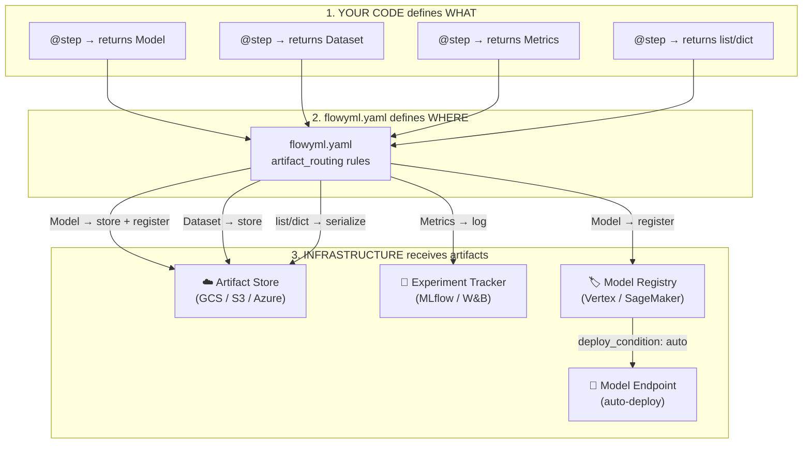

# 🔀 Type-Based Artifact Routing

FlowyML provides automatic type-based artifact routing. Define artifact types in your code, and FlowyML automatically routes them to the configured infrastructure — **no manual upload code required**.

<div class="hero-section" markdown>

## 🎯 Your Code Defines *What*. Your YAML Defines *Where*.

FlowyML inspects the **return type** of each step. Based on the type (`Model`, `Dataset`, `Metrics`) and your `flowyml.yaml` configuration, it automatically saves, registers, logs, and optionally deploys artifacts — with zero extra code.

</div>

---

## 🔍 How It All Connects

### The Complete Flow: YAML → Code → Infrastructure



### 📌 The Golden Rules

!!! important "When Does FlowyML Upload Artifacts?"
    | Scenario | What Happens |
    |----------|-------------|
    | **No `flowyml.yaml` / local stack** | ✅ Artifacts saved locally to `.flowyml/artifacts/` — **no cloud upload** |
    | **Stack with `artifact_store: gcs/s3`** | ✅ **All** step outputs are automatically uploaded to the configured bucket |
    | **Step returns a `Model` type** | ✅ Saved to artifact store **AND** registered in model registry (if one is configured) |
    | **Step returns a `Metrics` type** | ✅ Logged to experiment tracker (MLflow/W&B) **AND** saved to artifact store |
    | **Step returns plain `list`, `dict`, `DataFrame`** | ✅ Serialized via materializers and saved to artifact store |
    | **No `model_registry` configured** | ✅ Models are saved to artifact store only — **no registration happens** |
    | **No `experiment_tracker` configured** | ✅ Metrics are saved to artifact store only — **no logging happens** |
    | **`artifact_routing` with `deploy: true`** | ✅ Model is saved, registered, **and deployed** to an endpoint |

### 🧩 Step-by-Step: How FlowyML Knows What To Do

**Example YAML:**

```yaml linenums="1"
# flowyml.yaml
plugins:
  experiment_tracker:            # ← (A) Metrics & Parameters go here
    type: mlflow
    tracking_uri: http://localhost:5000
    experiment_name: my_experiments

  artifact_store:                # ← (B) ALL artifacts stored here
    type: gcs
    bucket: my-ml-artifacts
    prefix: experiments/
    project: my-gcp-project

  model_registry:                # ← (C) Model type auto-registered here
    type: vertex_model_registry

  orchestrator:                  # ← (D) WHERE steps RUN (not storage)
    type: vertex_ai
    project: my-gcp-project
    location: us-central1
    staging_bucket: gs://my-staging-bucket

  artifact_routing:              # ← (E) OPTIONAL fine-grained rules
    Model:
      store: gcs                 # Save to artifact_store
      register: true             # Register in model_registry (C)
      deploy: false              # Don't auto-deploy
    Dataset:
      store: gcs
      path: "{run_id}/data/{step_name}"
    Metrics:
      log_to_tracker: true       # Log to experiment_tracker (A)
```

**Now, here's how your code maps to this config:**

```python linenums="1"
from flowyml import step, Pipeline, context
from flowyml.core import Model, Dataset, Metrics

# ─── STEP 1: Returns a Dataset ─────────────────────────────
@step(outputs=["training_data"])
def load_data() -> Dataset:
    """FlowyML sees return type: Dataset

    What happens:
    1. Serialized via the Dataset materializer
    2. Uploaded to GCS: gs://my-ml-artifacts/experiments/{run_id}/data/load_data/
       (path from artifact_routing → Dataset → path template)
    3. Lineage recorded in metadata store
    """
    import pandas as pd
    df = pd.read_csv("data.csv")
    return Dataset(data=df, name="training_features", format="parquet")

# ─── STEP 2: Returns a Model ───────────────────────────────
@step(inputs=["training_data"], outputs=["model"])
def train(training_data: Dataset) -> Model:
    """FlowyML sees return type: Model

    What happens:
    1. Model serialized (sklearn → pickle, torch → .pt, etc.)
    2. Uploaded to GCS: gs://my-ml-artifacts/experiments/{run_id}/model/
    3. Registered in Vertex AI Model Registry as "fraud_detector" v1.0
       (because model_registry is configured AND artifact_routing.Model.register: true)
    4. NOT deployed (deploy: false)
    """
    from sklearn.ensemble import RandomForestClassifier
    clf = RandomForestClassifier().fit(training_data.data, labels)
    return Model(data=clf, name="fraud_detector", version="1.0.0")

# ─── STEP 3: Returns Metrics ───────────────────────────────
@step(inputs=["model", "training_data"], outputs=["metrics"])
def evaluate(model: Model, training_data: Dataset) -> Metrics:
    """FlowyML sees return type: Metrics

    What happens:
    1. Metrics logged to MLflow (experiment_tracker) automatically:
       → mlflow.log_metrics({"accuracy": 0.95, "f1": 0.92})
       (because artifact_routing.Metrics.log_to_tracker: true)
    2. Also saved to GCS as JSON for lineage
    3. No manual mlflow.log_metrics() call needed!
    """
    preds = model.data.predict(training_data.data)
    return Metrics({"accuracy": 0.95, "f1": 0.92})

# ─── ASSEMBLE & RUN ────────────────────────────────────────
pipeline = Pipeline("production", context=context(lr=0.01))
pipeline.add_step(load_data)
pipeline.add_step(train)
pipeline.add_step(evaluate)
pipeline.run()  # FlowyML handles ALL routing automatically!
```

!!! tip "💡 Key insight: You write ZERO infrastructure code"
    Notice there's no `mlflow.log_metrics()`, no `gcs.upload()`, no `registry.register()` anywhere in your code. FlowyML does all of this based on:

    1. The **return type** of your step (`Model`, `Dataset`, `Metrics`, or plain Python types)
    2. The **plugins** section in `flowyml.yaml` (which stores are configured)
    3. The **artifact_routing** rules (optional fine-grained control)

---

## 🧩 Core Artifact Types

```python
from flowyml.core import Model, Dataset, Metrics, Parameters

@step
def train_model(data: Dataset) -> Model:
    """Train a model - automatically routed based on type."""
    clf = RandomForestClassifier().fit(data.data, labels)
    return Model(
        data=clf,
        name="fraud_detector",
        version="1.0.0",
        framework="sklearn"  # Auto-detected if not provided
    )

@step
def evaluate(model: Model, test_data: Dataset) -> Metrics:
    """Evaluate model - metrics auto-logged to tracker."""
    predictions = model.data.predict(test_data.data)
    return Metrics({
        "accuracy": accuracy_score(y_true, predictions),
        "f1": f1_score(y_true, predictions),
    })

@step
def preprocess(raw_data: pd.DataFrame) -> Dataset:
    """Preprocess data - saved to configured artifact store."""
    processed = clean_and_transform(raw_data)
    return Dataset(
        data=processed,
        name="training_features",
        format="parquet"  # Auto-detected from data type
    )
```

## Configuration ⚙️

Configure routing in `flowyml.yaml`:

```yaml
stacks:
  local:
    orchestrator: { type: local }
    artifact_store: { type: local, path: "./artifacts" }

  gcp-prod:
    orchestrator: { type: vertex_ai, project: ${GCP_PROJECT} }
    artifact_store: { type: gcs, bucket: my-ml-artifacts }
    model_registry: { type: vertex_model_registry }
    model_deployer: { type: vertex_endpoint }
    experiment_tracker: { type: mlflow, tracking_uri: ${MLFLOW_URI} }

    artifact_routing:
      Model:
        store: gcs
        register: true      # Auto-register to model registry
        deploy: true        # Auto-deploy to endpoint
        endpoint_name: production-model
      Dataset:
        store: gcs
        path: "{run_id}/datasets/{step_name}"
      Metrics:
        log_to_tracker: true
      Parameters:
        log_to_tracker: true

  aws-staging:
    orchestrator: { type: sagemaker, region: us-east-1 }
    artifact_store: { type: s3, bucket: my-s3-bucket }
    model_registry: { type: sagemaker_model_registry }
    model_deployer: { type: sagemaker_endpoint, role_arn: ${SAGEMAKER_ROLE} }

    artifact_routing:
      Model: { store: s3, register: true }
      Dataset: { store: s3 }

active_stack: local
```

## Stack Switching 🔄

### Via Environment Variable

```bash
FLOWYML_STACK=gcp-prod flowyml run my_pipeline
```

### Via Context Manager

```python
from flowyml.plugins import use_stack

# Run with specific stack
with use_stack("gcp-prod"):
    pipeline.run()

# Nested stacks work too
with use_stack("gcp-prod"):
    with use_stack("aws-staging"):
        # Uses aws-staging
        pass
    # Back to gcp-prod
```

### Via CLI

```bash
# List available stacks
flowyml stack list

# Show current stack
flowyml stack show

# Set default stack
flowyml stack set gcp-prod

# Run with specific stack
flowyml run pipeline.py --stack gcp-prod
```

## Artifact Types Reference 📚

### Model

For ML models - routes to artifact store, optional registry and deployment.

```python
from flowyml.core import Model

model = Model(
    data=trained_model,           # Required: the model object
    name="my_model",              # Optional: display name
    version="1.0.0",              # Optional: version string
    framework="sklearn",          # Optional: auto-detected
    serving_config={...},         # Optional: serving configuration
    input_schema={...},           # Optional: input schema
    output_schema={...},          # Optional: output schema
    metadata={"key": "value"},    # Optional: additional metadata
)
```

### Dataset

For datasets - routes to artifact store.

```python
from flowyml.core import Dataset

dataset = Dataset(
    data=dataframe,               # Required: the data
    name="training_data",         # Optional: display name
    format="parquet",             # Optional: auto-detected
    schema={...},                 # Optional: data schema
    statistics={...},             # Optional: dataset statistics
)
```

### Metrics

For evaluation metrics - logs to experiment tracker.

```python
from flowyml.core import Metrics

# Simple usage
metrics = Metrics({"accuracy": 0.95, "loss": 0.05})

# With step number (for training loops)
metrics = Metrics({"loss": 0.05}).at_step(100)

# With metadata
metrics = Metrics({"accuracy": 0.95}).with_metadata(model_version="1.0")
```

### Parameters

For hyperparameters - logs to experiment tracker.

```python
from flowyml.core import Parameters

params = Parameters({
    "learning_rate": 0.001,
    "epochs": 100,
    "batch_size": 32,
})
```

## Routing Rules 📋

Each artifact type can have routing rules:

| Field | Type | Description |
|-------|------|-------------|
| `store` | string | Artifact store name (gcs, s3, local) |
| `path` | string | Path template with placeholders |
| `register` | bool | Register to model registry (Model only) |
| `deploy` | bool | Enable deployment (Model only) |
| `deploy_condition` | string | `manual`, `auto`, or `on_approval` |
| `deploy_min_metrics` | dict | Minimum metrics for auto-deploy |
| `endpoint_name` | string | Endpoint name for deployment |
| `log_to_tracker` | bool | Log to experiment tracker |

### Conditional Deployment

Models are **not automatically deployed** just because `deploy: true` is set. Deployment behavior is controlled by `deploy_condition`:

```yaml
artifact_routing:
  Model:
    store: gcs
    register: true
    deploy: true

    # Option 1: Manual deployment (default)
    deploy_condition: manual
    # Model is registered but not deployed. Use CLI to deploy:
    # flowyml model deploy my_model --version 1.0.0

    # Option 2: Auto-deploy when metrics meet thresholds
    deploy_condition: auto
    deploy_min_metrics:
      accuracy: 0.95
      f1_score: 0.90

    # Option 3: Require human approval
    deploy_condition: on_approval
```

**Setting metrics for conditional deployment:**

```python
@step
def train_and_evaluate() -> Model:
    model = train(data)
    accuracy = evaluate(model, test_data)

    # Include metrics in model metadata for conditional deployment
    return Model(
        data=model,
        name="classifier",
        version="1.0.0",
        metadata={"metrics": {"accuracy": accuracy, "f1_score": f1}}
    )
```

### Path Templates

Use placeholders in paths:

```yaml
path: "{run_id}/{step_name}/{artifact_name}"
```

Available placeholders:
- `{run_id}` - Pipeline run ID
- `{step_name}` - Step that produced the artifact
- `{artifact_name}` - Artifact type name (lowercase)

## Available Plugins 📦

### Model Registries

- `vertex_model_registry` - Google Cloud Vertex AI Model Registry
- `sagemaker_model_registry` - AWS SageMaker Model Registry

### Model Deployers

- `vertex_endpoint` - Google Cloud Vertex AI Endpoints
- `sagemaker_endpoint` - AWS SageMaker Endpoints

### Artifact Stores

- `gcs` - Google Cloud Storage
- `s3` - AWS S3
- `local` - Local filesystem

### Experiment Trackers

- `mlflow` - MLflow tracking
- `wandb` - Weights & Biases
- `tensorboard` - TensorBoard
