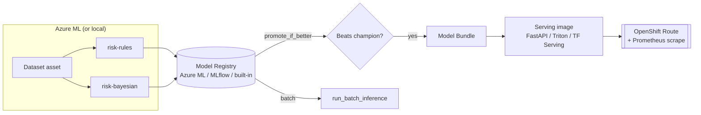

# 🏭 End-to-End: Train on Azure ML, Serve on OpenShift

This tutorial walks through a **complete, working** production loop with FlowyML:

1. Author custom model flavors (rule-based + Bayesian) as first-class artifacts.
2. Train them in a pipeline and **register** each with metrics and lineage.
3. Run training **locally** or on **Azure ML** by switching one stack.
4. **Compare** the new candidate against the current production champion.
5. **Promote & deploy** the winner — as a FastAPI, Triton, or TensorFlow Serving
   container — to **OpenShift**, **Kubernetes**, or local Docker.
6. Serve online predictions with health probes + Prometheus metrics, and run
   **batch** scoring with the same packaging.

All the code lives in [`examples/production_serving/`](https://github.com/UnicoLab/FlowyML/tree/main/examples/production_serving)
and runs end-to-end on a laptop with no cloud account.

!!! tip "The big idea"
    You reference a model by **name + stage**. FlowyML transparently handles
    fetching the artifact from the registry, packaging it, building the serving
    image, mounting the model, and rolling it out. Changing *where* it runs is a
    config change, not a code change.

---

## 0. Install

```bash
pip install "flowyml[azure]"          # core + Azure ML/Blob
# optional extras used below:
pip install fastapi uvicorn prometheus-client   # local FastAPI serving
# arviz + pymc only needed for real PyMC posteriors
```

You also need the relevant CLIs on `PATH` for remote targets: `docker`, and
`oc` (OpenShift) or `kubectl` (Kubernetes).

---

## 1. Author your models (once)

Put model classes/functions in an **importable module** — not a notebook or
`__main__` — so the pickled model can be *loaded back inside the serving
container*. FlowyML ships base classes that guarantee picklability and a
uniform `.predict()` interface.

```python title="models.py"
from __future__ import annotations

import numpy as np
from flowyml.models import BayesianPredictor, RuleBasedModel


class RiskRules(RuleBasedModel):
    """Explainable hand-written baseline."""

    def predict(self, X):
        arr = np.asarray(X, dtype=float)
        cutoff = self.params.get("cutoff", 0.5)
        return [(1 if (row[0] > 0.8 and row[1] > cutoff) else 0) for row in arr]


def posterior_mean_predict(idata, X):
    """Module-level predict fn so BayesianPredictor unpickles in a container."""
    X = np.asarray(X, dtype=float)
    beta = np.asarray(idata["beta"], dtype=float)
    logits = X @ beta + float(idata["intercept"])
    return (1.0 / (1.0 + np.exp(-logits)) > 0.5).astype(int)


def make_bayesian_model(beta, intercept) -> BayesianPredictor:
    return BayesianPredictor(
        idata={"beta": list(beta), "intercept": float(intercept)},
        predict_fn=posterior_mean_predict,
        metadata={"kind": "bayesian-logistic"},
    )
```

!!! note "Real PyMC / ArviZ"
    Swap `idata` for an ArviZ `InferenceData` object. FlowyML's
    [`PyMCMaterializer`](../advanced/materializers.md) serializes it to NetCDF
    automatically when you register or store it as an asset.

---

## 2. The training pipeline

Each step is a normal FlowyML step. Datasets and models are created as
**assets** (`Dataset.create`, `Model.create`) so lineage is captured, and each
model is pushed to the **model registry** with metrics and a stage.

```python title="pipelines/training.py"
import time
import numpy as np
from flowyml import Pipeline, step
from flowyml.assets import Dataset, Model
from flowyml.registry.model_registry import ModelRegistry, ModelStage
from models import RiskRules, make_bayesian_model


@step(outputs=["dataset"])
def load_data() -> dict:
    rng = np.random.default_rng(0)
    X = rng.random((500, 3))
    y = ((X[:, 0] + X[:, 1] * 1.5 - X[:, 2]) > 1.0).astype(int)
    ds = Dataset.create(data={"X": X, "y": y}, name="risk-training-data", version="1")
    return {"X": X.tolist(), "y": y.tolist(), "asset_id": ds.metadata.asset_id}


@step(inputs=["dataset"], outputs=["candidates"])
def train_and_register(dataset: dict) -> dict:
    X, y = np.asarray(dataset["X"]), np.asarray(dataset["y"])
    registry = ModelRegistry()
    version = f"v{int(time.time())}"
    parent = Dataset.create(data={"X": X, "y": y}, name="risk-training-data", version="1")

    rules = RiskRules(cutoff=0.5)
    acc = float((np.asarray(rules.predict(X)) == y).mean())
    Model.create(data=rules, name="risk-rules", trained_on=parent)      # lineage
    registry.register(rules, name="risk-rules", version=version, framework="rule_based",
                      metrics={"accuracy": acc}, stage=ModelStage.DEVELOPMENT)

    bayes = make_bayesian_model(beta=np.array([1.0, 1.5, -1.0]), intercept=-1.0)
    acc_b = float((np.asarray(bayes.predict(X)) == y).mean())
    Model.create(data=bayes, name="risk-bayesian", trained_on=parent)   # lineage
    registry.register(bayes, name="risk-bayesian", version=version, framework="bayesian",
                      metrics={"accuracy": acc_b}, stage=ModelStage.DEVELOPMENT)

    return {"candidates": {"risk-rules": version, "risk-bayesian": version}}


def create_pipeline() -> Pipeline:
    return Pipeline("training").add_step(load_data).add_step(train_and_register)
```

Run it locally:

```bash
cd examples/production_serving
python pipelines/training.py
# → registers risk-rules and risk-bayesian in the built-in SQL registry
```

---

## 3. Stacks: local → Azure ML → OpenShift

The **only** thing that changes between environments is `flowyml.yaml`. The
pipeline and deploy code stay identical.

```yaml title="flowyml.yaml"
stacks:

  # Local development — everything on your machine, built-in SQL registry.
  local:
    orchestrator: { type: local }
    artifact_store: { type: local, path: ./.flowyml/artifacts }
    model_deployer: { type: local_docker }

  # Production — train on Azure ML, register to Azure ML, serve on OpenShift.
  azureml-openshift:
    orchestrator:
      type: azure_ml
      subscription_id: ${AZURE_SUBSCRIPTION_ID}
      resource_group: ${AZURE_RESOURCE_GROUP}
      workspace_name: ${AZURE_WORKSPACE}
      compute: cpu-cluster
      environment: "AzureML-sklearn-1.0-ubuntu20.04-py38-cpu@latest"
    artifact_store:
      type: azure_blob
      account_url: ${AZURE_BLOB_ACCOUNT_URL}
      container_name: ml-artifacts
    model_registry:
      type: azureml_registry
      subscription_id: ${AZURE_SUBSCRIPTION_ID}
      resource_group: ${AZURE_RESOURCE_GROUP}
      workspace_name: ${AZURE_WORKSPACE}
    model_deployer:
      type: openshift
      namespace: ml-prod
      registry_uri: ${OPENSHIFT_REGISTRY}

  # Alternative — train on Azure ML but register to a central MLflow server.
  azureml-mlflow:
    orchestrator: { type: azure_ml, subscription_id: ${AZURE_SUBSCRIPTION_ID},
                    resource_group: ${AZURE_RESOURCE_GROUP}, workspace_name: ${AZURE_WORKSPACE},
                    compute: cpu-cluster }
    artifact_store: { type: azure_blob, account_url: ${AZURE_BLOB_ACCOUNT_URL},
                      container_name: ml-artifacts }
    model_registry: { type: mlflow_registry, registry_uri: ${MLFLOW_TRACKING_URI} }
    model_deployer: { type: kubernetes, namespace: ml, registry_uri: ${CONTAINER_REGISTRY} }

active_stack: local
```

Switch environment with an env var (or `--stack` per run):

```bash
export FLOWYML_STACK=azureml-openshift
python pipelines/training.py           # now trains on Azure ML compute
```

!!! info "What each component does"
    | Component | Role in this tutorial |
    |-----------|----------------------|
    | `orchestrator: azure_ml` | Submits the pipeline as an Azure ML job on `cpu-cluster` |
    | `artifact_store: azure_blob` | Stores datasets/models/lineage in Blob |
    | `model_registry: azureml_registry` / `mlflow_registry` | Versioned model store; stages via tags |
    | `model_deployer: openshift` / `kubernetes` / `local_docker` | Where the serving container runs |

    Secrets are read from `${ENV_VARS}`, so `flowyml.yaml` is safe to commit.

---

## 4. Compare, promote & deploy the winner

`promote_if_better` compares the candidate against the current production
champion on a metric and — only if it wins — promotes it and (optionally)
deploys it. The `DeploymentSpec` is the same regardless of target.

```python title="deploy.py"
import os, sys
from flowyml.deployment import DeploymentSpec, ModelRef, promote_if_better


def main(model_name: str, candidate_version: str) -> None:
    target = "openshift" if os.environ.get("FLOWYML_STACK", "").endswith("openshift") else "local_docker"

    spec = DeploymentSpec(
        name=f"{model_name}-api",
        model=ModelRef(model_name),        # version filled in on promotion
        runtime="fastapi",                 # any framework → FastAPI works everywhere
        target=target,
        namespace="ml-prod",
        route_host=f"{model_name}.apps.example.com",
        registry_uri=os.environ.get("OPENSHIFT_REGISTRY"),
        code_paths=["models.py"],          # bake custom model code into the image
        port=8080,
    )

    decision = promote_if_better(
        model_name, candidate_version,
        metric="accuracy", higher_is_better=True, min_improvement=0.0,
        to_stage="production", auto_deploy=True, deployment_spec=spec,
    )

    print("Promoted:", decision.promoted, "-", decision.reason)
    if decision.deployment:
        print("Endpoint:", decision.deployment.endpoint_url or decision.deployment.message)


if __name__ == "__main__":
    main(sys.argv[1], sys.argv[2])
```

```bash
# grab the version printed by training, then:
python deploy.py risk-bayesian v1783596659
# local  → builds image, docker run, endpoint http://localhost:8080
# prod   → builds+pushes image, applies Deployment/Service/Route on OpenShift
```

!!! warning "Custom model code must ride along"
    Because `RiskRules`/`BayesianPredictor` are *your* classes, pass
    `code_paths=["models.py"]` (or a package dir). FlowyML copies them into the
    image under `/app/code` (on `PYTHONPATH`) so the pickle re-loads at serve
    time. Built-in frameworks (sklearn/PyTorch/ONNX/TF) need nothing extra.

---

## 5. Call the endpoint

```bash
curl -X POST http://localhost:8080/predict \
     -H 'content-type: application/json' \
     -d '{"inputs": [[0.9, 1.0, 0.1], [0.1, 0.1, 0.9]]}'
# → {"prediction": [1, 0], "model": "risk-bayesian", "version": "v1783596659"}

curl http://localhost:8080/health      # {"status": "ok"}
curl http://localhost:8080/metadata    # name, version, framework, metrics, signature
curl http://localhost:8080/metrics     # Prometheus exposition
```

Manage it with the CLI:

```bash
flowyml deployment list
flowyml deployment status risk-bayesian-api
flowyml deployment predict risk-bayesian-api --json '{"inputs": [[0.9,1.0,0.1]]}'
flowyml deployment delete risk-bayesian-api
```

---

## 6. Batch scoring (same packaging)

For offline jobs, reuse the exact packaging/fetch path — no server needed. On a
remote stack the step runs on Azure ML compute automatically.

```python
from flowyml.deployment import run_batch_inference

result = run_batch_inference(
    "risk-bayesian", "s3://data/scoring/2026-07-09.parquet",
    stage="production", output_path="predictions.parquet", batch_size=5000,
)
print(result.num_rows, "rows →", result.output_path)
```

---

## 7. Swap the serving runtime

Nothing above changes except one field:

=== "FastAPI (default)"

    ```python
    DeploymentSpec(name="m", model=ModelRef("risk-bayesian", stage="production"),
                   runtime="fastapi", target="openshift", code_paths=["models.py"])
    ```

=== "NVIDIA Triton"

    ```python
    DeploymentSpec(name="m", model=ModelRef("clf", stage="production"),
                   runtime="triton", target="openshift")
    ```

=== "TensorFlow Serving"

    ```python
    DeploymentSpec(name="m", model=ModelRef("tf_clf", stage="production"),
                   runtime="tensorflow_serving", target="kubernetes")
    ```

---

## 8. Render manifests for GitOps (no cluster)

Prefer to commit YAML instead of applying it live? Set `dry_run` in the spec's
`extra` — the rendered manifests come back on `result.details`:

```python
from flowyml.deployment import DeploymentService

spec.extra["dry_run"] = True          # or DeploymentSpec(..., extra={"dry_run": True})
result = DeploymentService().deploy(spec)
print(result.details["manifests"])    # Deployment + Service + Route/Ingress + HPA
```

or `flowyml deploy risk-bayesian --target openshift --dry-run > k8s.yaml`.

---

## What you built



- ✅ Custom **rule-based** and **Bayesian** models as first-class artifacts
- ✅ Training with **lineage + metrics**, local or on **Azure ML**
- ✅ Versioned **registry** (built-in, Azure ML, or MLflow)
- ✅ **Champion/challenger** promotion gate
- ✅ Transparent **packaging → image → deploy** to OpenShift/K8s/Docker
- ✅ Online serving with **health probes + Prometheus**, plus **batch** scoring

### Where to go next

- [Model Serving & Deployment guide](../guides/model-serving-deployment.md) — the full API surface
- [Enterprise Stacks](../guides/enterprise-stacks.md) — define stacks at company level
- [Model Registry](../user-guide/model-registry.md) · [Azure integration](../integrations/azure.md) · [Kubernetes](../integrations/kubernetes.md)
