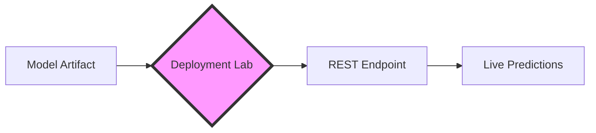

# 🚀 Deployment Lab: Production Serving 🏭

The **Deployment Lab** is FlowyML's integrated model serving engine. It bridges the gap between a trained artifact and a live production endpoint, allowing you to deploy REST APIs with a single click.

---

## 🛠️ The Deployment Lifecycle



### 1. Artifact Selection
From the **Assets** tab, choose any `Model` artifact. FlowyML automatically identifies the framework (Keras, PyTorch, Scikit-Learn) and prepares the runtime environment.

### 2. Configuration
The Lab allows you to tune your endpoint for production requirements:
- **API Token**: Secure your endpoint with auto-generated Bearer tokens.
- **Rate Limiting**: Prevent abuse by capping requests per minute (RPM).
- **Time-to-Live (TTL)**: Perfect for ephemeral testing. Set the deployment to auto-destruct after 30 minutes to save resources.

### 3. Monitoring & Logs
Once live, you can monitor individual request/response cycles in the **Live Logs** viewer.

---

## 💻 Making Your First Prediction

FlowyML endpoints are standard REST APIs. You can consume them from any language.

```python linenums="1"
import requests

# The endpoint and token are provided in the Deployment Lab UI
URL = "http://localhost:9000/predict"
HEADERS = {"Authorization": "Bearer flowy_sk_... "}

payload = {
    "data": {
        "user_id": 123,
        "features": [1.0, 2.5, 0.3]
    }
}

response = requests.post(URL, headers=HEADERS, json=payload)
print(f"Prediction: {response.json()['result']}")
```

---

## 🛡️ Production Hardening

!!! warning "State Management"
    The local Deployment Lab uses in-memory processes for the MVP. For high-availability production workloads, we recommend using the **Kubernetes Plugin** or **Vertex AI Stack**, which handles container orchestration and autoscaling.

### Shadow Deployments
Use the **Context Switching** feature in the UI to deploy a new version of a model alongside the "Standard" version. You can then route a small percentage of secondary traffic for A/B testing or "Shadow" validation.

---

## 💡 Pro Tips

!!! info "Automatic Dependencies"
    FlowyML detects your model's requirements. If you deploy a TensorFlow model, the Lab will offer to install `tensorflow` in the serving process automatically.

!!! tip "Client SDK"
    Use the `flowyml-client` library for native Python integration with built-in retry logic and type validation.
