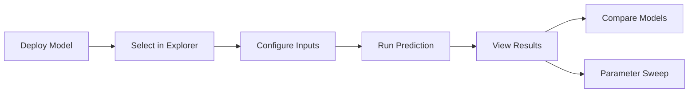

# 🔬 Model Explorer

The Model Explorer is an interactive testing workbench for deployed ML models. Test predictions, run parameter sweeps, compare models side-by-side, and inspect model architecture — all from the UI.

!!! tip "Quick Access"
    Deploy a model from the **Assets** page → open **Model Explorer** → the model is auto-selected.

## Workflow

## Features

### Single Prediction

1. Select a running deployment from the sidebar
2. Use the **Form** or **JSON** editor to set inputs
3. Click **Predict** to get outputs, latency, and confidence
4. Results are displayed as charts and tables

### Model Comparison (`Compare` mode)

Select two deployed models and run the same inputs against both. A comparison table shows:

- Output values per metric
- Relative % difference (Δ)
- Latency comparison

### Parameter Sweep

Pick a numeric parameter and define a sweep range:

- **Min / Max** — the value range
- **Steps** — number of data points

Results are visualized as an animated bar chart showing how outputs vary across the range.

### Model Introspection

The **Model Info** tab shows real metadata from the loaded model:

- Framework and version
- Input/output shapes
- Layer count and total parameters
- Feature names

### External API Connection

Switch to **External** mode to test any REST API endpoint (e.g., a production model behind an API gateway):

- Enter endpoint URL and optional API key
- Run predictions against external services

### Live Logs

View real-time logs from the model server, useful for debugging prediction errors.

### Prediction History

All predictions are saved in session and accessible from the **History** tab. Click any entry to reload its inputs.

## REST API

| Endpoint | Method | Description |
|---|---|---|
| `/api/explorer/schema/{model_id}` | GET | Get model input/output schema |
| `/api/explorer/predict` | POST | Run a prediction |
| `/api/explorer/sweep` | POST | Run parameter sweep |
| `/api/explorer/model-info/{deployment_id}` | GET | Get model introspection data |
| `/api/explorer/logs/{deployment_id}` | GET | Get deployment logs |
| `/api/explorer/sessions` | GET | List exploration sessions |
| `/api/explorer/sessions` | POST | Create exploration session |
| `/api/explorer/sessions/{id}` | GET / DELETE | Get or delete session |
